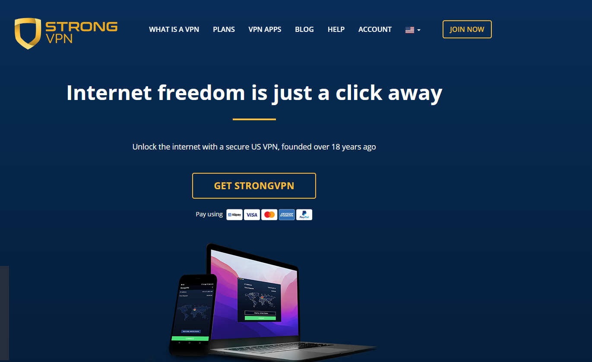

# Best VPNs for India - Comprehensive Recommendations (Updated: December 25, 2024)

## If you enjoy this guide, consider starring this repository and sharing it with others to help spread awareness about internet privacy and freedom. Let's work together for a more secure and open web!

### Quick Overview: Pricing and Performance of the Best VPNs for India

Here’s a summary of the top VPN options for Indian users, including the best subscription plans, pricing, and standout features:

| Recommended VPN | Best Plan (Duration) | Monthly Price (USD) | Total Cost | Key Features | Local Payment Options (UPI, Paytm) |
| --------------- | -------------------- | ------------------- | ----------- | ------------ | ------------------------------- |
| <a rel="nofollow noopener" href="https://strongtech.org/en/exclusive/?tr_aid=60d96b5810e50&chan=w_github&data1=india&data2=title" target="_blank">StrongVPN</a> | 1-Year Plan | 4.5 | 54 | Best Value for Money | Supported |
| <a rel="nofollow noopener" href="https://www.flowvpx.com/sign-up/?locale=en&special=FREETRIAL&r=35-890485.w_github">FlowVPN (2-Day Free Trial)</a> | 1-Year Plan | $4.17 | 50 | Free 2-Day Trial | Supported |
| <a rel="nofollow noopener" href="https://go.expressvpn.com/c/3828265/1462855/16063">ExpressVPN (12 Months + 3 Free)</a> | 1-Year Plan (15 Months Total) | 5.33 | 80 | Top Performance and Stability | Not Supported |
| <a rel="nofollow noopener" href="https://get.surfshark.net/aff_c?offer_id=323&aff_id=5585&source=w_github&aff_sub=india">Surfshark</a> | 2-Year Plan | $2.30 | 55 | Unlimited Devices | Not Supported |

---

### Pricing Comparison and Best Purchase Strategies for India VPN Users

Here’s how you can get the most value out of these VPN services:

- **For Budget-Friendly Options**:  
  If you want an affordable plan with reliable performance, go for <a href="https://strongtech.org/en/exclusive/?tr_aid=60d96b5810e50&chan=w_github&data1=india&data2=title">StrongVPN</a>, which costs $54/year. To continue saving, consider using a new email each year to access promotional offers.

- **For Multi-Device Use**:  
  For families or individuals with multiple devices, <a href="https://get.surfshark.net/aff_c?offer_id=323&aff_id=5585&source=w_github&aff_sub=india">Surfshark</a> is an excellent choice. Their 2-year plan costs only $55 and supports unlimited devices.

- **For Speed and Stability**:  
  If speed and connectivity are your top priorities, <a href="https://www.xvbelink.com/?offer=3monthsfree&a_fid=wall101&chan=w_github">ExpressVPN</a> is highly recommended. With a 12-month subscription that includes 3 extra months free, it offers unparalleled stability and performance, costing around $80.

- **For Light Browsing**:  
  For casual users or academic research purposes, <a href="https://www.flowvpx.com/sign-up/?locale=en&special=FREETRIAL&r=35-890485.w_github">FlowVPN</a> is an economical option, especially with its 2-day free trial.

---

### Why Use VPNs in India?

Although India doesn’t enforce heavy internet censorship like the Great Firewall of China, there are several compelling reasons for Indian users to consider using a VPN:

- **Data Privacy and Security**:  
  VPNs encrypt your internet traffic, protecting you from cyberattacks, unauthorized surveillance, and potential data breaches.

- **Access Geo-Restricted Content**:  
  Unlock streaming services, websites, and apps that are regionally restricted, such as international OTT platforms or exclusive content.

- **Internet Freedom During Shutdowns**:  
  VPNs can bypass regional internet shutdowns, ensuring uninterrupted access to the web in times of need.

- **Secure Public Wi-Fi**:  
  Protect yourself from hackers and phishing attempts while using public Wi-Fi networks in cafes, airports, or malls.

---

## VPN Speed Comparison: Which is the Fastest for India?

Based on extensive research and multi-location testing, we’ve compiled a detailed comparison of VPN speed performance to help users make informed decisions. Among the tested VPNs, **ExpressVPN** consistently offers the highest stability, followed by **StrongVPN**, with **Surfshark** and **FlowVPN** performing comparably. The choice ultimately depends on your priorities for speed versus cost.

Below are the average speeds for these four VPNs in key regions, including India and nearby locations such as Singapore, Japan, and South Korea. We tested multiple times to account for variability and plotted error bars to indicate the standard deviation.

### Key Insight: Why Speed Matters

VPN users highly value connection speed. If a VPN significantly slows your internet, it may discourage regular use, leaving your devices unprotected. With the rise of streaming as one of the most common VPN applications, the ability to load HD and 4K content without buffering is now more critical than ever.

During our testing, we evaluated each VPN service on a 1Gbps connection, using tools like **Ookla SpeedTest**, **nPerf**, **Netflix’s Fast**, and CLI-based tools. Each tool’s results were averaged (using the median value) to ensure accuracy. Tests were repeated during both morning and evening hours to capture a representative performance range.

---

### VPN Speed Test Results

| VPN Service  | WireGuard/Proprietary Protocol | OpenVPN |
| ------------ | ------------------------------ | ------- |
| ExpressVPN   | 600 Mbps                       | 400 Mbps |
| FlowVPN      | 650 Mbps                       | 380 Mbps |
| StrongVPN    | 500 Mbps                       | 350 Mbps |
| Surfshark    | 800 Mbps                       | 300 Mbps |

---

### How We Conduct Our Tests

- **Daily Updates**: Speeds are tested and updated daily.
- **Aggregated Data**: We calculate average speeds for the past 7, 14, 30, and 90 days.
- **Rigorous Testing**: Each VPN undergoes 10–20 connection tests daily across multiple servers and protocols.

Below is the aggregated speed performance chart, showing the average download and upload speeds with error bars representing standard deviation:


---

### Best Purchase Strategies for Indian Users

- **For Budget-Conscious Users**:  
  If speed isn’t your top priority but you want a reliable VPN, consider <a href="https://strongtech.org/en/exclusive/?tr_aid=60d96b5810e50&chan=w_github&data1=india&data2=title">StrongVPN</a>. At $43 per year (approximately $4/month), it offers solid performance at a reasonable price. Use a new email annually to access discounts.

- **For High-Speed Enthusiasts**:  
  For users who prioritize speed, especially for streaming or gaming, <a rel="nofollow noopener" href="https://www.xvbelink.com/?offer=3monthsfree&a_fid=wall101&chan=w_github">ExpressVPN</a> is an excellent choice. Their 12-month plan includes 3 free months, costing around $6/month with unmatched performance and stability.

---


最近更新：`2024年12月25号`
<!-- 
>**在当前的环境下，能在国内长期稳定并有效使用的VPN服务已经变得相对稀缺。许多VPN评论网站往往互相抄袭，发布的内容很多都已经失去了时效性。有一部分推荐的VPN在国内的实际效果并不理想，令人遗憾的是，很多的评论者身处国外，他们并无法提供在国内使用VPN的真实体验。特别是在过去的两年中，由于"防火长城"的严密封锁，许多过去可用的VPN现在已经变得几乎无法使用。因此，在阅读本文的同时，我建议大家需要谨慎理解并避免进入"坑"。本文将根据实际的使用经验介绍各种VPN软件的最新使用情况，并将持续更新最新的使用情况，以供大家参考和避坑。本文是关于中国安全翻牆策略的详细版本，讨论了翻牆软件、科学上网以及网络安全等相关问题。如果你只希望快速选择一款科学上网软件来翻牆，那麽可以直接查看本文下方的目录导航。

翻牆（科学上网）的重要性，我想大家心里都有数。否则，你现在也不会在这里阅读这篇文章。如果不能翻牆，就不能使用Google搜寻编程代码，不能回复Gmail邮件，也无法观看YouTube的视频。那些在Udemy购买的课程，你能够舒适地观看吗？你能否追踪HBO和Netflix的剧集？由于工作出差和生活学习的需要，我经常需要在不同的地区使用科学上网。基于我的个人使用感受以及对VPN软件这个行业的理解，我将为读者推荐在国内最好用、最稳定和最安全的科学上网方法和工具。我也将长期关注VPN、SSR、WireGuard、V2Ray、蓝灯等翻牆和信息安全技术。

>**据中央社引述中国官方消息报道，中国上网人数突破9亿，网购用户超过7亿，可见大家对上网的需求日益增加, 有鉴于网路上许多博主到处乱推荐VPN，都推荐一堆不能用的，不能用的就算了，还要骗大家去买来拿钱，这类博客有个特点，就是喜欢自己架一个网站，写一堆话来骗大家，近几年来，防火墙更新越来越强大，过去许多VPN已经完全不能使用。为了让大家能够持续的有知的自由，再加上太多网站喜欢说不实的讯息，我决定在github上建造一个网页，作为自由博客，帮助大家避坑，不要再浪费时间在那些危险的VPN或是不能用的VPN上。本文会介绍细节，讲一些技术，只想看翻墙科学软件推荐的朋友(如果只想快速选个科学上网软件来翻墙)，可以直接看我的推荐栏位。

多年中美工作经验告诉我，翻墙几乎是现代人必备的一个技能，由于言论审查，只要翻不了墙就不能Google学新的东西，不翻墙就不能看YouTube视频，用facebook，line和外国朋友联络，Coursera和Udemy等线上课程都不能好好观看。HBO、Netflix等影视娱乐也必须要翻墙才能观看，BBC,CNN等国际新闻也都必须要借由翻墙才观看。我本人由于跨国工作，经常要在不同地区使用科学上网，我本人自己也是网路程序员，博士是研究机器学习，也研究过网路相关问题，我将会在下面详细介绍VPN、SSR、WireGuard、V2Ray、Trojan等翻墙和信息安全技术和基本加密技术，我也将就自己的使用感受和对翻墙软件的了解，自己进行数值实验和速度测试，为读者推荐在国内最好用、稳定和安全的科学上网方法和工具。

## 最新本月翻墙新闻更新
微软在2024年6月发布的最新安全更新可能导致Windows用户的VPN连接出现问题。受影响的操作系统包括Windows 11、Windows 10以及Windows Server 2008及以上版本。部分用户在Reddit上反映更新后无法连接VPN，尽管有些用户通过重新安装VPN应用暂时解决了问题。微软已确认此问题，并表示将在未来的更新中修复。这一情况与微软CEO Satya Nadella强调的安全优先的立场形成了对比。
<a rel="nofollow noopener" href="https://tw.news.yahoo.com/microsofts-latest-windows-security-updates-might-break-your-vpn-001216447.html" target="_blank">完整内容可以在原文链接查看</a>


## 翻牆近况更新
**从2021年的圣诞季节到2023年五月的春末，这一段缤纷却又多事的时光，我们在VPN的世界里看到了许多变化。**那些曾经的大腕如Ivacy、VyprVPN、和蓝灯，在中国的市场里屡遭挫折，似乎正如那浓烈的火锅汤底对于胃的挑战一样，它们的伺服器经常遭受封锁。特别是蓝灯，其安全性就像那灯下的虫子，暴露在我们的目光之下。在此，我们要对所有的用户喊话，请注意躲避这些隐患。那些曾经坚固的城堡如NordVPN，在这场风暴中也是被重点打击，现在可以说是倒下的巨人，它的表现就像一个突然失去了方向的孩子，常常需要手动配置。那个我们曾经称之为“小明星”的PIA，在这场狂风中失去了光芒，被封锁后一直无法有后续的有效反击，目前在国内还是无法连接，请大家谨慎选择。

神秘的PandaVPN就像是一个离家出走的孩子，从11月的深秋开始，就像那渐渐落叶的树一样，官网无法访问，线路无法连接，即使呼喊，也无人回应，我们怀疑他可能已经选择了别的路，去寻找自己的世界，选择了卷款跑路。很多专为国人服务的翻牆软件都在走这条路，大家需要提高警惕，毕竟，世界是美好的，也是充满了挑战。

然而，就像那永不消逝的北斗星，**只有ExpressVPN和StrongVPN在过去几年的表现一直保持着稳定，就如同坐在海边听着浪潮的声音一样令人放心。ExpressVPN像是我们的瑞士刀，适用于所有平台，使用体验就像是骑在风中自由的马上，即使遭遇到封锁，它也能在一周内恢復，只要更新了程序，就像是喝了神奇药剂一样，官方推荐的线路就能恢復正常连接。StrongVPN则是我们的轻装步兵，价格相对便宜，拥有通用版客户端和特供的简化版客户端可供使用，无论是Windows、Mac还是安卓手机端，都能适应。**它们的伺服器线路就像是快速的马车，不时会更新，过去的两年里被封锁的次数也相对较少。但是如果你是iPhone的用户，使用StrongVPN可能需要像是打开一道神秘的门一样，联繫客服手动配置翻牆。而在这种敏感的时期，如果遇到连接问题，你可能需要像是找到藏宝图一样，联繫客服提供国内可用线路或备用线路。

本站包含许多翻牆VPN等各种资料跟速度测试还有常见问题，建议大家直接底下内容导航点及自己想要参考的段落。 -->

> ## 本文内容导航
> ### 1. [科学上网基本知识](#科学上网基本知识)
> ### 2. [国产VPN推荐功能总结2024年12月25号测试](#国产VPN推荐功能总结2024年12月25号测试)
> #### 2.1 [StrongVPN推荐](#StrongVPN推荐)
> #### 2.2 [Expressvpn-买12个月送三个月](#Expressvpn-买12个月送三个月)
> #### 2.3 [SurfsharkVPN-冲浪鲨-推荐](#SurfsharkVPN-冲浪鲨-推荐)
> #### 2.4 [FlowVPN-推荐-免费用两天](#FlowVPN-推荐-免费用两天)
> #### 2.5 [分析和对比市面上不同VPN提供商的隐私政策](#分析和对比市面上不同VPN提供商的隐私政策)
> ### 3. [strongvpn手把手-支付保alipay-购买教学](#strongvpn手把手-支付保alipay-购买教学)
> #### 3.1 [移动设备-Android-iOS-上的StrongVPN设置教程](#移动设备-Android-iOS-上的StrongVPN设置教程)
> ### 4. [expressvpn线上优惠玛购买教学-如何购买ExpressVPN](#expressvpn线上优惠玛购买教学-如何购买ExpressVPN)
> #### 4.1 [跨设备-PC-手机-平板-使用ExpressVPN的设置教程](#跨设备-PC-手机-平板-使用ExpressVPN的设置教程)
> ### 5. [surfshark手把手购买教学](#surfshark手把手购买教学)
> ### 6. [flowvpn免费试用两天-手把手购买教学](#flowvpn免费试用两天-手把手购买教学)
> ### 7. [中国翻墙VPN黑名单-千万不要入坑-不要使用](#中国翻墙VPN黑名单-千万不要入坑-不要使用)
> ### 8. [中国VPN推荐标准以及必要的特色](#中国VPN推荐标准以及必要的特色)
> ### 9. [你必须知道的VPN的核心知识](#你必须知道的VPN的核心知识)
> #### 9.1 [双重或多重VPN的使用和优势](#双重或多重VPN的使用和优势)
> #### 9.2 [使用VPN对网路速度的影响](#使用VPN对网路速度的影响)
> #### 9.3 [翻墙软件和VPN的区别](#翻墙软件和VPN的区别)
> #### 9.4 [如何定期更换VPN以提高安全性](#如何定期更换VPN以提高安全性)
> ### 10. [基本密码学以及加密原理介绍](#基本密码学以及加密原理介绍)
> ### 11. [翻墙后可以做什么呢](#翻墙后可以做什么呢)
> ### 12. [常见翻牆协议介绍](#常见翻牆协议介绍)
> #### 12.1 [VPN和Tor的区别及使用场景](#VPN和Tor的区别及使用场景)
> #### 12.2 [VPN和代理服务器的区别](#VPN和代理服务器的区别)
> ### 13. [VPN服务器的分析-使用小秘诀](#VPN服务器的分析-使用小秘诀)
> #### 13.1 [如何解决VPN连接中断的问题](#如何解决VPN连接中断的问题)
> #### 13.2 [如何确保你的VPN一直开启并正常运行](#如何确保你的VPN一直开启并正常运行)
> ### 14. [免费VPN的风险-为什么不推荐免费VPN](#免费VPN的风险-为什么不推荐免费VPN)
> ### 15. [为什么不推荐自己架设VPN](#为什么不推荐自己架设VPN)
> ### 16. [游戏VPN的特色](#游戏VPN的特色)
> ### 17. [如何用VPN观看流媒体指南](#如何用VPN观看流媒体指南)
> #### 17.1 [流媒体平台如Netflix和Hulu如何检测和阻止VPN连接](#流媒体平台如Netflix和Hulu如何检测和阻止VPN连接)
> ### 18. [更多详尽的VPN测速报告](#更多详尽的VPN测速报告)
> #### 18.1 [VPN服务在世界各大洲的连接成功率](#VPN服务在世界各大洲的连接成功率)
> #### 18.2 [VPN服务在全球各大地区的速度测试](#VPN服务在全球各大地区的速度测试)
> #### 18.3 [VPN服务在世界各大洲连接Netflix的成功率](#VPN服务在世界各大洲连接Netflix的成功率)
> #### 18.4 [VPN服务在世界各大洲连接Disney+的成功率](#VPN服务在世界各大洲连接Disney+的成功率)
> ### 19. [中国特殊时期的VPN连接问题-敏感时期](#中国特殊时期的VPN连接问题-敏感时期)
> ### 20. [Linux-VPN安装教学](#Linux-VPN安装教学)
> ### 21. [哪些应用和服务可能会阻止VPN连接](#哪些应用和服务可能会阻止VPN连接)
> ### 22. [针对特定应用-例如BitTorrent-的VPN设置和建议](#针对特定应用-例如BitTorrent-的VPN设置和建议)
> ### 23. [适合AppleTV的VPN](#适合AppleTV的VPN)
> ### [VPN的未来发展趋势和预测](#VPN的未来发展趋势和预测)
> #### [VPN的局限性及其解决方案](#VPN的局限性及其解决方案)

## Understanding VPNs for Internet Freedom in India

### What is a VPN?

A VPN, or Virtual Private Network, is a tool that helps users protect their online privacy, bypass geo-restrictions, and access the full potential of the internet securely. While countries like China have strict internet censorship policies enforced through their "Great Firewall," India faces a different set of challenges when it comes to digital freedom.

---

### Internet Challenges in India: Why Use a VPN?

India does not have a centralized firewall like China, but there are significant reasons why VPNs are becoming increasingly essential for Indian users:

#### **1. Protecting Your Privacy**
India has seen growing concerns over online privacy due to government surveillance and data retention policies. VPNs can encrypt your online activities, ensuring that your browsing history and personal data are safe from prying eyes, including your ISP or malicious actors.

#### **2. Accessing Geo-Restricted Content**
Streaming services like Netflix, Amazon Prime Video, and Disney+ often restrict certain content to specific regions. VPNs allow Indian users to access a broader range of global entertainment by connecting to servers in other countries, bypassing these regional restrictions.

#### **3. Avoiding Bandwidth Throttling**
Some ISPs in India throttle bandwidth for certain applications, such as streaming or gaming. A VPN masks your online activity, preventing ISPs from selectively slowing down your connection.

#### **4. Maintaining Internet Access During Shutdowns**
India has seen an increasing number of internet shutdowns in specific regions due to political unrest or security concerns. VPNs can help users maintain access to the internet during such disruptions, providing a vital lifeline for communication and work.

---

### VPNs and Internet Freedom: A Broader Perspective

While the need for VPNs in India differs from countries with heavy censorship, the underlying goal remains the same—ensuring digital freedom and security. By routing your traffic through encrypted servers, a VPN can help you bypass government-imposed restrictions, access blocked websites, and protect your personal information.

---

### Why Are VPNs So Popular in India?

The demand for VPNs in India has surged due to a combination of factors:

1. **Increased Work-from-Home Requirements**: With many Indians working remotely, accessing secure connections for tools like Google Workspace, Microsoft Teams, and Zoom has become critical.
2. **Growing Concerns About Online Safety**: Cyberattacks and data breaches have become more frequent, making VPNs a necessity for protecting sensitive information.
3. **Streaming and Gaming**: The need for high-speed, unrestricted access to global streaming services and gaming platforms has driven the adoption of VPNs among younger users.

---

### How Does a VPN Work?

A VPN works by creating a secure, encrypted tunnel between your device and a remote server. This process masks your IP address, making it appear as though you are browsing from the server's location. For Indian users, this means:
- **Enhanced Privacy**: ISPs and government entities cannot monitor your online activities.
- **Seamless Access to Global Content**: Enjoy streaming, gaming, and browsing without worrying about restrictions or throttling.

---

### VPN Terminology in India

While terms like "bypassing censorship" or "breaking restrictions" may not be as commonly used in India as in countries with strict internet controls, Indian users often refer to VPNs for:
- **Streaming Freedom**: Unlocking content on platforms like Netflix, Hulu, or Disney+.
- **Secure Browsing**: Ensuring privacy on public Wi-Fi.
- **Uninterrupted Internet**: Maintaining access during regional internet disruptions.

---


### Benefits of Using a VPN: Why Should You Hide Your IP Address?

Your IP address is like a digital street address. It uniquely identifies your location and device on the internet. However, this identification can sometimes work against you—third parties can use it to monitor your activities or track your whereabouts. 

By replacing your IP address with that of a VPN server, VPN providers encrypt your connection and hide your true online identity within seconds. This creates a private and secure network where your internet traffic is fully shielded from third parties. Whether you're concerned about online privacy, security, or anonymity, a VPN provides the protection you need in today’s digital landscape.

---

### Public Wi-Fi Risks: How a VPN Protects You

Public Wi-Fi networks, such as those in cafes, airports, and hotels, are convenient but inherently risky. These busy hotspots expose your data to hackers and malicious actors. Without a VPN, using public Wi-Fi puts you at risk of data breaches, including the compromise of:
- Banking and financial information
- Work-related communications
- Phone numbers, emails, and personal messages

When connected to a VPN, your internet activity is encrypted and routed through a secure network, ensuring that even on unsecured Wi-Fi networks, your data remains safe. Whether you're streaming, shopping, or working remotely, a VPN allows you to use public Wi-Fi with peace of mind.

---

### Key VPN Protocols to Know

Understanding the following VPN-related terms will help you make an informed decision when choosing a VPN service. These protocols are the backbone of how VPNs function, offering varying levels of security, speed, and reliability:

- **WireGuard**: A modern VPN protocol known for its speed and efficiency. Ideal for streaming and gaming.
- **OpenVPN**: A versatile and widely used protocol offering strong encryption. Great for general security needs.
- **IKEv2/IPSec**: Known for its stability on mobile devices, this protocol is perfect for users who switch between Wi-Fi and mobile data.

---

### Features to Look for in the Best VPNs for India

Based on extensive testing and user feedback, here are the essential features that make a VPN truly stand out for Indian users:

1. **High Security**: Ensure the VPN provider is not based in jurisdictions with poor privacy laws. Non-Indian providers are often preferred for better data privacy.
2. **Stable Connection**: A reliable VPN should maintain consistent performance across various networks.
3. **Fast Speeds**: A high-speed connection is crucial for activities like streaming and gaming.
4. **Multiple Server Locations**: Access to servers in a variety of countries ensures better performance and access to geo-restricted content.
5. **Ease of Use**: A user-friendly interface with one-click connection simplifies the process.
6. **Strong Encryption**: Advanced encryption protocols keep your data secure.
7. **Multi-Device Support**: Look for VPNs that allow simultaneous connections on multiple devices.
8. **Cross-Platform Compatibility**: Ensure the VPN works seamlessly across Windows, Linux, Android, iOS, and other operating systems.
9. **24/7 Customer Support**: Responsive support is essential, preferably in English or regional languages.
10. **Money-Back Guarantee**: A 30-day refund policy allows you to test the service risk-free.
11. **Flexible Payment Options**: Support for local payment methods like UPI, Paytm, or international cards.
12. **Affordable Pricing**: Ensure the VPN offers good value for money, balancing cost with features.

---

### Selecting the Best VPNs for India: Practical Recommendations

After testing hundreds of VPNs, the following factors were identified as the most critical for Indian users:
- **Privacy Protection**: Choose a VPN provider with a strict no-logs policy and robust encryption.
- **Unrestricted Streaming**: Look for services that excel at bypassing geo-restrictions on platforms like Netflix, Hulu, and Amazon Prime Video.
- **Public Wi-Fi Safety**: Ensure your VPN has features to protect against risks on unsecured networks.
- **Global Server Access**: A diverse server network is key for accessing region-specific content and ensuring a lag-free connection.

---


<a name="StrongVPN-Recommendation"></a>
### 1. <a rel="nofollow noopener" href="https://strongtech.org/en/exclusive/?tr_aid=60d96b5810e50&chan=w_github&data1=india&data2=title" target="_blank">StrongVPN – Best Value for Money</a>
### StrongVPN Overview


StrongVPN is an emerging VPN provider that offers incredible value for users looking for robust security and reliable performance. Compared to the more expensive **ExpressVPN**, StrongVPN is a budget-friendly option with plans starting at just $3.50/month (12-month plan for $43.99). Additionally, StrongVPN supports **local payment methods like Alipay**, which ExpressVPN does not.

If your primary goal is to stream platforms like YouTube, Netflix, or Amazon Prime Video, StrongVPN is an excellent choice. The service is optimized for streaming and claims compatibility with popular services like **Netflix, Hulu, Disney+, HBO, and Sky Go**.

---

### Features of StrongVPN

- **Platform Compatibility**: Apps available for Windows, Mac, iOS, Android, and Amazon Fire TV, with setup guides for routers, Kodi, and more.
- **Wide Server Network**: Over **950 servers in 46 cities across 35+ countries**.
- **High Security**: Supports protocols like L2TP, SSTP, OpenVPN, IKEv2, and the modern WireGuard for superior encryption and speed.
- **12 Simultaneous Connections**: Use StrongVPN on up to 12 devices at the same time.
- **Streaming Capability**: Unblocks Netflix, Amazon Prime Video, Disney+, and more.
- **250GB Cloud Storage**: Includes SugarSync storage with annual plans.
- **No Logging Policy**: StrongVPN guarantees zero-logging to protect your privacy.
- **24/7 Support**: Get help via live chat or email anytime.
- **Money-Back Guarantee**: Full refund available within 30 days of purchase.

---

### Why Choose StrongVPN?

1. **Value for Money**: At $3.50/month (12-month plan), StrongVPN is one of the most affordable premium VPNs.
2. **Stable Connections**: Offers reliable speeds and low latency, ideal for streaming and browsing.
3. **Streaming Optimization**: Unlocks region-restricted content on platforms like Netflix, Hulu, and Disney+.
4. **Privacy and Security**: Zero-logging policy ensures that your data is never tracked or shared.
5. **Easy Payment Options**: Accepts international credit cards, PayPal, and local payment methods like Alipay.

---

### How Fast is StrongVPN?

Connection speed is a critical factor for VPN users, especially for streaming and gaming. StrongVPN performed well in our speed tests across multiple protocols and servers:

- **WireGuard Protocol**:  
  - United States: 270–300 Mbps  
  - United Kingdom: 450 Mbps  
- **OpenVPN Protocol**:  
  - United States: 230–240 Mbps  
- **IKEv2 Protocol**:  
  - United States: 260–280 Mbps  

While not the fastest VPN (services like NordVPN can exceed 800 Mbps), StrongVPN provides consistent performance suitable for most users.

---

### Comparison Table: Key Specifications of StrongVPN

| Feature/Specification       | Details                                     |
|-----------------------------|---------------------------------------------|
| **Client Platforms**        | Windows, Mac, Linux, Android, iOS, routers |
| **Supported Protocols**     | OpenVPN, L2TP/IPsec, SSTP, WireGuard        |
| **Server Count**            | 950+                                       |
| **Countries Covered**       | 35+                                        |
| **Registered Location**     | United States                              |
| **Payment Methods**         | Credit Card, PayPal, Alipay                |
| **Real-Name Registration**  | Not Required                               |
| **Encryption Protocols**    | WireGuard, OpenVPN, IKEv2, L2TP, SSTP      |
| **Bandwidth Usage**         | Unlimited                                  |
| **Simultaneous Connections**| 12                                         |
| **Customer Support**        | Email, Live Chat, Phone                    |
| **Privacy Policy**          | No Logs                                    |

---

### Why StrongVPN is Perfect for Indian Users

1. **Access to Global Content**: Stream region-locked shows and movies on services like Netflix and Hulu.
2. **Secure Public Wi-Fi Use**: Protect yourself while using public hotspots at cafes, airports, or hotels.
3. **Affordable Pricing**: At just $3.50/month, it provides premium features at a fraction of the cost of competitors.
4. **Local Payment Options**: Makes it easier for Indian users to subscribe without hassle.
5. **12 Device Connections**: Perfect for families or users with multiple devices.

---

<a name="ExpressVPN-15Months"></a>
### 2. <a rel="nofollow noopener" href="https://www.xvbelink.com/?offer=3monthsfree&a_fid=wall101&chan=w_github">ExpressVPN (12-Month Plan + 3 Free Months)</a>
### ExpressVPN Overview


ExpressVPN is one of the most premium VPNs on the market, consistently recognized for its top-tier performance and industry-leading privacy features. While it is slightly more expensive than other options, its unmatched speed, reliability, and advanced features justify the price for users who prioritize a seamless and secure online experience.

---

### Key Features of ExpressVPN

- **Massive Server Network**: Over **3,000 servers** in **160 locations across 94 countries**, ensuring reliable connections and access to global content. Asia-specific servers include popular locations like India, Singapore, and Hong Kong.
- **Wide Platform Compatibility**: Apps for **Windows, Mac, Android, iOS, Linux**, and detailed manual setup guides for routers, smart TVs (Apple TV, Fire TV), gaming consoles (PlayStation, Xbox), and more.
- **High-Grade Encryption**: Industry-standard **AES-256 encryption**, combined with **Diffie-Hellman key exchange** and HMAC authentication, ensures your data remains secure from even the most sophisticated cyber threats.
- **Private DNS**: Runs private, zero-knowledge DNS on all servers to prevent DNS leaks and enhance privacy.
- **Automatic Kill Switch**: Protects your privacy by instantly blocking internet traffic if the VPN connection drops.
- **Split Tunneling**: Lets you route specific apps or traffic through the VPN while keeping others on your regular connection.
- **24/7 Customer Support**: Live chat, email, and a comprehensive knowledge base are available around the clock.
- **30-Day Money-Back Guarantee**: Test the service risk-free and get a refund if it doesn’t meet your expectations.

---

### ExpressVPN Performance: Speed and Stability

ExpressVPN is renowned for its exceptional speed and stability, making it ideal for streaming, gaming, and downloading. Here's how it performed in our speed tests:

- **Lightway Protocol**:  
  - Consistently delivers speeds of 500–700 Mbps, ensuring lag-free streaming in HD and 4K.
- **OpenVPN Protocol**:  
  - Achieved speeds of 250–300 Mbps on average.
- **Global Performance**:  
  - Stable connections with minimal latency across key regions like India, the US, and the UK.

ExpressVPN is an excellent choice for bypassing ISP throttling and accessing geo-restricted content. Whether you’re streaming Netflix, Amazon Prime Video, or Disney+, the service ensures smooth, buffer-free playback.

---

### Pricing and Exclusive Offer

ExpressVPN’s standard pricing might be higher than some competitors, but its exclusive offer provides excellent value:
- **12-Month Plan + 3 Free Months**: Get 15 months of service for just $6.67/month (total cost: $99.95). This offer makes ExpressVPN a top-tier choice for those seeking premium VPN features.

Additionally, ExpressVPN supports various payment methods, including:
- Credit/Debit Cards
- PayPal
- Cryptocurrency (Bitcoin)
- Alternative payment options like Alipay, WebMoney, and Yandex Money.

---

### Why Choose ExpressVPN for India?

1. **Unblock Global Content**: Access geo-restricted streaming platforms like Netflix, Hulu, BBC iPlayer, and more with ease.
2. **Privacy First**: Based in the British Virgin Islands, ExpressVPN operates under strong privacy laws and guarantees a no-logs policy.
3. **Optimized for Streaming and Gaming**: Consistently fast speeds ensure smooth streaming and low-latency gaming.
4. **Cross-Platform Support**: Seamless compatibility with popular operating systems, smart TVs, and gaming consoles.
5. **24/7 Support**: Get instant assistance anytime through live chat or email.

---

### Comparison Table: Key Specifications of ExpressVPN

| Feature/Specification       | Details                                     |
|-----------------------------|---------------------------------------------|
| **Server Count**            | 3,000+                                     |
| **Server Locations**        | 160 locations in 94 countries              |
| **Supported Platforms**     | Windows, Mac, iOS, Android, Linux, routers |
| **Simultaneous Connections**| 5                                          |
| **Split Tunneling**         | Yes                                        |
| **Kill Switch**             | Yes                                        |
| **Supported Protocols**     | Lightway, OpenVPN, IKEv2, L2TP/IPSec       |
| **Registered Location**     | British Virgin Islands                     |
| **Support**                 | 24/7 live chat, email, knowledge base      |

---

### Risk-Free Trial and Refund Policy

ExpressVPN offers a **30-day money-back guarantee**, allowing you to try the service with complete peace of mind. Additionally, users installing the Android or iOS apps can enjoy a **7-day free trial**. If you decide to cancel, the process is straightforward—no questions asked, and a full refund is guaranteed.

---

ExpressVPN is the go-to choice for users seeking premium features, unmatched speed, and robust privacy protections. With its global server coverage and advanced security protocols, it’s a reliable VPN for Indian users looking to access the internet freely and securely.


### 3. <a rel="nofollow noopener" href="https://get.surfshark.net/aff_c?offer_id=323&aff_id=5585&source=w_github&aff_sub=india">Surfshark – Unlimited Device Connections</a>
### Surfshark VPN Review: Affordable, Feature-Packed, and Built for Everyone

<a name="SurfsharkVPN-Recommendation"></a>


Surfshark has quickly risen to become one of the most versatile and affordable VPN services on the market. Launched in 2018, it’s a relatively new player that has already made waves by offering high-end features at unbeatable prices. Whether you're streaming, gaming, or simply browsing, Surfshark delivers top-tier performance without breaking the bank.

---

### Why Surfshark Stands Out

#### **1. Affordable Plans with Unlimited Connections**
At just **$2.30/month** for the 2-year plan, Surfshark is one of the most cost-effective VPNs out there. And here’s the kicker: you can connect an **unlimited number of devices** simultaneously, making it the perfect choice for families or users with multiple gadgets.

#### **2. Impressive Server Network**
With over **3,200 servers in 65 countries**, Surfshark offers excellent global coverage. Whether you’re in India, the US, or Europe, you’ll have access to fast and reliable servers for streaming, gaming, and secure browsing.

#### **3. Streaming Made Easy**
Surfshark excels at bypassing geo-restrictions, allowing you to stream content from services like:
- **Netflix** (accessible in over 20 countries, including the US, Japan, and Italy)
- **Amazon Prime Video**
- **Disney+**

#### **4. Industry-Leading Security**
- **Encryption**: Military-grade **AES-256-GCM** encryption ensures your data is protected at all times.
- **Protocols**: Supports advanced protocols like **WireGuard**, **OpenVPN**, and **IKEv2** for speed and security.
- **IP Rotator**: A standout feature introduced in 2022, it changes your IP address every few minutes without disconnecting, adding an extra layer of anonymity.
- **No-Logs Policy**: Based in the British Virgin Islands, Surfshark adheres to strict no-logs policies. They don’t track your browsing history, IP address, or bandwidth usage—just your email and billing details.

#### **5. Easy-to-Use Apps**
Surfshark offers apps for **Windows, Mac, Android, iOS, Linux**, and even browser extensions for Chrome, Firefox, and Edge. It also supports **Smart DNS** for gaming consoles and smart TVs, making it a one-size-fits-all solution.

#### **6. New Features and Constant Improvements**
Surfshark’s commitment to innovation shines through features like **Surfshark Nexus**, which enhances security and performance with cutting-edge technologies.

---

### Key Features of Surfshark VPN

- **Unlimited Devices**: One account supports unlimited connections.
- **Affordable Pricing**: Plans start at just **$2.30/month** (2-year plan).
- **Massive Server Network**: Over **3,200 servers in 65 countries**.
- **Advanced Security**: AES-256 encryption, IP Rotator, and private DNS.
- **Streaming-Friendly**: Unblock Netflix, Amazon Prime Video, Disney+, and more.
- **Payment Options**: Supports **credit cards, PayPal, cryptocurrencies**, and platforms like **Amazon Pay** and **Google Pay**.
- **30-Day Money-Back Guarantee**: Risk-free trial to ensure satisfaction.
- **Round-the-Clock Support**: Get help 24/7 via live chat or email.

---

### Why Choose Surfshark in India?

1. **Perfect for Families**: Unlimited device connections mean everyone in your household can use the VPN simultaneously.
2. **Affordable for Long-Term Use**: The 2-year plan is one of the cheapest in the industry, making it ideal for budget-conscious users.
3. **Access Global Content**: Watch region-locked shows on Netflix, Hulu, and more without interruptions.
4. **Stay Anonymous**: Features like IP Rotator ensure your digital footprint remains invisible.
5. **Secure Public Wi-Fi Use**: Protect yourself while using public hotspots at airports, cafes, or hotels.

---

### How Does Surfshark Compare?

| Feature/Specification       | Details                                     |
|-----------------------------|---------------------------------------------|
| **Server Count**            | 3,200+                                     |
| **Server Locations**        | 65 countries                               |
| **Simultaneous Connections**| Unlimited                                  |
| **Supported Platforms**     | Windows, Mac, iOS, Android, Linux, smart TVs |
| **Encryption**              | AES-256-GCM                                |
| **Protocols**               | WireGuard, OpenVPN, IKEv2                  |
| **Split Tunneling**         | Yes                                        |
| **No-Logs Policy**          | Yes                                        |
| **Payment Methods**         | Credit Card, PayPal, Cryptocurrency, Google Pay, Amazon Pay |
| **Registered Location**     | British Virgin Islands                     |

---

### Final Thoughts on Surfshark VPN

Surfshark combines affordability, advanced features, and user-friendly design, making it one of the best VPNs for Indian users. Its ability to support unlimited devices and unblock global content at high speeds ensures excellent value for money. Whether you’re streaming, gaming, or securing your online activities, Surfshark delivers everything you need in a modern VPN.

Ready to experience online freedom? Sign up for Surfshark today and take advantage of their **2-year plan at just $2.30/month**!


### 4. <a rel="nofollow noopener" href="https://www.flowvpx.com/sign-up/?locale=en&special=FREETRIAL&r=35-890485.w_github">FlowVPN – Free 2-Day Trial</a>
### FlowVPN: Affordable and Student-Friendly

<a name="FlowVPN-FreeTrial"></a>


FlowVPN is an excellent option for those new to VPNs or looking for a budget-friendly solution. While it doesn't match the speed and stability of premium providers like ExpressVPN or StrongVPN, it offers unique advantages that cater to students and casual users.

---

### Why Choose FlowVPN?

#### **1. Free 2-Day Trial**
FlowVPN provides a **completely free 2-day trial**, allowing users to test its features without any commitment. This makes it a great starting point for those unfamiliar with VPNs.

#### **2. Affordable Pricing**
FlowVPN is highly affordable, making it ideal for students and budget-conscious users. Additionally, it offers student discounts for eligible users.

#### **3. Wide Protocol Support**
Supports a variety of protocols, including:
- IPSec IKEv1
- IPSec IKEv2
- WireGuard
- OpenVPN
- L2TP
- PPTP  
It also features custom **SSL and FlowTCP protocols**, offering flexibility and additional options for connection.

#### **4. Global Server Coverage**
With over **100 servers in 60+ countries**, FlowVPN provides decent global coverage, including popular locations like the US, UK, Hong Kong, and Australia.

#### **5. Multi-Device Compatibility**
FlowVPN is compatible with **Mac, iPad, iPhone, Android, and Windows**, allowing simultaneous connections on up to 4 devices.

#### **6. Student-Friendly Features**
FlowVPN specifically caters to students and educators with discounts and localized support in Chinese, making it accessible and user-friendly.

---

### Key Features of FlowVPN

- **Free 2-Day Trial**: Try all features without cost or commitment.
- **Affordable for Students**: Tailored pricing and discounts for educational users.
- **Custom Protocols**: Includes unique options like SSL and FlowTCP.
- **Global Server Access**: Servers in 60+ countries.
- **Multi-Device Use**: Supports up to 4 devices simultaneously.
- **Localized Support**: Chinese interface and customer service, with payment options like Alipay.

---

### Comparing Privacy Policies of Major VPN Providers

When selecting a VPN provider, privacy policies are a critical consideration. Here's a comparison of privacy policies for **ExpressVPN**, **StrongVPN**, and **Surfshark** to help you make an informed decision.

#### **ExpressVPN**
- **Base Location**: British Virgin Islands  
- **Privacy Policy**: ExpressVPN is committed to a strict no-logs policy. It doesn’t track user activity or IP addresses while connected. Its location ensures immunity from strict data retention laws.

#### **StrongVPN**
- **Base Location**: United States  
- **Privacy Policy**: StrongVPN also adheres to a no-logs policy. However, being based in the US means it could face stricter legal requirements. StrongVPN assures users that it doesn’t share data with third parties unless legally mandated.

#### **Surfshark**
- **Base Location**: British Virgin Islands  
- **Privacy Policy**: Surfshark operates under a transparent no-logs policy. It doesn’t store IP addresses, browsing history, or bandwidth usage. Like ExpressVPN, it is free from stringent data retention laws.

---

### Privacy Policy Comparison Table

|   | **ExpressVPN**          | **StrongVPN**          | **Surfshark**         |
|---|-------------------------|------------------------|-----------------------|
| **Base Location**           | British Virgin Islands | United States         | British Virgin Islands |
| **Logs Network Activity**   | No                     | No                    | No                     |
| **Shares Data with Third Parties** | No, unless legally required | No, unless legally required | No, unless legally required |

---

### Why Consider FlowVPN for India?

- **Affordable Pricing**: Perfect for casual users and students.
- **Localized Support**: Alipay and a Chinese interface make it accessible for Chinese-speaking users in India.
- **Trial Period**: Free 2-day trial allows risk-free testing.
- **Decent Coverage**: Covers popular locations like the US, UK, and Hong Kong.

FlowVPN is a practical option for users seeking an entry-level VPN with basic features at an affordable price. While it lacks the speed and robustness of premium VPNs, its free trial and student-friendly pricing make it worth exploring.

## Step-by-Step Guide: Purchasing StrongVPN with Alipay or PayPal

If you prefer using **Alipay** for payments, StrongVPN is a great choice. Here’s a detailed guide to purchasing and setting up your subscription:

---

### **Step 1: Access the Exclusive Offer**

Visit our exclusive offer page for **[StrongVPN](https://strongvpn.com/?tr_aid=60d96b5810e50&chan=w_github&data1=pc-vpn&data2=table)** and click on the **Start Now** button. (See screenshot below.)



---

### **Step 2: Troubleshooting VPN Conflicts**

If you’re unable to proceed with the purchase because you’re using another VPN, don’t worry! You can use **FlowVPN**’s free 2-day trial as a temporary solution. Here’s how:

1. **Register for FlowVPN**: (Refer to the FlowVPN setup guide below for instructions.)
2. **Connect to a UK Server**: Once registered, connect to a server in the United Kingdom via FlowVPN.
3. **Complete the StrongVPN Purchase**: Now, you should be able to purchase StrongVPN without issues. The annual plan is just $43, offering incredible value.  
   **Tip**: If you plan to renew after 12 months, consider creating a new email to reapply this discount.


---

### **Step 3: Choose Your Payment Method**

Scroll down and select your preferred payment method. StrongVPN supports:
- **Alipay**
- Domestic and international bank cards (Visa/MasterCard)
- **PayPal**


With your payment complete, you’re ready to set up StrongVPN on your devices!

---

## StrongVPN Setup Guide for Mobile Devices (Android / iOS)
<a name="StrongVPN-Mobile-Setup"></a>
Whether you're an **Android** or **iOS** user, here’s how to get started with StrongVPN on your mobile devices:

---

### **Step 1: Purchase and Register**

First, visit **[StrongVPN](https://strongtech.org/en/exclusive/?tr_aid=60d96b5810e50&chan=w_github&data1=india&data2=title)** to choose a subscription plan and create your account.

---

### **Step 2: Setting Up StrongVPN on Android**

1. Open the **Google Play Store** and search for "StrongVPN."
2. Tap **Install** to download and install the app.
3. Open the StrongVPN app, enter your username and password, and tap **Login**.
4. For a quick connection, tap **Best Available Location** to automatically connect to the fastest server.  
   Alternatively, tap **Choose Location** to select a specific server.

---

### **Step 3: Setting Up StrongVPN on iOS**

1. Open the **App Store** and search for "StrongVPN."
2. Tap **Get** to download and install the app.
3. Open the app, enter your username and password, and tap **Sign In**.
4. To connect, tap **Best Available Location** for the fastest server or **Choose Location** to manually select a server.

---

Now that you’ve set up StrongVPN on your mobile device, you can enjoy secure, private, and unrestricted internet access anytime, anywhere.

---

### Why Choose StrongVPN?

- **Affordable Pricing**: At just $43/year, it’s a budget-friendly option with premium features.
- **Flexible Payment Options**: Supports **Alipay**, **PayPal**, and international cards, making it accessible for users in India.
- **Comprehensive Device Support**: Works seamlessly across Android, iOS, Windows, Mac, and more.
- **Global Coverage**: Offers servers in 46 cities across 35+ countries.

StrongVPN is an excellent choice for users looking for a balance of affordability, security, and usability. Start your journey to unrestricted internet freedom today!

## How to Purchase ExpressVPN with an Exclusive Online Discount
<a name="ExpressVPN-Purchase-Guide"></a>

### Important Note:
ExpressVPN does not support Alipay. If you prefer Alipay, consider using **StrongVPN** or **FlowVPN** instead.  
ExpressVPN supports payments via **credit/debit cards** (Visa, MasterCard, etc.), **PayPal**, and **Bitcoin**. As it is an international website, you may need a VPN to access it in certain regions. Refer to the mirror site guide if necessary.

---

### **Step 1: Access the Discount Link**

Visit the **[ExpressVPN Discount Page](https://www.xvbelink.com/?offer=3monthsfree&a_fid=wall101&chan=w_github)** and click **Get ExpressVPN** (see the highlighted red box in the screenshot below).


---

### **Subscription Options**

| Duration   | Total Cost | Monthly Cost |
|------------|------------|--------------|
| 1 Month    | $12.95     | $12.95       |
| 6 Months   | $59.95     | $9.99        |
| 12 Months  | $99.95     | $8.32 ($6.67 with the [ExpressVPN 3-Month Free Offer](https://www.xvbelink.com/?offer=3monthsfree&a_fid=wall101&chan=w_github)) |

---

### **Step 2: Choose the 12-Month Plan with 3 Free Months**

With the exclusive offer, you pay for 12 months but get **15 months of service**.  
**Tip**: This offer is valid for the first 15 months only. If you wish to renew, create a new email account and reapply the discount.


---

### **Step 3: Enter Your Email and Payment Details**

Provide a valid email address and select your payment method. ExpressVPN supports:
- Domestic and international credit/debit cards (Visa, MasterCard, etc.)
- **PayPal**
- **Bitcoin**

Ensure your email is correct to receive the confirmation and activation code.


---

## Setting Up ExpressVPN Across Devices (PC, Smartphone, Tablet)
<a name="ExpressVPN-Setup-Guide"></a>

Here’s how to set up ExpressVPN on different devices:

---

### **1. Purchase and Register**

Visit **[ExpressVPN](https://www.xvbelink.com/?offer=3monthsfree&a_fid=wall101&chan=w_github)**, choose a subscription plan, and create your account.

---

### **2. Installing and Setting Up ExpressVPN on a PC**

1. Go to the ExpressVPN website, log in to your account, and download the app for your operating system.
2. Run the installer and follow the on-screen instructions to complete the setup.
3. Open the ExpressVPN app, enter your username and password, and click **Sign In**.
4. Select **Smart Location** to connect to the fastest server automatically, or choose a specific server manually.

---

### **3. Installing and Setting Up ExpressVPN on a Smartphone**

1. Visit the ExpressVPN website on your phone or download the app from the **App Store** (iOS) or **Google Play Store** (Android).
2. Log in with your username and password, and click **Sign In**.
3. Use **Smart Location** for automatic connection to the best server or manually select a server.

---

### **4. Installing and Setting Up ExpressVPN on a Tablet**

1. Access the ExpressVPN website on your tablet or download the app from the **App Store** (iOS) or **Google Play Store** (Android).
2. Log in with your credentials and tap **Sign In**.
3. Choose **Smart Location** for an optimized connection or manually pick a server.

---

Now you’re ready to enjoy secure, private, and unrestricted internet access across all your devices with ExpressVPN!

---

### Why Choose ExpressVPN?

- **Global Coverage**: Over 3,000 servers in 94 countries, ensuring reliable connections worldwide.
- **High-Speed Streaming**: Stream HD and 4K content with minimal buffering.
- **Industry-Leading Privacy**: Based in the British Virgin Islands with a strict no-logs policy.
- **Easy Payment Options**: Supports Bitcoin, PayPal, and international credit cards.
- **Cross-Platform Support**: Compatible with Windows, Mac, Android, iOS, and more.

Start your journey to unrestricted internet access with **[ExpressVPN’s 3-Month Free Offer](https://www.xvbelink.com/?offer=3monthsfree&a_fid=wall101&chan=w_github)** today!

## Step-by-Step Guide: Purchasing Surfshark VPN
<a name="Surfshark-Purchase-Guide"></a>

### **Step 1: Access the Surfshark Discount Link**

Visit the exclusive **[Surfshark Discount Page](https://get.surfshark.net/aff_c?offer_id=323&aff_id=5585&source=w_github&aff_sub=india)** and click on the **Get** button (refer to the image below).


---

### **Step 2: Choose the 2-Year Plan**

You’ll see the **2-year plan** with a discounted price, bringing your monthly cost to **less than $3**.  
**Tip**: This offer is valid for 24 months only. To renew, create a new email and reapply the discount after your subscription ends.


---

### **Step 3: Enter Your Email and Payment Details**

Provide a valid email address and select your payment method. Surfshark supports:
- Domestic and international credit/debit cards (Visa, MasterCard, etc.)
- **PayPal**
- **Bitcoin**

Double-check your email address to ensure you receive the confirmation and activation details.


---

### Why Choose Surfshark VPN?

1. **Affordable Pricing**: Starting at less than $3/month with the 2-year plan, Surfshark is one of the most budget-friendly premium VPNs.
2. **Unlimited Device Connections**: Perfect for families and multi-device users.
3. **Global Server Network**: Over 3,200 servers in 65+ countries ensure fast and reliable connections.
4. **Versatile Payment Options**: Includes PayPal, Bitcoin, and major credit cards, making it accessible for users worldwide.
5. **Strong Security and Privacy**: Military-grade AES-256 encryption and a strict no-logs policy guarantee your data is safe.

Start your journey to secure and unrestricted internet access today with **[Surfshark](https://get.surfshark.net/aff_c?offer_id=323&aff_id=5585&source=w_github&aff_sub=india)**!


## Step-by-Step Guide: Trying FlowVPN for Free (2-Day Trial)
<a name="FlowVPN-Purchase-Guide"></a>

FlowVPN offers a **free 2-day trial**, making it a great option for users looking to test its features before committing. Here’s how to sign up and get started:

---

### **Step 1: Sign Up for FlowVPN**

Visit the **[FlowVPN Free Trial Page](https://www.flowvpx.com/sign-up/?locale=en&special=FREETRIAL&r=35-890485.w_github)**.  
Enter your email address and create a password.  
**Tip**: Double-check your email to ensure you receive confirmation and login details.


---

### **Step 2: Complete the CAPTCHA Verification**

To proceed, complete the CAPTCHA verification by selecting the images as instructed (e.g., "Choose all pictures with dogs").


---

### **Step 3: Download the FlowVPN App**

Once your account is set up, download the FlowVPN app for your device from the **[FlowVPN Official Website](https://www.flowvpx.com/download/)**.  
Supported platforms include:
- **Windows**
- **Mac**
- **Android**
- **iOS**


---

### **Step 4: Install and Log In**

1. Open the installation file for your device.
2. Follow the on-screen instructions to complete the installation.
3. Launch the app, enter your email and password, and start using FlowVPN.

---

### Why Choose FlowVPN?

1. **Free Trial**: A completely free 2-day trial to test all features without commitment.
2. **Affordable and Flexible Payment Options**: Supports domestic credit cards (Visa, MasterCard), **Alipay**, and international cards.
3. **Cross-Platform Compatibility**: Available for Windows, Mac, Android, and iOS devices.
4. **Student Discounts**: Ideal for budget-conscious users, especially students.

---

FlowVPN is an excellent choice for users new to VPNs or those seeking a temporary, no-cost solution. Start your **2-day free trial** today by signing up on the **[FlowVPN Free Trial Page](https://www.flowvpx.com/sign-up/?locale=en&special=FREETRIAL&r=35-890485.w_github)**!


## VPN Challenges in India During Sensitive Periods
<a name="India-VPN-Challenges"></a>

### What Are "Sensitive Periods" in India?

In India, "sensitive periods" refer to times when internet restrictions or disruptions occur due to political, social, or international events. These disruptions may include throttling, blocking specific websites, or complete shutdowns in certain regions. Such measures are often implemented to maintain security, but they can pose significant challenges for internet users, including those relying on VPNs.

During these periods, accessing even non-restricted websites can become difficult, as internet speeds drop or connections become unstable. While premium VPN providers like **ExpressVPN** and **Surfshark** often adapt quickly to such scenarios, less robust services may struggle to maintain functionality.

---

### Common Scenarios Leading to Internet Restrictions

#### **1. During Major National Events**
Internet restrictions are frequently imposed during significant national events, such as elections or high-profile government meetings. These measures may include:
- **Slower Speeds**: Even top-tier VPNs may experience reduced performance.
- **Blocked Servers**: Access to certain VPN servers might be restricted. Switching to protocols like **OpenVPN** or **WireGuard** can help in some cases.
- **Increased Surveillance**: Online activity might be monitored more closely, emphasizing the importance of VPN encryption.

#### **2. Regional Shutdowns**
India has seen numerous regional internet shutdowns during protests, communal tensions, or law enforcement operations. These shutdowns are often temporary but can severely disrupt communication and access to information. VPNs can sometimes bypass localized restrictions, but their effectiveness depends on the severity of the shutdown.

#### **3. Black Swan Events**
Unexpected global or national crises—such as the COVID-19 pandemic or international conflicts—can lead to heightened internet restrictions. These may include blocking international news outlets or social media platforms to prevent misinformation. During such times, premium VPNs like **StrongVPN** or **Surfshark** are invaluable for maintaining access to essential online resources.

---

### How to Stay Connected During Sensitive Periods

1. **Use Premium VPNs**: Services like **ExpressVPN** and **Surfshark** offer advanced protocols and robust server networks to handle restrictions.
2. **Switch Protocols**: Protocols like **WireGuard** or **OpenVPN** are more resilient to throttling and blocking.
3. **Stay Updated**: Monitor updates from your VPN provider, as they may roll out temporary fixes or alternative server options during disruptions.
4. **Prepare in Advance**: Download and configure VPN apps before restrictions are expected, ensuring you have access when you need it most.

---

### Regional Observations

#### **1. Internet Restrictions in Jammu & Kashmir**
Frequent and prolonged shutdowns have been reported in this region due to security concerns. VPNs are often the only way for residents to access vital services and information.

#### **2. Restrictions During Protests**
Major protests, such as the farmer protests in 2020-2021, led to localized internet shutdowns. VPNs helped many users stay connected, although speeds were often throttled.

#### **3. Internet Blackouts During Exams**
To prevent cheating during national or state-level exams, authorities have occasionally shut down internet access in specific regions. VPNs are generally ineffective in complete blackouts but may help bypass restrictions in less severe cases.

---

### Choosing the Right VPN for India

In challenging times, not all VPNs are created equal. Here are some recommendations:
- **ExpressVPN**: Known for its fast speeds and reliable connections, even during disruptions.
- **Surfshark**: Offers affordable plans with unlimited device connections and robust encryption.
- **StrongVPN**: A solid choice for bypassing regional restrictions with multiple protocol options.

For detailed comparisons and setup guides, refer to our VPN recommendations below.

### Why Not Set Up Your Own VPN Server?

You may consider setting up your own VPN server for better control, privacy, or accessing geo-restricted content. However, we strongly discourage this approach for the following reasons:

1. **High Costs**: Building your own VPN requires substantial investment in hardware, software, and a reliable internet connection. The ongoing maintenance costs can add up quickly.

2. **Time-Consuming**: Setting up and maintaining a VPN server is a complex task requiring significant technical expertise and ongoing updates.

3. **Security Risks**: Without the right security measures, your VPN server could be vulnerable to malware, data breaches, or unauthorized access.

For these reasons, using a reputable commercial VPN service is often a better and safer alternative.

---

### Why Avoid Creating a VPN on Your Own Computer?

Setting up a VPN on your personal computer may seem like an easy solution, but it comes with several drawbacks:

1. **Technical Complexity**: While open-source protocols like **WireGuard**, **OpenVPN**, or other custom configurations are available, they require technical knowledge to implement securely. Misconfiguration can expose your system to vulnerabilities.

2. **High Maintenance**: Running a VPN server on your computer requires keeping your system online 24/7. Additionally, you'll need to stay ahead of security updates and adapt to potential changes in blocking techniques.

3. **Legal and Privacy Concerns**: Depending on your jurisdiction, hosting a VPN server may attract unwanted attention or legal complications. Sharing your VPN setup with others could also pose risks.

Instead, opt for reliable VPN providers that offer robust security and regular updates.

---

### Avoid Using Cracked Software

Using cracked or pirated VPN software is not recommended due to several reasons:

1. **Unreliable and Buggy**: Cracked software often lacks stability and proper updates, leading to frequent crashes and poor performance.
   
2. **Lack of Support**: Unlike official versions, cracked software doesn’t come with customer support or security assurances.

3. **High Security Risks**: Cracked software can expose your system to viruses, malware, and data breaches, putting your personal information at risk.

4. **Fraudulent Sources**: Many cracked software distributors operate scams, promising free access but delivering subpar or malicious products.

Invest in legitimate VPN solutions or explore free, trustworthy alternatives.

---

### Recommendations for VPNs in India

Based on personal experience, using a **paid VPN** is the best choice for most users. Paid VPNs typically provide:
- Cross-platform compatibility (Windows, Mac, Android, iOS, etc.).
- Integration of advanced protocols like **WireGuard**, **Trojan**, and **OpenVPN**, ensuring high security and performance.
- Regular updates and active customer support.

#### Why Avoid Free VPNs?
While free VPNs may seem attractive, they come with significant risks:
1. **Unstable Connections**: Free VPNs often struggle to maintain reliable connections.
2. **Malware Risks**: Some free VPNs include mining malware or trackers that compromise your privacy.
3. **Limited Features**: Bandwidth restrictions, fewer servers, and poor performance are common with free services.

Instead, choose reputable paid VPN providers like **ExpressVPN**, **Surfshark**, or **StrongVPN** for a secure and seamless experience. These providers offer:
- Affordable long-term plans.
- Strong encryption and privacy policies.
- Broad compatibility across devices.


## 中国翻墙VPN黑名单-千万不要入坑-不要使用
<a name="中国翻墙VPN黑名单-千万不要入坑-不要使用"></a>


### ProtonVPN
Proton VPN在2018年以前也是一个很火红的VPN，然而近年来由于防火牆更新的缘故，Proton VPN已经被墙，无法再使用，很多网友也提到 Proton VPN 连不上等问题，之所以劝大家不要再入坑，就是因为Proton vpn在中国早就已经不能使用，proton vpn的官网网站自己已经承认: 自己的软体服务商已经在中国被墙，所以不需要再花时间尝试了。在此捷图为证。


### Astrillvpn

Astrillvpn算是很贵的VPN。在我们开始谈论 AstrillVPN 是否适合通过防火墙之前，我们先来看看以下几点我认为是不足的地方。

首先价格太高了：
Astrill VPN非常昂贵，一年一个月要10美元，而StrongVPN每月3美元，ExpressVPN 15个月每月7美元，即使你只购买六个月，每月9美元，Surfshark每月只需6美元，7美元，两个只需3美元 年。 这根本就是是整个 VPN 市场上最贵的一款。

并非所有网站都可以访问（没有退款机制）：
如果这么贵的话，应该是极速的，可以解封很多网站，但是AstrillVPN可以浏览Netflix，但是一些像huhu这样的网站就不行了。 最重要的是，与ExpressVPN、Surfshark VPN相比，StrongVPN有1个月的退款，而Astrill VPN只有7天的试用期（而且不退款）。 千万不要使用。


### NordVPN

NordVPN是一款非常有名非常多人使用的欧美VPN。很可惜 NordVPN 的官方网站在中国无法使用。NordVPN 总部位于巴拿马，没有参与五眼或十四眼联盟，因此该公司承诺不保留用户日志。 从这个角度来看，它属于非中文VPN，这是一个很好的条件。 NordVPN 也与其他 VPN 相同，具有适用于 Windows、macOS 和 Linux 的桌面应用程序，以及适用于 Android 和 iOS 以及 Android TV 的移动应用程序。 不仅如此，NordVPN也很擅长营销，Nord与很多youtuber合作过，口碑非常高。 很遗憾，2018年之后，技术逐渐落后，在我看来是一个遗憾。


### VyprVPN
如果您看到其他人推荐 VyprVPN，请不要再使用了。 VyprVPN 目前在中国的表现相对较差。 我个人的经验是2年前在中国还不错，但是从那以后速度和稳定性都下降了。 但是，由于其隐私和安全功能，VyprVPN 对于印度来说仍然是一个不错的选择。 此外，VyprVPN 还可以提供对印度被封锁网站和内容的访问。


### IVacy加强版

2023年5月的实测结果，连接成功率和速度堪忧，表现欠佳。目前状况来看，使用效果并不理想。

**注意**：如果你是Windows客户端的用户，有个小技巧可以试试。你可以请求客服向你提供"China Prime"版本的客户端进行登录，这是专门为中国用户设计的版本，可能会有不错的效果。

IVacy VPN在业界别具一格，它并不限制用户的在线设备数量。这一特性在VPN服务供应商中堪称少见，许多其他VPN供应商都会对在线设备数量进行限制。

#### IVacy: 聚焦中国市场

IVacy在全球70多个地区都设有服务器，同时，它对中国市场的关注度也相当高。这点在它的中文支持上表现得尤为明显。

#### 安全性和匿名性: 军用级别的加密技术

IVacy采用军用级别的加密技术，用户可以通过VPN实现IP匿名隐藏以及DNS隐藏等，以最大限度地保护自己的隐私安全。

#### 掉线切换机制: 高效的网络切换

虽然在使用过程中，VPN掉线是无法避免的，但是IVacy实现了高效的网络切换。通过多个服务器的切换，保证了隐私和匿名性。

#### 7*24小时技术支持: 时刻在线解答你的问题

无论在使用过程中遇到何种问题，你都可以在任何时刻联系他们的客户服务团队。他们的服务团队全天候在线，随时准备帮你解决问题。

### PureVPN：老牌服务商，但是体验一般
PureVPN在2023年1月的测试中，虽然可用，但并无特别亮点，给人的体验感一般。部分节点可以连接，但网速只能说凑合。对于想翻墙回国的用户来说，不太推荐使用这款VPN，因为其在中国的服务器已被去除。不过，据群友反映，近期PureVPN在国内的表现相较于之前有所提升。如果你有兴趣，可以试试，如果体验不佳，可以直接申请退款。

PureVPN是一家成立于2006年的老牌服务商，总部位于英属维尔京群岛，一个许多VPN大厂选择设立地址的地方，因为这里的政策对于互联网数据的加密保护相对宽松。在全球的106个地区拥有超过6500台服务器，虽然线路众多，但并非所有节点在中国都能用。在中国的网络速度、稳定性上，相较于其他几家VPN服务商，PureVPN的表现一般。就我去年的体验来说，客户端VPN线路连不上的时间加起来有2个月左右，约占全年的80%。但如果你在敏感时期使用OpenVPN手动配置的话，全年可用率会更高一些。

#### 用户友好度
PureVPN的客户端支持中文，对国内的用户十分友好。另一大特点是曾设有北京、上海等城市的服务器，极大地方便了海外华人浏览优酷、爱奇艺、酷狗音乐等有国内版权的网站。支持WireGuard协议，这点对于国内用户还不错。然而，中国的服务器目前已被去除，这可能会给用户带来不便。

#### 设备支持
PureVPN支持Windows、Mac OS、iOS（包括iPhone和iPad）、以及安卓Android等设备，并最多支持10台设备同时使用。需要特别注意的是，对于Mac用户，我在Macbook上使用时发现Mac版本的APP在国内并不好用，软件容易卡死，建议Mac用户使用OpenVPN手动配置。在其他设备的APP客户端上，我并未发现此类问题。

#### 隐私保护
PureVPN拥有多种加密协议，并提供安全的DNS机制以及其他隐私保护功能，包括保护连接断开切换的机制，以防在连接中断后出现数据泄露的风险。PureVPN承诺不会记录行为日志，并且不会将数据分享给任


这个表格列出了不确定能用，价格过高，或者已经不能使用的 VPN，以帮助读者避免选购不合适的 VPN。

| VPN 名称 | 描述 |
| --- | --- |
| 360VPN | 不确定能用 |
| Astrill VPN | 价格太高 |
| CyberGhost | 价格太高 |
| 大象VPN | 不确定能用 |
| Flyvpn | 不确定能用 |
| GreenVPN | 不确定能用 |
| hotspot shield | 免费VPN |
| IPVanish VPN | 价格太高 |
| Kitten VPN | 不确定能用 |
| Kuto VPN | 不确定能用 |
| LetsVPN(快连VPN) | 不确定能用 |
| NordVPN | 已经不能使用 |
| Panda VPN | 不确定能用 |
| PlexVPN | 小型VPN |
| Private VPN | 不确定能用 |
| Proton VPN | 不确定能用 |
| PureVPN | 不确定能用 |
| QuickVPN | 不确定能用 |
| Shadowrocket | 不确定能用 |
| SuperVPN | 不确定能用 |
| Testflight VPN | 不确定能用 |
| Thunder VPN(闪电VPN) | 非常不稳定 |
| Turbo VPN | 不确定能用 |
| UrbanVPN | 免费VPN |
| VPN Proxy Master | 不确定能用 |
| VPN hub | 不确定能用 |
| VyprVPN | 不确定能用 |
| Windscribe | 免费VPN |
| 光年VPN | 已跑路 |
| 公主连接加速器 | 不确定能用 |
| 极光VPN | 不确定能用 |
| 海鸥网络加速助手 | 风险VPN |
| 火箭 VPN | 不确定能用 |
| 佛跳墙VPN | 不确定能用 |
| 老王VPN | 已经有人被抓 |
| 蓝灯VPN | 开源 |
| 边缘VPN | 小型VPN |
| 狗急加速VPN | 小型VPN |
| 飞鱼VPN | 小型VPN |
| 黑洞VPN | 不确定能用 |
| 蚂蚁VPN | 不确定能用 |
| 789vpn(加速器) | 不确定能用 |
| 神灯VPN | 不确定能用 |
| 云帆VPN | 不确定能用 |
| tenonvpn | 小型VPN |
| 夏时VPN | 小型VPN |


## 中国VPN推荐标准以及必要的特色
<a name="中国VPN推荐标准以及必要的特色"></a>
在选择 VPN 服务时，以下是一些重要的考虑因素：

### 1. 稳定可靠的大品牌
随着我国政策的日益严格和“墙”的不断升高，一些常见的 VPN 流量，如过去的 PPTP 协议，现在已经容易被识别和封锁。此外，一旦某些 IP 被大规模发现有特征流量，这些 IP 基本上就不能再使用了。这也是自建 SSR 存在的问题，一旦 IP 被封，通常需要付费购买新的 IP。

因此，选择一个稳定可靠的大品牌 VPN 非常重要。这需要 VPN 服务商有强大的资金和技术支持，才能应对“墙”的不断升级和迭代，长期保持 VPN 服务的稳定和可靠。

### 2. 个人测试和使用
本文推荐的 VPN 服务都是全球排名前 20 的大品牌，都经过了我个人的使用和测试。这与许多其他的推荐不同，那些推荐可能是没有实际测试和使用过，或者包含了很多过期的信息。例如，有些 VPN 品牌可能已经倒闭（比如 Green 等国产品牌），或者以前在国内能用，现在却不能用了。

我个人也是经常几家换着用，最少要做两手准备，以防在墙外出现尴尬的情况。

我们的 VPN 推荐是基于上述的选择标准，建议大家在选择 VPN 时，参考这些标准和我们的 VPN 排名，以及我分享的最新使用信息，而不是盲目付费购买。


### 1 各种操作系统均支持
如果你运行的是 Windows 或 macOS，多数人不必担心这个问题。大多数VPN还具有适用于Android和iOS的移动应用程序。 但是，如果你运行的是Linux或其各种特别的发行版，例如 Ubuntu，则情况并非如此。大多数VPN仅提供适用于 Linux 的命令行应用程序，而Expressvpn 和strongvpn 是少数具有完整 Linux 应用程序的 VPN 之一。

### 2 多少设备同时连接
Expressvpn，StrongVPN，flowvpn，最多允许五种设备连结，surfshark则可以允许无限多台设备连接，这里要记住的一件事是，这只是你可以同时连接的设备数量。你仍然可以在无限多的设备上安装和运行 Expressvpn，StrongVPN，flowvpn 等服务——你只是无法同时在所有设备上运行 VPN。

### 3 拆分隧道技巧
拆分隧道(英文称作VPN split tunneling)，简单说就是: 拆分隧道允许您选择哪些应用程序将通过VPN运行，哪些应用程序将不受保护。比方我在国内一个浏览器听爱奇异，另一个浏览器在看IEEE的文章(研究生的日常)，爱奇异就不需要通过VPN，IEEE则需要通过VPN，这样让你的平均速度的最大化。通常当你运行VPN时候，local端的速度会降低，因为中间的传输VPN加密需要时间。隧道拆芬可以部份解决这个问题。

### 4 带宽(bandwidth)
这是一个经常被误解的主题，很多博主搞不清楚带宽限制和数据限制的差别。带宽决定了你一次可以传输多少数据。简单说，你拥有的带宽越多，你可以传输的视频质量就越高。拥有无限带宽意味着连接到 VPN的其他人不会影响你的速度。再举个例子: 另一方面，数据限制决定了你在特定时间段内可以使用的流量。例如，如果你的每日数据流量限制为10GB，您可以观看两到三部高清电影，或下载 10GB 的文件。

### 5 七天24小时 客户支持
通常有两种方法，ExpressVPN 等高级VPN提供商提供聊天(online chat)作为主要支持形式。更多大多数提供商允许你直接通过电子邮件沟通，strongvpn 和expressvpn都有即时聊天系统。

### 6 30天内退款保证
如果你对为你购买的VPN犹豫不决，你会很高兴听到大多数 VPN 提供30天内退款保证


## VPN 隐私功能
### 7 无日誌政策
无日志政策几乎是VPN必要条件，简单说: 他永远不会记录或存储您的数据。但是，除了检查VPN提供商的历史记录是没有什么好方法可以知道哪些提供商会真正的清除用户的纪录。过去有不少VPN号称无纪录，但是后面被发现 偷偷的贩售使用者资料，这类VPN，我有整理在下方。大家千万不要使用。

### 8 多元付款方式 
包含 信用卡，master card, visa card。paypal。支付保alipay，ExpressVPN甚至允许你使用比特币等加密货币进行支付。

### 9 安全性高: 使用最新的加密系统
加密的原理需要用到很多数学，这裡不在详述，VPN使用加密协议对您的数据进行加扰，并使用加密密钥确保其安全。你很可能会看到以字母和数字组合命名的加密类型，例如 AES-256、RSA-4096。这都是不同的加密演算法，牵涉到很多代数相关的问题，简单说 数字越大，加密协议越安全。

### 10 各种VPN协议
在VPN裡面，有各种协议，PPTP vs. OpenVPN vs. L2TP/IPsec vs. SSTP各种协议。每种协议针对不同设备跟用途各有优劣，这裡不再做详述

### 11 VPN自动化的功能
VPN现在会自动执行VPN连接，因此你不会意外连接到不受保护的互联网。例如，你可以选择连接到离你最近的服务器，或你最后连接的位置。但并非所有VPN服务都提供相同的自动化功能。

### 12 VPN终止开关
VPN终止开关是另一个自动化功能，如今几乎是标准的VPN功能。如果你的VPN由于某种原因停止工作，它会自动切断你的互联网连接。这可确保你始终受到安全VPN连接的保护，即使VPN突然连接中断，你也会马上离开互联网。保障你的安全

## VPN服务器的分析-使用小秘诀
<a name="VPN服务器的分析-使用小秘诀"></a>
VPN服务器的分布，也是一个很VPN效能的关键因素，第一: 服务器的数量当然重要，但更重要的是它们的分布方式以及它们复盖的国家/地区。你离VPN服务器越近，连接速度就越快。

### 如何解决VPN连接中断的问题
<a name="如何解决VPN连接中断的问题"></a>

使用VPN（Virtual Private Network）时，连接中断是一个常见的问题。这可能由多种原因导致，例如网络质量不佳，服务器过载，甚至是防火墙的干扰。不论原因如何，这都是一个令人沮丧的问题，尤其是当你正在进行重要的工作或看你最喜欢的节目时。但是，有一些有效的策略可以帮助你解决这个问题：

#### 1. 更换VPN服务器

有时候，VPN连接中断的问题可能是由于你正在连接的服务器过载或质量不佳。在这种情况下，更换到另一个服务器可能是一个快速有效的解决方案。大多数VPN服务都提供多个服务器供用户选择，你可以试试看是否有其他服务器可以提供更稳定的连接。

#### 2. 检查网络连接

如果你的互联网连接本身就存在问题，那么VPN服务可能无法正常工作。在这种情况下，你需要解决网络连接问题，例如，尝试重启路由器，或者与你的互联网服务提供商联系。

#### 3. 切换VPN协议

大多数VPN服务都支持多种VPN协议，例如OpenVPN，PPTP，L2TP/IPsec等。这些协议在速度，安全性和稳定性上有所不同。如果你经常遇到连接中断的问题，你可以试试看切换到其他的VPN协议。

#### 4. 使用网络连接监控功能

一些高级的VPN服务提供了网络连接监控（Network Lock）或者叫做断网杀开关的功能。这个功能能够在你的VPN连接突然中断时立即停止所有的网络流量，以防止你的数据被泄露。当你的VPN连接恢复后，网络流量就会自动恢复。

在解决VPN连接中断的问题时，关键在于找到问题的根源。这可能需要一些时间和耐心，但是一旦你找到了解决方案，你就可以享受到无中断的VPN服务。

### 如何确保你的VPN一直开启并正常运行
<a name="如何确保你的VPN一直开启并正常运行"></a>

确保VPN一直开启并正常运行对于保持连续的网络安全和隐私至关重要。以下是一些策略和建议：

#### 1. 选择一个稳定的VPN服务

并非所有的VPN服务提供商都一样，一些服务提供商可能比其他服务更稳定，有更好的客户支持，或者有更强的基础设施。在选择VPN服务时，务必做好调查，并根据你的需求和预算选择最适合你的服务。

#### 2. 使用自动启动功能

大多数VPN应用都有自动启动功能，这意味着当你启动设备时，VPN会自动连接。这可以帮助确保你的VPN一直开启。

#### 3. 使用杀开关（Kill Switch）功能

杀开关是一种特殊的VPN功能，当你的VPN连接意外中断时，它会立即断开你的互联网连接，防止你的数据在未加密的状态下传输。当VPN重新连接后，互联网连接也会自动恢复。

#### 4. 定期检查VPN连接

虽然大多数VPN应用会在连接中断时提供通知，但还是有一些可能不会。你可以定期检查你的VPN状态，或者使用一些第三方工具来监控你的VPN连接。

#### 5. 确保你的设备和应用程序保持最新

过时的操作系统和应用程序可能会影响VPN的性能和稳定性。确保你的设备和VPN应用都保持最新，可以帮助你防止这种问题。

#### 6. 选择正确的VPN协议

不同的VPN协议在稳定性，安全性和速度方面有所不同。在网络环境不稳定或者速度较慢的情况下，使用更稳定或更快的协议可能有助于保持VPN的连续连接。

每个人的情况和需求可能会有所不同，你可能需要根据自己的具体情况调整这些策略。在任何情况下，保持你的VPN一直开启并正常运行都是保护你的网络安全和隐私的重要步骤。


### 实体vs虚拟服务器
实体服务器是存在于现实世界中的硬件(硬体速度比软体快)。它在帮助提供商端运行VPN软件，当你使用VPN时，它就是您连接和发送流量的工具。实体服务器（在大多数情况下）比虚拟服务器更快。虚拟服务器是在实体服务器上运行的模拟服务器，可能位于不同的位置。ExpressVPN使用一些虚拟服务器为他们的用户提供他们无法操作的国家/地区的访问权限。例如，如果某个国家/地区已禁止 VPN(像是中国)，或者如果在那里建立硬体服务器在经济上不可行(非洲国家)，则VPN可以使用虚拟服务器来提供对该位置的访问。

### 媒体服务器 
媒体服务器是针对带宽密集型任务（通常是多媒体影音平台）来进行优化的服务器。并非所有服务器的构建方式都相同，由于位于高流量位置，某些服务器的容量可能会降低。媒体服务器应该（理论上）为繁重的任务提供更好的连接，并隐藏你正在使用VPN的事实，因此媒体网站不会阻止你。

### P2P服务器
P2P（或“点对点”）网络是您可以直接从其他用户的计算机下载文件的地方，而不是集中式服务器。特别适合torrent的下载如，果您打算使用 VPN 进行种子下载，那么使用专用服务器总是有帮助的。除了额外的带宽容量，这些P2P服务器还提供额外的安全措施。


## 在中国使用VPN常见的问题
底下是网友常常问问的部分问题，我将它稍微整理如下:

### 我购买的strong VPN突然不能连线，要如何处理: 
strongvpn 是目前最受欢迎的 VPN 提供商之一，但这并不意味着它是完美的。 用户体验的一个常见问题是 strongvpn 丢失连接。 这可能会令人沮丧，尤其是当你正在将 VPN 用于重要的事情时。 发生这种情况的原因有几个。 首先，strongvpn 可能在您所在的地区遇到中断。 其次，您的互联网连接可能不稳定。 第三，您可能超出了计划的数据限制。 第四，您连接的服务器可能正在经历大量流量。 如果您遇到 strongvpn 丢失连接，您应该做的第一件事是检查您所在地区是否存在任何已知问题。 如果没有，请尝试重新启动路由器和 strongvpn 客户端。 如果这不起作用，请联系客户支持以帮助解决问题。


### 如果您在尝试购买 StrongVPN 时收到“检测到可疑活动，请联系支持”消息 (Suspicious activity detected, please contact the support.)
如果您在尝试购买 StrongVPN 时收到“检测到可疑活动，请联系支持”消息，则可能是您使用的公共代理 IP 或邮箱有问题。我们建议尝试其他机会或联系客户服务寻求帮助。联系客户服务时，请务必提供与您合作的代理的 IP 地址，以便他们调查问题并尽快帮助解决问题。

### 防火牆升级导致expressvpn，不能连线，怎麽处理。
ExpressVPN 是一种虚拟专用网络服务，允许用户以更高的隐私和安全性连接到互联网。 但是，升级墙后，ExpressVPN无法连接。 这是因为墙的例行升级导致ExpressVPN的几个常用节点突然无法连接。 但别担心，有一个解决方案。 用户可以尝试连接手机上的其他节点，也可以尝试使用L2TP协议连接其他节点。 使用 ExpressVPN，用户将能够以更高的隐私和安全性享受互联网。


### 防火牆升级导致surfshark，不能连线，怎麽处理。
Surfshack 提供了一种专用的智能上网模式，可自动将您连接到最佳位置的最快服务器。 这使其成为想要在海外访问相关内容或网站的任何人的理想选择。 然而，Surfshack 的一个缺点是它偶尔会失去连接。 这可能令人沮丧，但您可以采取一些措施来解决此问题。 首先，确保您使用的是最新版本的 Surfshack 应用程序。 其次，检查您的互联网连接并确保其稳定。 最后，如果一切都失败了，您可以尝试连接到不同的 Surfshack 服务器。 按照这些步骤，您应该能够成功连接到 Surfshack 并享受它的所有好处。

### 经过15个月以后，我想要再用优惠代码购买expressvpn? 是否可以?
如果您希望续订 ExpressVPN 订阅，可以通过此页面上的折扣链接进行。 只需使用新的电子邮件地址创建一个新帐户，您就有资格获得三个月的免费。 然后，您可以直接从 ExpressVPN 网站续订旧帐户或购买新订阅。 请记住，年度续订旧帐户没有折扣，因此如果您走这条路线，则必须支付全价。

其他VPN续费方法与此相同。 大多数品牌为新帐户提供折扣，因此在注册新帐户之前清除浏览器 cookie 或使用 VPN 非常重要。 这将帮助您避免被系统视为重复注册。 续订订阅时，请务必检查可能提供的任何特别优惠或交易。 您通常可以在品牌网站上或通过搜索引擎找到这些优惠。 如果您通过第三方提供商续订订阅，请务必询问他们是否提供任何折扣。 很多时候，通过第三方提供商续订订阅可以为您省钱。

### 使用expressVPN或strongvpn 连接后，访问国内网站慢或者无法访问，
对于那些寻求可靠且价格合理的 VPN 服务的人来说，StrongVPN 或expressvpn 是一个不错的选择。然而，SStrongVPN 或expressvpn的一个缺点是它是一个全球代理。这意味着连接后，你的数据会先发送到国外服务器，然后再传回给你。这可能会显着增加你的连接延迟，并使网页浏览或流式视频非常缓慢。一种解决方案是在你的计算机上安装虚拟机并使用它来访问 StrongVPN。通过这样做，你可以完全避免延迟问题。此外，StrongVPN 经常提供续订折扣，因此值得经常查看他们的网站以获得最优惠的价格。

部分电脑读者也主要遇到strongVPN的外网连接问题（我自己用的时候遇到过这样的问题，但是重新连接就好了，如果一直无法上网，请咨询官网） 回复来自客服是： 本地网络操作 商用DNS有限制，可能需要修改DNS服务器。比如改成114DNS或者阿里云DNS就可以解决这个问题。修改DNS服务器：打开Strong VPN客户端——点击设置——点击高级——选择“使用自定义DNS服务器”——第一行DNS服务器地址输入8.8.8.8——第二行输入8.8.4 4输入DNS服务器地址（或其他可以连接的公网DNS服务器）-save-restart strong vpn-retry connection

如果仍然无法解决，可能与您的路由器设置或你的 ISP 限制有关。您可以尝试以下解决方案：

1) 在路由器上为 UDP 500 和 UDP 4500 配置端口转发；
2) 在您的路由器上启用 OpenVPN/IPSec 直通；
3) 设置您计算机的防火墙以允许来自 Strong 的所有流量


## strongvpn 的使用安装教学

现在来解释如何下载并使用strongvpn。按照上述方法付完钱以后，选择你的对应设备: 有iOS, linux, windows, mac, 或android，这裡用windows系统当作教学。关于其他设备，可以参考我的其他文章。

###  第一步  StrongVPN官方网站注册并完成购买以后，从<a href="https://dr-wall.com/go/strong?data1=strong&data2=article">StrongVPN</a> 登入用户端后台，选择”StrongVPN Client”，strongvpn会自动侦测你的系统。
如果系统没有自动选择，你可自行选择作业系统进行软件下载。


### 第二步: 下载完成后，根据指示即可安装完成。登入需要输入信箱与刚刚透过邮件设定好的密码。
有时候，系统会询问您是否允许设置 StrongVPN 应用程序，单击弹出窗口上的“是”按钮。偶尔也会询问您是否允许启动 StrongVPN 应用程序。也点"是"。即可


### 第三步: 输入帐号密码之后开启，输入帐号密码登入即可使用。参考下方图片


### 第四步: 智能选择节点或是自己选择地点
你可以透过Strongvpn内建的智慧节点选择或自行选择节点进行连线。我个人建议中国翻墙首选的话，目前测试起来香港台湾日本等三地效果最佳。更多细节我会在下面一一回答。


## Expressvpn 的安装教学

现在来解释如何下载并使用Expressvpn。按照上述方法付完钱以后，选择你的对应设备: 有iOS, linux, windows, mac, 或android，这裡用windows系统当作教学。关于其他设备，可以参考我的其他文章。

### 第一步 记得先用<a rel="nofollow noopener" href="https://www.xvbelink.com/?offer=3monthsfree&a_fid=wall101&chan=w_github">Expressvpn 优惠</a>购买
Expressvpn 底下我用mac当作教学。 先到<a href="https://www.expressvpn.com/vpn-software/vpn-mac">官方网站</a>下载，expressvpn会自动侦测你的设备。或是登录帐号: 转到ExpressVPN 帐户仪表板。如果出现提示，请输入你的 ExpressVPN 帐号密码 并单击登录

### 获取激活码(activation code)
要在的 Mac 电脑上使用 ExpressVPN，找到你的activation code。


### 第二步 安装应用程序
在电脑上找到下载的文件并打开它。弹出一个窗口。系统会问你 “是否允许运行一个程序来确定是否可以安装该软件。” 单击继续，然后继续单击继续，直到到达“安装类型”屏幕。选择安装local位置，点击安装。等待安装完成，然后单击关闭


### 第三部: 登入expressvpn开始使用:
首先sign in ExpressVPN，输入你的帐号密码(或是刚刚的activation code)，mac系统可能会询问你是否允许在VPN 配置中添加 ExpressVPN IKEv2，请单击允许继续。


### 第四部: 使用方法
要连接到 VPN 服务器位置，请单击中间的圈圈按钮。. 默认情况下，ExpressVPN 会建议为自动提供最佳体验的位置，称为智能位置。点选以后，红色的圈圈会变成绿色的 (显示connected)。表示连线上了，这时候可以测试看看可否翻牆成功。

注意：每一次订阅，最多可以同时将五台设备连接到 VPN。

要关掉vpn，就在点击中间的按钮，系统会回到disconnected状态。点下方可以换国家。 自己选择位置，在中国的朋友建议选择香港，台湾，日本这几个地方。更多expressvpn操作细节，请参考我的其他文章。


## Surfshark 的安装教学

现在来解释如何下载并使用Surfshark。按照上述方法付完钱以后，选择你的对应设备: 有iOS, linux, windows, mac, 或android，这裡用windows系统当作教学。关于其他设备，可以参考我的其他文章。
### 到官方网站下载surfshark以后，进行安装
可參考下方圖片，系統會詢問你是否安裝，都點是:


### 输入帐号密码

下載完成以後，打開系統，輸入帳號密碼即可登入。


### 即可连线成功。

點選中間的connected按鈕，即可連線，這時候會出現surfshark正在運行的畫面，左邊可以選擇連線國家，請參考下方是意圖。


## flowvpn 的安装教学

### 现在来解释如何下载并使用FlowVPN。按照上述方法付完钱以後
选择你的对应设备: 有iOS, linux, windows, mac, 或android，这裡用windows系统当作教学。关于其他设备，可以参考我的其他文章。


### 下載完軟體以後，點擊安裝，安裝完畢即可

### 点选连线(connect)，下方选单可以选取连线国家。参考下方图片，连线上以后，windows电脑会出现flowvpn已经connected。
可以選擇國家


## 翻墙后可以做什么呢

当你使用VPN翻墙后，你将会迎来一个全新的网络世界。这个世界拥有丰富的资源，无论你是寻找丰富的娱乐内容，获取更广泛的新闻报道，还是进行深入的在线学习，你都可以在这个网络世界中找到满足你的网站和应用。为了让你能更好地利用翻墙后的网络，我在此提供了一份详尽的网站和应用列表供你参考。

首先，我们来看看社交媒体类应用，如Twitter、Facebook、Instagram、YouTube、WhatsApp、Telegram、Line等，这些都是我们在生活中交流沟通的重要平台。

然后是流媒体服务，如Netflix、Hulu、HBO Max、Disney+、BBC iPlayer、HBO Now等，这些平台提供了大量的电影和电视剧资源。

接下来是搜索引擎和问答社区，包括Google、Bing、DuckDuckGo、Reddit、Quora、Stack Exchange、Medium、Wikipedia等，这些网站可以帮助我们快速地找到所需的信息。

新闻和媒体网站，如CNN、BBC、The New York Times、The Washington Post、The Guardian、Reuters、Al Jazeera、Bloomberg、Vice News等，可以让我们获取第一手的国际新闻。

游戏爱好者可以通过VPN访问Steam、Epic Games、Origin、Battle.net、GOG、Twitch等游戏和游戏平台。

此外，你还可以通过VPN访问The Pirate Bay、KickassTorrents、1337x、RARBG、Torrentz2、Nyaa.si等文件分享和下载网站。

其他类型的网站还包括匿名网络（如Tor）、匿名电子邮件（如ProtonMail）、博客和论坛（如WordPress、PHPBB）、在线教育网站（如Coursera、edX）、网上购物网站（如Amazon、eBay）等等。

请注意，虽然VPN可以帮助我们翻墙，但我们在使用的过程中，仍需要注意合法合规，尽量避免访问那些可能涉及法律风险的网站。

以下是一份更详细的网络资源分类，希望对你有所帮助：

|   类别   |   选择1   |   选择2   |   选择3   |   选择4   |   选择5   |
| :----: | :----: | :----: | :----: | :----: | :----: |
| 视频(电影)网站 | [Netflix](https://www.netflix.com/) | [Hulu](https://www.hulu.com/) | [Amazon Prime Video](https://www.primevideo.com/) | [BBC iPlayer](https://www.bbc.co.uk/iplayer) | [Disney+](https://www.disneyplus.com/) |
| 音乐网站 | [Spotify](https://www.spotify.com/) | [Pandora](https://www.pandora.com/) | [Apple Music](https://www.apple.com/apple-music/) | [Tidal](https://tidal.com/) | [SoundCloud](https://soundcloud.com/) |
| 查阅研究资料 | [Google Scholar](https://scholar.google.com/) | [Arxiv](https://arxiv.org/) | [IEEE](https://www.ieee.org/) | [JSTOR](https://www.jstor.org/) | [PubMed](https://pubmed.ncbi.nlm.nih.gov/) |
| 搜寻引擎 | [Google](https://www.google.com/) | [Bing](https://www.bing.com/) | [DuckDuckGo](https://duckduckgo.com/) | [Yahoo](https://www.yahoo.com/) | [StartPage](https://www.startpage.com/) |
| 漫画网站 | [Marvel Unlimited](https://www.marvel.com/unlimited) | [DC Universe](https://www.dcuniverse.com/) | [ComiXology](https://www.comixology.com/) | [Crunchyroll](https://www.crunchyroll.com/) | [Webtoon](https://www.webtoons.com/) |
| 国外新闻 | [CNN](https://www.cnn.com/) | [BBC](https://www.bbc.com/) | [The Wall Street Journal](https://www.wsj.com/) | [The Guardian](https://www.theguardian.com/) | [Al Jazeera](https://www.aljazeera.com/) |
| 线上课程 | [Coursera](https://www.coursera.org/) | [edX](https://www.edx.org/) | [Khan Academy](https://www.khanacademy.org/) | [Udemy](https://www.udemy.com/) | [LinkedIn Learning](https://www.linkedin.com/learning/) |
| 社群媒体 | [Facebook](https://www.facebook.com/) | [Instagram](https://www.instagram.com/) | [Twitter](https://twitter.com/) | [LinkedIn](https://www.linkedin.com/) | [Pinterest](https://www.pinterest.com/) |

### 翻牆違法嗎?
按照《中国计算机信息国际联网管理暂行条例》第六条、第十四条的规定。1997 年的法规规定，个人和组织只能通过政府提供的渠道连接到国际网络。不過中国很少执行禁止个人公民使用 VPN 的法律，而且很少有任何人因使用 VPN 而被指控犯罪的先例。话虽如此，中国当局确实让你难以获得有效的 VPN。VPN 提供商网站被封锁。VPN 应用程序已从 Apple 和 Android 应用程序商店中删除。由于防火墙中使用的服务器黑名单和 VPN 检测技术，许多 VPN 在该国无法正常工作。

2017 年，有报道称中国即将禁止所有 VPN。这个故事首先由彭博社报道，称该国的三个国营互联网服务提供商将在 2018 年 2 月阻止对所有用于绕过防火墙的 VPN 的访问。
这份误导性的报告在中国 VPN 用户中引起了很大的恐慌，但被中国自己的工业和信息化部揭穿为假消息。2018年2月，VPN用户继续照常营业。

如果您正在中国旅行并想在手机上访问免费网络，请务必提前下载您的 VPN 应用程序

**只要不討論敏感信息，就不會被抓**

## 免费VPN的风险-为什麽不推荐免费VPN
<a name="免费VPN的风险-为什麽不推荐免费VPN"></a>
虚拟专用网络（VPN）为那些需要访问网络审查区域的内容的用户提供了一个重要工具，它可以在用户和互联网之间建立一个加密的隧道，保护用户的数据和隐私。然而，虽然免费的VPN服务可能看起来很吸引人，但它们却充满了风险。

首先，许多免费VPN服务的数据安全和隐私保护能力不足。因为提供VPN服务需要资源和成本，免费VPN服务商需要找到某种方式来维持运营。在许多情况下，这意味着他们可能会出售用户的数据给第三方广告商或其他利益相关者。这就使得用户的个人信息，如浏览历史、地理位置、甚至可能包括一些敏感信息被泄露。

其次，免费VPN的性能往往不佳。由于需要在大量用户之间分享有限的资源，免费VPN通常具有较慢的速度，频繁的断线，以及更长的等待时间。这意味着用户可能需要花费更多的时间等待内容加载，而且可能会在浏览过程中经历许多中断。

最后，一些免费VPN可能会在你的设备上安装恶意软件。这可能包括广告软件、间谍软件，或者其他类型的恶意程序，它们可能会窃取你的信息，破坏你的设备，甚至将你的设备变成僵尸网络的一部分。

因此，虽然免费VPN在初看上可能看起来是一种方便的选择，但是长远来看，它可能带来更多的麻烦和风险。我们建议你选择一个有信誉、收费、并且提供良好隐私保护政策的VPN服务。

### 免费VPN的风险：

1. **数据和隐私保护能力不足**：免费VPN可能会出售你的数据给第三方广告商或其他利益相关者。
2. **性能不佳**：免费VPN的速度可能较慢，可能会频繁断线，等待时间可能会更长。
3. **安全风险**：免费VPN可能会在你的设备上安装恶意软件，包括广告软件、间谍软件或其他类型的恶意程序。
4. **法律风险**：一些免费VPN可能存在违法行为，如未经许可的网络接入或非法数据获取，使用这类服务可能会导致法律问题。
5. **不稳定**：免费VPN的服务往往不稳定，可能在任何时候中断服务，且无法保证服务质量。
6. **支持和更新问题**：免费VPN往往缺乏有效的客户支持，以及对新的威胁和漏洞的及时更新。

### 为什么不推荐免费的VPN？
有人会问：为什么不推荐免费的电脑VPN？

- 1 免费电脑VPN有广告。如果有广告，你的速度会变慢，影响你观看视频的体验。
- 2 免费电脑 VPN 通常有一个未知的公司地址。跑了，找不到人负责，尽量不要用，浪费时间
- 3 免费电脑VPN可能含有恶意软件、木马程序，您的个人信息可能会被窃取，包括信用卡、个人账号密码等信息，由于免费且不承担任何法律责任，可能含有挖矿软件。
- 4 根据这几年被公安叫喝茶的经历，都是免费的VPN外包，最着名的就是老网VPN和彩灯VPN的案例。我们再看一个公安叫来的免费VPN喝茶的例子。 .
结论：永远不要碰任何免费的VPN。你报警喝茶的罚款就够你买一年的ExpressVPN了。

## 为什么不推荐自己架设VPN
<a name="为什么不推荐自己架设VPN"></a>

为什么不建议自己架设VPN：一份给中国翻墙者的建议
当我们谈论“翻墙”，我们实际上是在谈论通过某种方式访问被中国政府封锁的在线资源。一种常见的方式是使用虚拟专用网络（VPN）。然而，自己架设VPN并不被推荐，原因有几个。

首先，从技术角度来看，自己架设VPN需要相当的专业知识。这不仅包括服务器的安装和维护，还包括数据加密、网络安全防护以及熟悉互联网协议。对于大多数人来说，这些都是非常复杂的任务，可能需要大量的时间和精力去学习。
其次，自己架设VPN可能会涉及到法律风险。中国的网络审查制度是严格的，一旦被发现在非法访问封锁的网站，可能会受到法律制裁。而使用公共的VPN服务，尤其是那些国际知名、有良好隐私保护政策的服务，可能会提供更好的匿名性和安全性。
再者，自建VPN需要一定的经济成本。你需要租赁服务器，购买相关软件，甚至可能需要聘请专业人员进行维护。对于大多数人来说，这可能是一项巨大的开销。

最后，自建VPN的稳定性和速度也是一个问题。你需要考虑到服务器的地理位置，带宽限制，以及可能的网络拥堵等问题。而公共的VPN服务往往有大量的服务器，可以提供更好的稳定性和速度。
综上所述，尽管自己架设VPN在某些情况下可能是一种选择，但总的来说，它并不适合大多数人，尤其是对技术不熟悉或者没有足够时间和资源的人。因此，我们通常不建议自己架设VPN，而是建议使用公共的、合法的、有信誉的VPN服务。

## 你必须知道的VPN的核心知识
<a name="你必须知道的VPN的核心知识"></a>

#### VPN的基本原理是什么？

VPN是英文Virtual Private Network的缩写，VPN 的一个关键部分是加密。数学上非常复杂，你只要知道加密会扰乱您的数据，您只能使用正确的密钥对其进行解密。
您的所有数据在进入互联网之前都会通过某些加密隧道，这样其他人无法看到这些数据。这允许您隐藏连接到网站时浏览器自动发送的元数据。浏览器携带大量数据，包括您的时区、内容语言、操作系统，甚至您的屏幕分辨率。尽管这些数据都不能直接识别您的身份，但整个集合可能对您来说是独一无二的，某些人可用于通过称为浏览器指纹识别的过程来识别您。政府机构、广告商和黑客可以利用这些信息来对付您。所以这就是你为何需要VPN

#### 什么是中国防火长城？

与其他国家采用的法规相比，中国以严格的互联网信息控制政策着称。这个工程通常被称为“中国的巨大防火墙”(great firewall)，是由中国政府公安部管理的一项倡议。顾名思义，这个项目的重点是监控和审查通过中国在线网络可以看到和不能看到的内容。该项目始于1998年，至今仍在通过多种方法不断改进限制技术。OpenNet Initiative 进行了一项实证研究，得出的结论是，中国拥有“世界上最复杂的内容过滤互联网制度”。使用的一些技术方法是 IP 阻塞，即拒绝特定域的 IP 地址。为了了解该政策的严格程度 包含了美国最受欢迎的网站列表 [实证研究](https://www.example.com/my%20great%20page)。谷歌、Facebook、雅虎位列前三；在这前三名中，没有一个是在中国被允许的。这是可以预料的，因为可以通过这些社交领域快速传播信息。网站让用户可以看到他们输入的域名在中国是否被屏蔽，是展示中国广泛使用的过滤的便捷工具。

#### VPN可以做什么？

通过以上对VPN的原理和防火长城的原理，有了一定了解之后，就会明白VPN可以做很多事情，那是因为它会改变你的IP地址。每台计算机在连接到互联网时都有一个唯一的 IP 地址，这会告诉其他计算机您在世界上的哪个位置。使用 VPN，您可以在访问 Internet 之前连接到另一台计算机（服务器），从而有效地告诉其他计算机您在不同的位置。对于大多数 VPN 服务，您实际上可以自己选择这个伪造的位置。

有了新的 IP 地址，就有很多可能性。例如，Netflix 等流媒体平台针对世界不同地区提供不同的内容。VPN 会改变您的IP位置，允许您访问其他国家的流媒体库。

在极端情况下，VPN 有助于绕过部分网路审查。世界各地的一些政府机构使用地理封锁，这是一种基于您的 IP 地址对内容进行区域锁定以阻止网站和服务的技术。VPN 通过更改您的 IP 地址并让您看起来像是从不同位置连接到互联网来解决这个问题。

另一方面，VPN 消除了个人上网的责任，因此有些人将它们用于（也称为点对点文件共享）受版权保护的内容和从事其他在线非法活动。

以下是您可以使用 VPN 执行的一些用途：

- 解锁流媒体平台：一些流媒体平台仅在某些位置可用，并且大多数针对不同地区有不同的库。VPN 可让您解锁流媒体平台并浏览来自世界各地的内容。
- 绕过审查：一些政府阻止其居民访问某些网站和服务。VPN 会更改您的虚拟位置，让您可以绕过审查并查看世界其他地方的可用内容。
- 停止在线跟踪： VPN 服务提供加密隧道，阻止您的互联网服务提供商和网站跟踪您的 IP 地址、地理位置和浏览器元数据等数据。
- 访问专用网络：您可以使用 VPN 远程连接到专用网络。尽管您仍在使用互联网，但 VPN 在专用网络和开放网络之间提供了一道屏障。


#### VPN真的有用(有效)吗？
关于 VPN 的有效性，一直以来都有争议，但由于我多年经验，有一点秘诀。只要您坚持使用信誉良好的付费VPN服务，例如我这里推荐的expressvpn，Strongvpn等等，您的 VPN 就可以正常工作。

不过，有些人还是不相信，也不能怪他们。举个例子，Facebook 提出每月向移动用户支付 20 美元以连接到 VPN。根据 TechCrunch 的一项调查，这个 VPN（有时被称为 Project Atlas)能使Facebook 能够访问移动设备的root权限，偷偷存取您的资料。

还有像 Hola 这样的免费 VPN，它提供连接到 Luminati 网络的免费 VPN 服务。该网络的订阅者每月支付费用，以使用 Hola 的免费 VPN 服务从设备访问带宽，实质上是在不知情的用户硬件上创建了一个僵尸网络。值得注意的是，自从问题浮出水面以来，Luminati 已经纠正了他们与僵尸网络相关的问题。

如果您连接到 VPN，您可以进行快速测试以查看它是否正常工作。

#### 在香港需要科学上网吗？ (在香港需要翻墻吗?)

香港作为一个开放自治地区的地位正日益受到北京日益增加的干预的威胁。它的互联网自由地位现在已经滑落到“部分自由”排名。无论您是想保护您的数字隐私还是访问美国 Netflix 或 BBC iPlayer 等被阻止的内容，我會建議在香港還是使用VPN(虚拟专用网络)。
香港居民没有中国大陆流行的那种封闭式互联网，但这并不意味着共产党没有关注你的一举一动。去年，许多人因持有主张脱离中国独立以及批评中国政府的观点而被捕。基于这些原因，我们建议您在香港浏览网页时使用 VPN。它有助于维护互联网上的隐私和匿名性，并使黑客和政府机构难以监视您的互联网活动。

防火墙只延伸到中国大陆。香港、台湾和澳门保持对全球互联网的自由开放访问。你仍然可以在没有 VPN 的情况下从这些地方访问所有您喜爱的社交媒体、新闻、聊天应用程序和多媒体网站。

#### 在中国台湾需要科学上网吗？ (在中国台湾需要翻墻吗?)
台湾以自由、不受限制、不受审查的互联网着称。所以不需要，绝大多数人在家中访问互联网时不需要登录 VPN 服务，无论是通过 Android 手机、Windows 计算机还是其他连接的设备。但是，VPN 是重要的隐私工具，尤其是在您浏览互联网时。當你在咖啡廳使用wifi服務時候，我還是建議大家使用VPN。

#### 除了中国以外，还有哪些地方需要使用VPN？
虽然中国是VPN使用最广泛的地方之一，但实际上在世界各地，许多人都会出于各种原因选择使用VPN。以下是一些其他可能需要使用VPN的地区和国家：
##### 1. 俄罗斯
俄罗斯政府在网路监控和限制方面的政策与中国相似。他们已经封锁了一些社交媒体平台和新闻网站。因此，为了突破这些限制，许多俄罗斯公民和访客选择使用VPN。
##### 2. 伊朗
由于严重的网路审查，伊朗的公民和访客可能需要使用VPN来获取被阻止的内容，如社交媒体和新闻网站。
##### 3. 土耳其
土耳其政府时常封锁各种社交媒体网站，包括Twitter和YouTube。VPN对于需要访问这些网站的土耳其人民和访客来说是必要的。
##### 4. 阿拉伯联合大公国(UAE)
阿联酋的互联网服务提供商对某些类型的服务，如VoIP进行了封锁，这就使得Skype、WhatsApp语音和视频通话等服务无法使用。因此，许多人选择使用VPN来获取这些服务。
除此之外，即使在互联网言论自由度较高的国家，如美国和欧洲，人们也可能会选择使用VPN来保护他们的隐私、避免网路追踪，或者解锁地区限制的内容（例如Netflix或其他流媒体平台的国家专属内容）。
无论在哪里，使用VPN都是对自由网路访问和隐私保护的重要工具。


#### 我购买的付费VPN无法上网，请问我该如何处理?
如果您在连接到 VPN 时遇到问题，可以尝试一些方法。 
1首先，检查以确保你的 VPN 设置正确并且你使用的是正确的登录凭据。 如果那里一切正常，请尝试重新启动计算机，然后再次尝试连接。 有时只需重新启动您的 VPN 客户端即可解决问题。

2如果您仍然遇到问题，下一步是联系你的 VPN 提供商的客户支持。 他们应该能够帮助您解决问题并让您快速连接。 在大多数情况下，您只需按照他们的指示进行操作即可。 

3但是，如果你仍然遇到困难，他们可能会通过远程访问您的计算机来诊断问题来进一步帮助你。


### 双重或多重VPN的使用和优势
<a name="双重或多重VPN的使用和优势"></a>
双重VPN或者称之为多重VPN，就是你的网络连接会通过两个或更多的VPN服务器，而不仅仅是一个。这样做的好处主要在于提高安全性和隐私性，但可能会对连接速度产生影响。以下是一些可能的优点和用途：

#### 1. 增强隐私保护

使用双重或多重VPN可以使你的网络活动更难以追踪。当你的数据通过第二个VPN服务器时，原始IP地址已经被第一个VPN服务器所掩盖。这就意味着，即使有人能够截取并分析第二个VPN服务器的数据，他们也只能看到来自第一个VPN服务器的IP地址，而无法找到你真实的IP地址。

#### 2. 防止监视和数据泄露

双重或多重VPN可以提供额外的安全层，这在你需要从不安全的网络（如公共WiFi）访问敏感信息时特别有用。即使在一个VPN连接被破解的情况下，攻击者还需要破解其他的VPN连接才能访问到你的数据。

#### 3. 规避严格的网络审查

在一些对网络进行严格审查的地区，如中国或伊朗，使用双重或多重VPN可能会有帮助。通过在不同的国家或地区设置VPN服务器，你可以有效地规避地理限制和审查。

然而，值得注意的是，双重或多重VPN也有一些可能的缺点。例如，多重加密和解密过程可能会使你的网络连接速度变慢。此外，设置和管理多个VPN连接可能会比使用单一VPN更为复杂。

总的来说，双重或多重VPN为寻求额外隐私和安全的用户提供了一个有效的工具，但是需要考虑其可能带来的性能和便利性的折衷。


### 使用VPN对网路速度的影响
<a name="使用VPN对网路速度的影响"></a>
使用虚拟私人网路（VPN）可以提供许多好处，如增加安全性和隐私，以及克服地理限制。然而，这些好处可能会以降低网路速度的形式出现。以下是对这种影响的讨论：

#### 1. 加密和解密的影响

VPN服务通过建立一个加密的"隧道"，将你的网路连接从你的设备路由到一个远程服务器。这个过程中的加密和解密可能会导致一些延迟。这种延迟的程度取决于你的VPN提供商的服务质量，以及你选择的特定加密协议。

#### 2. 服务器的地理位置

你连接的VPN服务器的地理位置也会影响你的网路速度。一般来说，与服务器的距离越远，网路延迟就可能越大。这意味着，如果你用VPN来访问在地理上距离你远的国家或地区的内容，你可能会体验到较慢的网路速度。

#### 3. 服务器的负载

在繁忙时期，VPN服务器可能会变得超载，这也可能导致你的连接速度变慢。一些优质的VPN提供商会投资在更多的服务器和更好的基础设施上，以最小化这种影响。

#### 4. 你的网路速度

需要注意的是，VPN不能比你的原始网路连接更快。也就是说，如果你在连接VPN之前就已经有网路速度的问题，那麽使用VPN可能会使这些问题更加严重。

总的来说，使用VPN确实可能会对你的网路速度产生影响，但具体的影响程度取决于许多因素。选择一个优质的VPN服务可以帮助你最小化这些影响。


### 翻墙软件和VPN的区别
<a name="翻墙软件和VPN的区别"></a>
"翻墙软件"和"VPN"（虚拟私人网络）这两个术语通常在讨论如何绕过互联网审查和访问被阻止的在线内容时出现。尽管它们有一些共同的目标，但是两者之间存在一些关键的区别。以下是对这些区别的讨论：

#### 1. 翻墙软件：特定于审查制度的工具

"翻墙"一词通常用于描述从严格审查的网络环境中访问受限制的内容的行为，如在中国大陆访问被阻止的网站。"翻墙软件"这个术语通常指的是为此目的特别设计的工具。

这些工具的设计目标通常是为了克服特定类型的网络审查，例如中国的防火长城（Great Firewall）。一些常见的翻墙软件包括Shadowsocks和Lantern，它们使用了各种方法来隐藏其流量，使其看起来像正常的、未被审查的网络流量。

#### 2. VPN：全面的网络安全和隐私工具

相比之下，虚拟私人网络（VPN）是一种更通用的工具，它不仅可以用于绕过网络审查，还可以提供其他网络安全和隐私的优点。

VPN服务通过创建一个加密的"隧道"，将你的网络连接从你的设备路由到一个远程服务器。这可以隐藏你的IP地址，并使你的数据在传输过程中被加密，从而使你的网络活动对外部观察者不可见。

虽然许多VPN服务也可以用于"翻墙"，但是由于它们的目标更为广泛，因此它们可能在特定审查制度下的性能上不如专门的翻墙软件。

总的来说，"翻墙软件"和"VPN"这两个术语代表的是两种不同的工具，每种工具都有其自己的优点和适用场景。在选择如何访问被阻止的内容时，你可能需要考虑你的具体需求，以及你所处的网络环境。


### 如何定期更换VPN以提高安全性
<a name="如何定期更换VPN以提高安全性"></a>
虽然VPN为用户提供了一层保护，保护其在线活动不被窥探，但为了更高程度的安全性，定期更换VPN服务商可能是一个值得考虑的选项。以下是关于如何实施这种策略的讨论：

#### 1. 制定定期更换的时间表

首先，你需要确定一个定期更换VPN服务的时间表。这可以根据你的需求和预算进行调整，但一般来说，每几个月更换一次VPN服务可能是一个合理的策略。

#### 2. 在更换VPN服务前进行研究

在更换到新的VPN服务前，你应该对其进行全面的研究。你应该确保新的VPN服务提供了你需要的功能和保护级别，比如有效的加密，严格的无日志政策，以及在你需要的地区有足够的服务器。

#### 3. 确保旧的VPN服务已经完全停用

在启用新的VPN服务之前，你需要确保旧的VPN服务已经完全停用，并且从你的设备上卸载。这可以防止可能存在的冲突或安全问题。

#### 4. 仔细测试新的VPN服务

在开始使用新的VPN服务之后，你应该对其进行仔细的测试，以确保它在所有你需要的方面都能正常工作。这包括检查其速度，连接稳定性，以及是否存在任何泄漏（如DNS泄漏或WebRTC泄漏）。

总的来说，定期更换VPN服务可以作为提高你的在线安全性的一个策略。然而，需要注意的是，这种策略需要更多的投入和管理，你应该权衡其潜在的好处和成本。


### 适合AppleTV的VPN-为什麽FlowVPN是Apple-TV-VPN的先驱
<a name="适合AppleTV的VPN"></a>
当我们谈论创新、强大和安全性，**FlowVPN** 站在最前线，是独一无二的VPN服务提供商。最近，他们推出的 **Apple TV VPN** 绝对是一个瞬间改变游戏规则的里程碑。

无论您在世界的任何角落，FlowVPN的Apple TV VPN都为您打开了一个全新的世界。电影、音乐、游戏或是任何您喜爱的节目，无论内容来源的地理位置在哪，现在都不再是问题。这将全世界的娱乐带到了您的客厅。

而且，FlowVPN始终专注于安全性。他们坚信，您有权访问您喜爱的内容，同时保护您的数据免受侵犯。他们强大的加密技术和无日誌政策将确保您的信息在任何时候都得到妥善保护。

将这两者结合起来，FlowVPN为Apple TV提供的VPN服务不仅创新，更重要的是，它满足了全球用户日益增长的需求，并为行业树立了新的标准。无论是流媒体速度，服务可用性，还是用户隐私，FlowVPN都是无与伦比的。

AppleTV的VPN教学
详细可以参考: <a rel="https://www.flowvpn.com/apple-tv/">Flow VPN for Apple TV</a>

虽然 tvOS 17 正在公开测试阶段，但 FlowVPN 必须通过 Apple 的 TestFlight 应用程序安装。要下载适用于 Apple TV 的 FlowVPN，请按照以下说明将 Apple 的 TestFlight 应用程序安装到 iOS/macOS 设备和 Apple TV，然后下载 FlowVPN。需要 tvOS 17。

1如果你是 FlowVPN 新手，请创建一个账户：[FlowVPN(免费试用两天)](https://www.flowvpx.com/sign-up/?locale=zh-cn&special=FREETRIAL&r=35-890485.w_github)

2将 TestFlight 下载到你的 iPhone、iPad 或 Mac：[下载 TestFlight](https://apps.apple.com/app/testflight/id899247664)

3在此加入 FlowVPN Apple TV 测试版：[适用于 Apple TV 的 FlowVPN](https://www.flowvpn.com/beta-tv)

4在 Apple TV 上下载 TestFlight：[从 Apple TV App Store 下载 TestFlight](https://apps.apple.com/app/testflight/id899247664)

5打开 TestFlight 应用程序并安装 FlowVPN

****FlowVPN的Apple TV VPN**** —— 当别人还在努力跟上时代，他们已经开创了新的时代。


### VPN和neftlix解锁地点的关係?

Netflix 是最受欢迎的流媒体服务之一，有大量电影和电视节目可供选择。 但是，Netflix 仅在某些国家/地区可用。 如果你位于 Netflix 支持的区域之外，你将无法访问该服务。 这就是 VPN 派上用场的地方。 通过连接到受 Netflix 支持的国家/地区的 VPN 服务器，你可以欺骗 Netflix，使其认为你位于该国家/地区。 这使你可以解锁 Netflix 并观看所有您喜爱的节目和电影。 除了 Netflix，VPN 还可用于解锁其他流行的流媒体服务，如 BBC iPlayer、Hulu 和 HBO。 因此，如果您正在寻找一种在世界任何地方观看您喜爱的节目的方式，VPN 就是您的最佳选择。

Netflix仍然是最受欢迎的在线串流服务，但现在，对于VPN的使用，它确实带来了一些挑战。

Netflix会根据不同的国家和地区提供不同的内容。例如，美国的观众和英国、日本或德国的观众会看到不同的节目。然而，使用VPN可以让你虚拟地更改你的地理位置。然而，Netflix近期的更新使其VPN检测和封锁技术变得更加有效。

为了确保我们的建议始终最新，我们每个月至少测试一次顶级供应商。下面，我们将列出当前最佳VPN服务能解锁的地点。

| VPN服务 | 能解锁的地点 |
| ------- | ----------- |
| ExpressVPN | 美国、加拿大、英国、法国 |
| StrongVPN | 美国、英国、德国、日本 |
| Surfshark | 加拿大、澳大利亚、日本、德国 |
| FlowVPN | 美国、加拿大、英国、澳大利亚 |


### Disney+與VPN

Disney+ 作为目前最受欢迎的在线串流服务之一，对 VPN 的使用有时会造成问题。

Disney+在不同的国家提供不同的内容，因此，美国的订阅者可以看到与英国，日本或德国不同的节目。然而，通过使用VPN，你可以虚拟更改你的位置，但是由于 Disney+ 最近的更新，其 VPN 检测和阻挡技术现在比以往更有效。

我们每个月至少测试一次顶级提供商，以确保我们的建议是最新的。以下，我们将概述目前最佳VPN服务能够解锁的位置。

| VPN供应商 | 可解锁的地点 |
| --------- | ----------- |
| ExpressVPN | 法国，美国，澳大利亚，加拿大 |
| StrongVPN | 英国，美国，南非，澳大利亚 |
| Surfshark | 美国，英国，加拿大，澳大利亚，日本 |
| FlowVPN | 美国，英国，德国，澳大利亚，日本 |

## 常見翻牆協議介紹

当谈到在线安全时，有许多不同的选项可用。 两个最受欢迎的选择是 VPN 和 SSR。 这两种选择都提供了许多好处，傳統的說法是: 它们也有一些关键的区别。 VPN 或虚拟专用网络对在您的设备和服务器之间发送的所有数据进行加密。 这使得任何人都很难拦截您的数据并将其用于恶意目的。 SSR 或安全套接字中继通过安全服务器转发所有数据来工作。 这意味着您的数据始终是加密的并且不受窃听者的影响。 但是，这也意味着您的连接可能比 VPN 慢。 在 VPN 和 SSR 之间进行选择时，重要的是要权衡每个选项的优缺点，以决定哪个适合您。

**異質計算(Heterogeneous computing)**

現在幾乎都是多系統一起使用，使用不只VPN，還有SSR，V2ray，Trojan等合成技術，人稱所謂的 **異質計算(Heterogeneous computing)**。
由于几个原因，异构计算在 vpn 中很重要。 一个原因是 vpn 使用多个设备连接到互联网，因此它受益于每个设备的处理能力。 另一个原因是 vpn 加密可能是计算密集型的，因此拥有多个设备有助于分配工作负载并提高性能。 最后，vpn 连接通常会受到高流量水平的影响，因此异构计算的可扩展性对于确保 vpn 用户具有一致的体验非常重要。 总之，异构计算可以成为 vpn 应用程序中的宝贵资产，提供改进的性能和可扩展性。現在來介紹常見的幾個連線技術


对于寻找翻墙的方法，确实存在许多方式，但各有其利弊。你提到的V2Ray或Shadowsocks等工具是自建服务器的常见选择。然而，需要注意的是，这些方法对于技术新手来说可能会相当复杂，并且IP地址可能会被封锁，导致服务不可用。同样，一些开源工具如Shadowsocks及其升级版SSR，虽然使用起来相对方便，但由于其代码公开，可能会被墙破解，用户的个人隐私安全也可能无法得到保证。

对于V2Ray，据北京理工大学2019年提交的论文【基于长短期记忆网络的V2ray流量识别方法】，专利申请正在审核中。如果这种技术被实施并应用于防火长城，V2ray的有效性可能会受到影响。

总的来说，使用VPN是最简单、最直接的翻墙方法，它适合大多数用户，尤其是对技术不熟悉的用户。然而，无论使用何种方法，用户都应注意维护自己的隐私安全，尽量避免使用不明确的服务。而对于经常需要翻墙的用户，最好准备好备用的翻墙工具，以防止某种方法突然失效。

#### SSR:

ShadowsocksR (SSR) 是一种代理软件，可用于绕过互联网审查和防火墙。 它的工作原理是通过加密隧道路由互联网流量，使 ISP 和政府机构难以监控或阻止互联网使用。 SSR 是 Shadowsocks 项目的一个分支，被广泛认为比其前身更安全、更高效。 虽然 ShadowsocksR 没有像其他一些代理软件那样广泛使用，但它在重视隐私和安全的互联网用户中拥有忠实的追随者。

#### V2ray:

V2Ray 是一种开源网络安全工具，可用于通过安全连接路由流量。 想要绕过互联网审查或访问受限内容的人经常使用它。 V2Ray 可以在 Windows、Mac、Linux 和 Android 上使用。 它也可用作 Google Chrome 和 Mozilla Firefox 的浏览器扩展。 V2Ray 使用以下协议：vmess、shadowsocks、socks、http/socks、vless。 v2ray 提供 obfsproxy 来混淆流量。 v2ray 支持 UDP、TCP、HTTP/Socks5 流量。 v2ray 有一个内置的 Web 服务器，可用于提供静态文件。 v2ray 还可用于通过加密连接隧道传输流量。

#### Trojan 

特洛伊木马是一种恶意软件，旨在允许未经授权访问计算机系统。 木马可以通过电子邮件附件、从不安全网站下载，甚至是短信传播。 一旦在计算机上安装木马，攻击者就可以访问敏感信息、安装额外的恶意软件，甚至远程控制系统。 众所周知，特洛伊木马很难检测和删除，这就是为什么采取预防措施很重要的原因。 保护自己免受木马攻击的一种方法是避免打开电子邮件附件或从未知来源下载文件。 您还应该在您的计算机上安装并运行受信任的反恶意软件程序。 通过采取这些简单的步骤，您可以帮助保护您的计算机免受木马和其他恶意软件的威胁。


### VPN和Tor的区别及使用场景
<a name="VPN和Tor的区别及使用场景"></a>
VPN（虚拟私人网络）和Tor（洋葱路由器）都是用于增强在线隐私和安全的工具，但它们在设计、功能和适用场景上存在一些重要的区别。以下是对这些区别的解释以及各自的使用场景：

#### 1. VPN：加密和IP掩盖

VPN服务通过建立一个加密的“隧道”将你的网络连接从你的设备路由到一个远程服务器。这种设置具有以下优点和用途：

- **加密数据**： VPN会在你的数据离开你的设备时加密，这样任何尝试拦截数据的第三方都只能看到密文。

- **隐藏IP地址**： 当你的数据经过VPN服务器时，它将获得该服务器的IP地址，从而隐藏你的真实IP地址。

- **规避地理限制**： 由于你的网络流量似乎来自VPN服务器的位置，因此你可以绕过基于地理的网络限制，例如流媒体服务的区域锁定。

然而，VPN用户需要信任VPN提供商。尽管第三方可能无法查看你的数据，但VPN提供商可以。因此，选择一个有严格无日志政策的VPN提供商是非常重要的。

#### 2. Tor：多重加密和匿名性

Tor网络通过在全球范围内的志愿者运行的服务器中多次重复加密和路由数据，提供了高度的匿名性。以下是Tor的一些优点和用途：

- **多重加密**： 你的数据在进入Tor网络之前会被加密三次，然后在到达目的地之前会依次在三个不同的服务器（称为节点）上解密。

- **匿名性**： 没有一个节点知道你的完整连接，这意味着即使有人监视网络，他们也无法追踪你的活动。

- **访问隐藏服务**： Tor允许你访问那些不在常规互联网上的隐藏服务（也被称为暗网）。

然而，Tor也有一些限制。由于数据必须在多个节点上进行解密和再加密，所以Tor的速度通常会比VPN慢。此外，由于Tor的匿名性，它常常被用于非法活动，这可能导致Tor用户被误认为参与了这些活动。

总的来说，VPN和Tor都有它们的优势和缺点。选择哪一个主要取决于你的需求——如果你希望快速且私密地访问地理限制的内容，VPN可能是更好的选择。而如果你希望尽可能地保护你的匿名性，那么Tor可能更适合你。


### VPN和代理服务器的区别
<a name="VPN和代理服务器的区别"></a>
虽然VPN和代理服务器都可以在互联网上提供隐私和匿名性，但它们的工作方式和提供的安全级别存在显著差异。以下是对这两种技术的比较：

#### 1. 工作原理

- **VPN（虚拟专用网络）**：VPN在你的设备和VPN服务器之间创建了一个安全的加密隧道。你的所有网络流量都会通过这个隧道，这意味着你的数据对外界是不可见的。你的设备只是显示为使用VPN服务器的IP地址。

- **代理服务器**：代理服务器作为你和互联网之间的中介。你的网络流量会先发送到代理服务器，然后由代理服务器转发到互联网。代理服务器返回的响应也是先发送给代理服务器，然后再转发给你。

#### 2. 安全性和隐私保护

- **VPN**：由于VPN提供了一个加密隧道，所以它可以提供更高的安全性和隐私保护。这对于需要在不安全的网络（如公共Wi-Fi）上进行敏感操作（如网上银行或发送敏感信息）的用户来说是非常有用的。

- **代理服务器**：代理服务器不提供与VPN相同的加密保护。虽然它们可以提供一定程度的匿名性，但你的数据在传输过程中可能会被第三方拦截和查看。

#### 3. 速度和性能

- **VPN**：由于VPN使用了加密，所以它可能会对你的网络速度有一定的影响。然而，高质量的VPN服务可以通过优化其网络和协议来最小化这种影响。

- **代理服务器**：代理服务器一般不使用加密，所以它们可能比VPN快一些。然而，免费的或者公共的代理服务器可能会有很多用户同时使用，这可能会严重影响其速度和稳定性。

总的来说，虽然VPN和代理服务器都可以提供网络隐私，但由于它们的工作方式和安全级别的差异，他们适合于不同的使用场景。

## 常见VPN protocols:

VPN 或虚拟专用网络是一种在线服务，允许用户通过安全、加密的连接连接到互联网。这使得 VPN 之外的任何人都很难窥探或干扰正在传输的数据。有几种不同类型的 VPN 协议，每种都有自己的优点和缺点。最常见的协议是 PPTP、L2TP/IPsec、SSTP、IKEv2/IPsec 和 OpenVPN。 

PPTP 是最古老和最简单的 VPN 协议类型，因此不如更现代的选项安全。然而，它相对容易设置，并且可以与大多数类型的互联网连接一起使用。 

L2TP/IPsec 是一种更安全的选项，通常由企业和组织使用。它可能比 PPTP 更难设置，但提供更好的安全性和性能。 

SSTP 是另一种提供良好安全性和性能的选项，但通常仅在 Windows 设备上可用。 

IKEv2/IPsec 是一种较新的协议，由于其速度和安全性而变得越来越流行。 

OpenVPN 是一种免费的开源协议，可用于大多数类型的设备。

## 游戏VPN的特色
<a name="游戏VPN的特色"></a>
在这个日益全球化的游戏世界里，我们越来越经常面对一些独特的挑战：服务器限制、网络延迟、防火墙过滤和地理封锁等。不过，有一个工具可以帮助我们解决这些问题——那就是虚拟专用网络，或者说VPN。特别是，我们强烈推荐两款高品质的VPN服务，**ExpressVPN**和**StrongVPN**，它们可以为您的游戏体验带来前所未有的提升。

首先，我们来讨论一下VPN如何与游戏结合。使用VPN进行游戏，可以帮助您解决许多痛点。其中最常见的一种情况是，一些游戏可能会在某些地区提前上市。有了VPN，您就可以选择连接到那些地区的服务器，实现提前体验游戏的目的。另一个常见的用例是解决地理限制问题。有些游戏可能会对某些地区的玩家进行限制，使用VPN，您可以“伪装”自己在其他地区，轻松规避这些限制。

接下来，我们来具体看一下ExpressVPN和StrongVPN的优点。

**ExpressVPN** 提供了超过160个地理位置的服务器选择，极大地提升了灵活性和便利性。它拥有非常友好的用户界面，并且支持所有主要的操作系统。最重要的是，ExpressVPN采用了先进的加密技术，保证了用户数据的安全。再加上其高速稳定的连接，使得ExpressVPN成为了游戏玩家的理想选择。

**StrongVPN** 则以其坚如磐石的稳定性和卓越的安全性赢得了用户的青睐。它的服务器网络遍布全球68个城市，确保了您可以连接到任何你想要的游戏服务器。此外，StrongVPN提供24/7的客户服务，任何问题和困扰，都可以得到迅速解答和处理。

总的来说，无论你是一个竞技游戏的玩家，还是一个喜欢探索新游戏的冒险者，VPN都能给你带来巨大的好处。ExpressVPN和StrongVPN都是我们强烈推荐的优质选择，它们将为你的游戏体验提供强大的保障。现在就点击下方的链接，开始你的全新游戏旅程吧！

- [立即体验ExpressVPN](https://go.expressvpn.com/c/3828265/1462855/16063)
- [立即体验StrongVPN](https://strongtech.org/cn/exclusive/?tr_aid=60d96b5810e50&chan=w_github&data1=fanqiang&data2=title)

_注意：在您购买时，我们可能会从中获得一定的佣金，但请放心，我们推荐的每一款产品都是我们亲自测试并深信其品质的。_


## 更多详尽的VPN测速报告
<a name="更多详尽的VPN测速报告"></a>
### VPN服务在全球各大地区的速度测试
<a name="VPN服务在全球各大地区的速度测试"></a>
下图展示了四种不同的VPN服务在全球各大地区的速度测试结果。蓝色柱状图代表下载速度，而红色柱状图代表上传速度。由此，我们可以直观地看出每个VPN服务在亚洲、欧洲、北美、南美、非洲和大洋洲地区的性能表现。
值得注意的是，速度测试的结果可能会因为许多因素而有所不同，包括服务器的位置、网络条件、测试时间等等。因此，这些结果应被视为参考，而不是决定性的性能指标。


### VPN服务在世界各大洲的连接成功率
<a name="VPN服务在世界各大洲的连接成功率"></a>
本图表展示了四种不同的VPN服务（ExpressVPN，FlowVPN，Surfshark，以及StrongVPN）在世界各大洲的连接成功率。每个子图代表一种VPN服务，横坐标是洲名，纵坐标是连接成功率。
从图中我们可以看出，这四种VPN服务在各大洲的表现都相当稳定，尤其在亚洲，欧洲，以及北美洲的表现更为突出。这意味着用户在这些地区使用这些VPN服务连接互联网的成功率都很高。
然而，在非洲和南美洲的表现相对较弱。这可能是由于这些地区的网络环境或者基础设施等因素影响。

总的来说，选择哪一种VPN服务，用户需要考虑他们所处的地理位置和该VPN服务在该地区的连接成功率。


#### StrongVPN Speeds in Different Network Environments 最近更新 `2024年12月25号`更新

| Location      |   StrongVPN 4G |   StrongVPN 5G |   StrongVPN WiFi |
|:--------------|---------------:|---------------:|-----------------:|
| North America |             60 |             63 |               60 |
| Europe        |             78 |             78 |               77 |
| Oceania       |             55 |             58 |               59 |
| Asia          |             74 |             72 |               75 |
| C-A           |             48 |             46 |               48 |
| South America |             50 |             51 |               52 |
| Africa        |             46 |             46 |               49 |


#### ExpressVPN Speeds in Different Network Environments 最近更新 `2024年12月25号`更新

| Location      |   ExpressVPN 4G |   ExpressVPN 5G |   ExpressVPN WiFi |
|:--------------|----------------:|----------------:|------------------:|
| North America |              64 |              62 |                60 |
| Europe        |              75 |              79 |                76 |
| Oceania       |              58 |              55 |                56 |
| Asia          |              75 |              72 |                72 |
| C-A           |              48 |              49 |                46 |
| South America |              51 |              52 |                54 |
| Africa        |              48 |              46 |                48 |

#### Surfshark Speeds in Different Network Environments 最近更新 `2024年12月25号`更新

| Location      |   Surfshark 4G |   Surfshark 5G |   Surfshark WiFi |
|:--------------|---------------:|---------------:|-----------------:|
| North America |             62 |             64 |               61 |
| Europe        |             75 |             76 |               76 |
| Oceania       |             55 |             57 |               58 |
| Asia          |             76 |             74 |               75 |
| C-A           |             45 |             45 |               47 |
| South America |             54 |             51 |               53 |
| Africa        |             46 |             46 |               45 |


#### FlowVPN Speeds in Different Network Environments 最近更新 `2024年12月25号`更新

| Location      |   FlowVPN 4G |   FlowVPN 5G |   FlowVPN WiFi |
|:--------------|-------------:|-------------:|---------------:|
| North America |           63 |           64 |             64 |
| Europe        |           79 |           79 |             78 |
| Oceania       |           56 |           58 |             57 |
| Asia          |           74 |           76 |             72 |
| C-A           |           49 |           49 |             46 |
| South America |           53 |           54 |             51 |
| Africa        |           49 |           45 |             48 |


### VPN服务在世界各大洲连接Netflix的成功率
<a name="VPN服务在世界各大洲连接Netflix的成功率"></a>
本图表展示了四种不同的VPN服务（ExpressVPN，FlowVPN，Surfshark，以及StrongVPN）在世界各大洲连接Netflix的成功率。每个子图代表一种VPN服务，横坐标是洲名，纵坐标是连接成功率。
从图中我们可以看出，这四种VPN服务在亚洲，欧洲和澳洲连接Netflix的成功率都相当高，表现出色。而在非洲和南美洲的表现则相对较弱。这可能是由于这些地区的网络环境或者基础设施等因素影响。
总的来说，选择哪一种VPN服务，用户需要考虑他们所处的地理位置和该VPN服务在该地区连接Netflix的成功率。这张图表提供了一个很好的视觉参考，帮助用户根据他们的需求和地理位置来选择最适合他们的VPN服务。


### VPN服务在世界各大洲连接Disney+的成功率
<a name="VPN服务在世界各大洲连接Disney+的成功率"></a>
本图表展示了四种不同的VPN服务（ExpressVPN，FlowVPN，Surfshark，以及StrongVPN）在世界各大洲连接Disney+的成功率。每个子图代表一种VPN服务，横坐标是洲名，纵坐标是连接成功率。
从图中我们可以看出，这四种VPN服务在亚洲，欧洲和澳洲连接Disney+的成功率都相当高，表现出色。而在非洲和南美洲的表现则相对较弱。这可能是由于这些地区的网络环境或者基础设施等因素影响。
总的来说，选择哪一种VPN服务，用户需要考虑他们所处的地理位置和该VPN服务在该地区连接Disney+的成功率。这张图表提供了一个很好的视觉参考，帮助用户根据他们的需求和地理位置来选择最适合他们的VPN服务。


## 如何用VPN观看流媒体指南
<a name="如何用VPN观看流媒体指南"></a>
> "因为我们生活在一个无边界的世界里，为什么我们的娱乐必须受到限制呢？" - 一个互联网的哲人。

想象一下，你躺在沙发上，吃着你最喜欢的零食，手中握着遥控器，准备观看Netflix上的最新美剧，或者沉迷在YouTube的创新内容中，甚至是Disney+上的最新电影。听起来很美好，对吧？但是，我们都知道，在中国，这个美好的场景并不是那么容易实现。

但是，别担心，我们有个秘密武器——VPN！今天，我们就要来聊聊如何利用这个神奇的工具，打破地域限制，享受全球的娱乐资源。这篇文章将会推荐两款适合在中国使用的VPN——StrongVPN和ExpressVPN。

### 第一步：选择适合你的VPN

当我们在谈论VPN时，我们必须要提一下两款闻名遐迩的VPN服务——**StrongVPN和ExpressVPN**。


这两款VPN都是行业内的佼佼者，提供高速稳定的连接和优秀的隐私保护。不仅如此，它们还有丰富的服务器资源和灵活的设备支持，让你可以在任何地方、任何时间，欣赏任何你喜欢的流媒体内容。

- **StrongVPN**：以其稳健的性能和简洁的用户界面赢得了用户的喜爱。它提供了全球70多个地方的950+服务器供你选择，无论你在哪里，都能找到一个靠谱的服务器连接。

- **ExpressVPN**：被誉为VPN行业的速度之王。它在全球94个国家和地区设有3000+服务器，无论你想观看哪个国家的Netflix，都可以找到相应的服务器。

### 第二步：安装和设置VPN

安装和设置VPN其实是非常简单的，就像安装手机APP一样。在你选择好VPN之后，只需要按照以下步骤操作即可：

1. 访问[StrongVPN官网](https://strongtech.org/cn/exclusive/?tr_aid=60d96b5810e50&chan=w_github&data1=fanqiang&data2=title) 或 [ExpressVPN官网](https://go.expressvpn.com/c/3828265/1462855/16063)，并注册一个账户。
2. 下载对应的VPN客户端。StrongVPN和ExpressVPN都支持各种设备，包括Windows，Mac，iOS，Android等。
3. 打开VPN客户端，并使用你的账户信息进行登录。
4. 在服务器列表中选择一个合适的服务器进行连接。记得选择的服务器所在的国家和你要观看的流媒体服务的所在国家一致。

### 第三步：欣赏你的流媒体

这个时候，你就可以打开Netflix，YouTube，或者Disney+，开始你的观影之旅了！

值得一提的是，如果你在观看过程中遇到了速度慢的问题，可以尝试更换其他的服务器，或者联系VPN的客服寻求帮助。

> "因为生活中已经有了太多的限制，我们的娱乐不应该再有边界。" 

所以，打破这个边界，让我们用StrongVPN或ExpressVPN开始我们的全球娱乐之旅吧！


### How Streaming Platforms Like Netflix and Hulu Detect and Block VPN Connections
<a name="Netflix-and-Hulu-VPN-Detection"></a>

Streaming services like Netflix and Hulu enforce geographical restrictions on content primarily due to licensing agreements. To implement these restrictions, they often employ sophisticated techniques to detect and block VPN connections. Here’s an overview of how these platforms achieve this:

---

#### **1. IP Address Detection**

Streaming platforms can identify VPN servers by detecting commonly used IP addresses:
- **Public IP Lists**: Many VPN providers use shared IP addresses, and these can be publicly identified or flagged by streaming services.
- **Blacklist Updates**: Once an IP address is identified as belonging to a VPN, it is added to a blacklist, preventing further access from that IP.

---

#### **2. Behavioral and Distribution Analysis**

Streaming platforms analyze IP behavior to detect anomalies:
- **High User Volume**: A single IP address being used by numerous users simultaneously can indicate a VPN server.
- **Mismatch in Geolocation**: If the IP address’s location conflicts with user information like billing address or device region, it raises suspicion.

---

#### **3. Protocol and Port Analysis**

Many VPNs use specific ports and protocols that can be detected:
- **Common VPN Protocols**: OpenVPN often uses ports like TCP 443 or UDP 1194. By analyzing traffic patterns, platforms can identify and block such protocols.
- **Traffic Signature**: Certain encryption signatures unique to VPN traffic may also trigger detection mechanisms.

---

#### **4. DNS Leak Detection**

If a VPN connection is not properly configured, a **DNS leak** may occur, revealing the user’s true IP address through DNS requests. Streaming platforms monitor DNS requests to identify such leaks and verify the user’s actual location.

---

### **How to Bypass VPN Detection**

Advanced VPN providers continuously adapt to bypass these measures. Here are some strategies used by premium VPN services:
1. **Dedicated Streaming Servers**: Specially optimized servers with unique IPs to avoid detection.
2. **Obfuscated Servers**: Servers that disguise VPN traffic as regular HTTPS traffic, making it harder to identify.
3. **Dynamic IP Rotation**: Regularly changing IP addresses to avoid being flagged.
4. **Private DNS**: Prevents DNS leaks by routing all DNS queries through encrypted channels.

For users seeking uninterrupted access to Netflix, Hulu, and other streaming platforms, reputable providers like **ExpressVPN** and **Surfshark** are highly recommended for their ability to bypass these restrictions effectively.

## Linux VPN Installation Guide
<a name="Linux-VPN-Installation-Guide"></a>

VPN (Virtual Private Network) technology enhances online security, protects personal privacy, and bypasses geographic restrictions. However, the installation and experience of VPNs can vary significantly between Linux and Windows platforms.

---

### **Differences Between Linux and Windows VPNs**

#### **User Experience**

- **Windows**:  
  Most VPN providers offer dedicated applications with a graphical user interface (GUI) for Windows, making it easy to connect to a VPN service. These clients often include additional features such as antivirus tools, ad blockers, and kill switches.

- **Linux**:  
  VPN usage on Linux often requires terminal-based configuration and command-line tools, as many providers do not offer a GUI client for Linux. While this might seem daunting for users unfamiliar with terminal commands, it provides greater flexibility and control for advanced users who want to customize their network connections.

---

#### **Security**

- **Linux**:  
  Linux is widely regarded as more secure than Windows due to its open-source nature. Its source code is openly available for scrutiny, enabling faster discovery and resolution of vulnerabilities. Additionally, Linux’s smaller user base makes it a less attractive target for hackers and malware.

- **Windows**:  
  While Windows offers robust VPN client options, its popularity makes it a more frequent target for cyberattacks. Regardless of the platform, using a VPN is essential for safeguarding online activity from monitoring and cyber threats.

---

#### **Compatibility**

- **Windows**:  
  With a larger user base, Windows is typically prioritized by VPN providers. Most services develop feature-rich, user-friendly clients specifically for Windows users.

- **Linux**:  
  While most major VPN providers support Linux, the level of support can vary:
  - Some providers offer full-featured Linux clients with GUI interfaces.
  - Others may only provide limited compatibility, requiring manual setup via terminal commands.
  
  Before selecting a VPN service, ensure it fully supports Linux and offers adequate documentation or support for your specific distribution.

---

### **General Steps to Install a VPN on Linux**

1. **Choose a VPN Provider**:  
   Select a provider that explicitly supports Linux, such as **ExpressVPN**, **Surfshark**, or **NordVPN**.

2. **Download Configuration Files**:  
   Most providers offer OpenVPN configuration files or specific Linux installers on their official websites.

3. **Install Required Packages**:  
   Depending on the VPN protocol, you may need to install tools like `openvpn`, `network-manager-openvpn`, or `wireguard`:
   ```bash
   sudo apt-get install openvpn network-manager-openvpn

## Introduction to Basic Cryptography and Principles of Encryption
<a name="Basic-Cryptography"></a>

Cryptography is the practice of secure communication in the presence of third parties. While its origins date back centuries, its modern applications have been extensively researched since the early 20th century. Cryptography underpins secure email, file sharing, and digital communication, making it an essential field for anyone interested in computer security.

---

### **Fundamentals of Cryptography**

Cryptography is not only a cornerstone of digital security but also a branch of mathematics, with various mathematical problems being deeply tied to cryptographic applications. It ensures the confidentiality, integrity, and authenticity of information in a digital age where data security is paramount.

#### **RSA Encryption**

RSA is a widely used public-key encryption algorithm and the standard for encrypting data over the Internet. It works by generating unique keys using two large prime numbers, which form the basis for encryption and decryption. As an **asymmetric encryption algorithm**, RSA allows public keys to be shared without compromising data security. Its robustness has made it a staple in secure communications.

#### **Elliptic Curve Cryptography (ECC)**

Elliptic Curve Cryptography (ECC) is a public-key cryptographic system that provides security through the properties of elliptic curves over finite fields. ECC is widely employed in protocols like TLS/SSL for securing web communications and in applications such as email, instant messaging, and VoIP. 

ECC's security advantage lies in its efficiency: it achieves equivalent security to RSA with much smaller key sizes. For example, while RSA might require a 2048-bit key, ECC can provide similar security with a 256-bit key. This makes ECC particularly useful for devices with limited computing power or storage.

---

### **Intersection of Parallel Computing and Cryptography**

Parallel computing and cryptography intersect in several critical areas, enabling faster and more secure data processing.

#### **Applications of Parallel Computing in Cryptography**

Cryptography relies on computational complexity for secure implementations, and parallel computing enhances the performance of:
- **Key Generation and Exchange**: Efficiently generating and distributing cryptographic keys.
- **Encryption/Decryption**: Accelerating these processes to handle large-scale data operations.
- **Hash Functions**: Rapidly generating cryptographic hashes for authentication.

One notable application is **distributed cryptanalysis**, where parallel computing is employed to crack encryption by dividing tasks across multiple processors, significantly reducing the time required for brute-force attacks.

#### **Applications of Cryptography in Parallel Computing**

In parallel computing environments, data security is paramount, as information is distributed across multiple nodes or processors. Cryptography ensures:
- **Secure Data Transmission**: Protecting data integrity and confidentiality during inter-node communication.
- **Authentication**: Verifying the identity of nodes to prevent unauthorized access.

The combination of cryptography and parallel computing creates opportunities for developing systems that balance performance and security.

---

### **Intersection of Quantum Computing and Cryptography**

The convergence of quantum computing and cryptography introduces both opportunities and challenges, reshaping the future of secure communications.

#### **Quantum Computing's Threat to Cryptography**

Quantum computers, with their ability to process data in parallel at an unprecedented scale, pose significant threats to current cryptographic systems:
- Algorithms like **Shor's Algorithm** enable efficient factoring of large numbers, undermining the security of RSA and other public-key systems based on computational complexity.

#### **Quantum Cryptography: Opportunities**

Quantum cryptography leverages quantum mechanics to develop new security paradigms:
- **Quantum Key Distribution (QKD)**: Ensures secure key exchange using principles like quantum entanglement and Heisenberg's uncertainty principle. Any attempt to intercept the quantum key alters its state, making eavesdropping detectable.

#### **The Path Forward**

As quantum computing evolves, research into quantum-resistant cryptographic systems will become increasingly crucial to ensure future-proof security solutions.

---

### **Conclusion**

The intersections of cryptography with fields like parallel and quantum computing highlight the dynamic and evolving nature of securing digital communications. While new challenges emerge with advancements in computational capabilities, these same advancements also offer opportunities for groundbreaking innovations in cryptography.

## VPN Settings and Recommendations for Specific Applications, e.g., BitTorrent
<a name="VPN-Settings-for-BitTorrent"></a>

BitTorrent is a widely used peer-to-peer (P2P) file-sharing protocol that allows users to share data directly. Due to its potential for copyright-infringing uses, there can be legal risks associated with using BitTorrent in some regions. To enhance online security and privacy, many users turn to VPN services. Here are some VPN recommendations and settings tailored for BitTorrent users:

---

### **1. Choose a VPN Service that Supports P2P Sharing**

Not all VPN providers allow P2P traffic like BitTorrent. Ensure that the VPN service you select explicitly supports P2P traffic and has servers optimized for this purpose.

---

### **2. Enable the Kill Switch Feature**

A **kill switch** automatically disconnects your internet if your VPN connection drops unexpectedly. This prevents your real IP address from being exposed to other P2P users, ensuring continued anonymity.

---

### **3. Optimize Encryption Levels**

While strong encryption ensures better security, it can also reduce download speeds. Consider balancing encryption levels based on your priorities:
- **AES-256 encryption** for maximum security.
- **Lower encryption protocols** (if available) for faster speeds when privacy risks are minimal.

---

### **4. Use Split Tunneling**

Many VPNs offer **split tunneling**, allowing you to route BitTorrent traffic through the VPN while leaving other activities (e.g., browsing or streaming) outside the VPN tunnel. This optimizes performance and reduces unnecessary load on the VPN connection.

---

### **Recommended VPN for BitTorrent: [ExpressVPN](https://go.expressvpn.com/c/3828265/1462855/16063)**

- **Supports P2P Sharing**: Optimized servers for fast and secure file sharing.
- **Advanced Features**: Includes a kill switch and split tunneling for flexibility and security.
- **Fast and Stable Connections**: Global server network ensures high-speed, uninterrupted downloads.
- **Customizable Encryption**: Adjust encryption protocols to suit your needs.

ExpressVPN’s robust performance and privacy-focused features make it an excellent choice for BitTorrent users.

---

## Future Trends and Predictions for VPNs
<a name="VPN-Future-Trends"></a>

The use of Virtual Private Networks (VPNs) has grown significantly in recent years, and this trend is likely to continue. Here are some key developments and predictions for the future of VPN technology:

---

### **1. Enhanced Security and Privacy**

As concerns over online privacy and security grow, VPN providers will likely innovate to offer:
- **Stronger encryption technologies** to combat evolving threats.
- **Zero-log policies** to ensure user anonymity.
- **Advanced leak protection features** to safeguard data.

---

### **2. Improved Performance and Stability**

With advancements in technology, VPNs are expected to deliver:
- **Higher speeds** and **lower latency**, rivaling standard internet connections.
- Adoption of protocols like **WireGuard**, known for its superior efficiency and performance.

---

### **3. Smarter Connection Optimization**

Future VPNs may leverage **AI and machine learning** to:
- Automatically connect to the fastest and most secure server.
- Customize server choices based on user activities like streaming or file sharing.

---

### **4. Broader Device and Platform Support**

As more devices become internet-enabled, VPNs will expand their compatibility to include:
- **Smart TVs**, **gaming consoles**, and **IoT devices**.
- Simplified cross-platform setups for seamless integration.

---

### **5. Privacy-Centric Policy Shifts**

With increasing awareness of data privacy issues, legislative and corporate shifts may:
- Promote privacy-centric practices globally.
- Drive greater adoption of VPNs as an essential tool for secure internet use.

---

While the specifics of future developments are uncertain, the trends indicate that VPNs will become increasingly secure, efficient, and user-friendly, addressing the evolving needs of users worldwide.


## VPN Settings and Recommendations for Specific Applications, e.g., BitTorrent
<a name="VPN-Settings-for-BitTorrent"></a>

BitTorrent is a widely used peer-to-peer (P2P) file-sharing protocol that allows users to share data directly. Due to its potential for copyright-infringing uses, there can be legal risks associated with using BitTorrent in some regions. To enhance online security and privacy, many users turn to VPN services. Here are some VPN recommendations and settings tailored for BitTorrent users:

---

### **1. Choose a VPN Service that Supports P2P Sharing**

Not all VPN providers allow P2P traffic like BitTorrent. Ensure that the VPN service you select explicitly supports P2P traffic and has servers optimized for this purpose.

---

### **2. Enable the Kill Switch Feature**

A **kill switch** automatically disconnects your internet if your VPN connection drops unexpectedly. This prevents your real IP address from being exposed to other P2P users, ensuring continued anonymity.

---

### **3. Optimize Encryption Levels**

While strong encryption ensures better security, it can also reduce download speeds. Consider balancing encryption levels based on your priorities:
- **AES-256 encryption** for maximum security.
- **Lower encryption protocols** (if available) for faster speeds when privacy risks are minimal.

---

### **4. Use Split Tunneling**

Many VPNs offer **split tunneling**, allowing you to route BitTorrent traffic through the VPN while leaving other activities (e.g., browsing or streaming) outside the VPN tunnel. This optimizes performance and reduces unnecessary load on the VPN connection.

---

### **Recommended VPN for BitTorrent: [ExpressVPN](https://go.expressvpn.com/c/3828265/1462855/16063)**

- **Supports P2P Sharing**: Optimized servers for fast and secure file sharing.
- **Advanced Features**: Includes a kill switch and split tunneling for flexibility and security.
- **Fast and Stable Connections**: Global server network ensures high-speed, uninterrupted downloads.
- **Customizable Encryption**: Adjust encryption protocols to suit your needs.

ExpressVPN’s robust performance and privacy-focused features make it an excellent choice for BitTorrent users.

---

## Future Trends and Predictions for VPNs
<a name="VPN-Future-Trends"></a>

The use of Virtual Private Networks (VPNs) has grown significantly in recent years, and this trend is likely to continue. Here are some key developments and predictions for the future of VPN technology:

---

### **1. Enhanced Security and Privacy**

As concerns over online privacy and security grow, VPN providers will likely innovate to offer:
- **Stronger encryption technologies** to combat evolving threats.
- **Zero-log policies** to ensure user anonymity.
- **Advanced leak protection features** to safeguard data.

---

### **2. Improved Performance and Stability**

With advancements in technology, VPNs are expected to deliver:
- **Higher speeds** and **lower latency**, rivaling standard internet connections.
- Adoption of protocols like **WireGuard**, known for its superior efficiency and performance.

---

### **3. Smarter Connection Optimization**

Future VPNs may leverage **AI and machine learning** to:
- Automatically connect to the fastest and most secure server.
- Customize server choices based on user activities like streaming or file sharing.

---

### **4. Broader Device and Platform Support**

As more devices become internet-enabled, VPNs will expand their compatibility to include:
- **Smart TVs**, **gaming consoles**, and **IoT devices**.
- Simplified cross-platform setups for seamless integration.

---

### **5. Privacy-Centric Policy Shifts**

With increasing awareness of data privacy issues, legislative and corporate shifts may:
- Promote privacy-centric practices globally.
- Drive greater adoption of VPNs as an essential tool for secure internet use.

---

While the specifics of future developments are uncertain, the trends indicate that VPNs will become increasingly secure, efficient, and user-friendly, addressing the evolving needs of users worldwide.

### Limitations of VPNs and Their Solutions
<a name="VPN-Limitations-and-Solutions"></a>

While VPNs are an effective tool for protecting online activities and bypassing geo-restrictions, they are not without their limitations. Here are some common VPN issues and practical solutions:

---

#### **1. Reduced Internet Speeds**

**The Problem**:  
VPNs encrypt and decrypt data to secure connections, which can lead to slower internet speeds.

**The Solution**:  
- Opt for a **high-quality VPN service** with fast servers and advanced encryption protocols to minimize speed reductions.  
- Connect to a VPN server closer to your physical location to reduce latency.  
- Experiment with different protocols like **WireGuard** or **OpenVPN**, which often offer better speed-performance balance.

---

#### **2. Connection Issues**

**The Problem**:  
At times, you may face difficulties connecting to a VPN server.

**The Solution**:  
- Check your internet connection to ensure it is stable.  
- Restart the VPN application or try connecting to a different server.  
- If the issue persists, reach out to the VPN provider's **customer support** for troubleshooting.

---

#### **3. Compatibility Problems**

**The Problem**:  
Not all VPN services support every device or operating system.

**The Solution**:  
- Before subscribing, ensure the VPN supports your device and operating system.  
- Many top VPN providers offer multi-platform apps for devices like **Windows, Mac, Android, iOS, and routers**.

---

#### **4. Privacy Concerns**

**The Problem**:  
Some VPN providers log user activity, posing a threat to your privacy.

**The Solution**:  
- Check the provider's **privacy policy** to confirm they have a strict no-logs policy.  
- Choose VPNs based in countries with strong privacy protection laws, such as the **British Virgin Islands** or **Switzerland**.  
- Reputable providers like **ExpressVPN**, **Surfshark**, and **NordVPN** are known for their commitment to user privacy.

---

By selecting a high-quality VPN provider and taking appropriate precautions, you can mitigate these limitations and enjoy a secure and seamless online experience.

