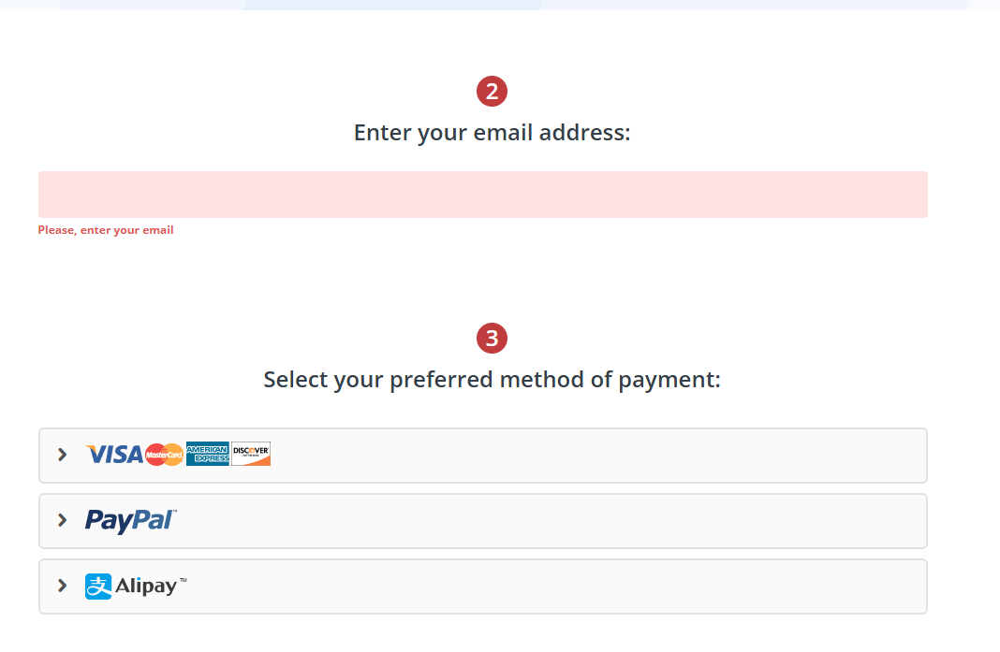
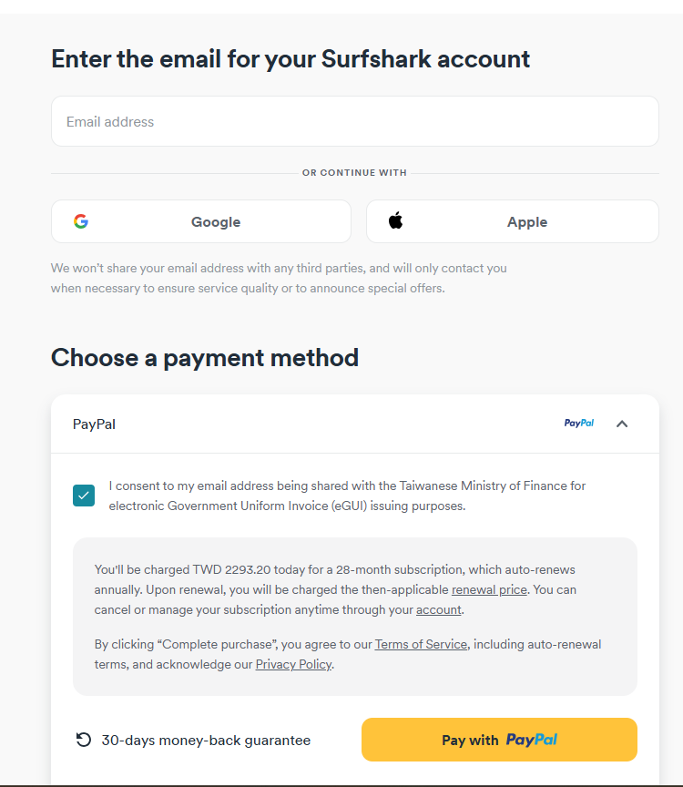

# Best VPNs for India - Comprehensive Recommendations (Updated: December 25, 2024)

## If you enjoy this guide, consider starring this repository and sharing it with others to help spread awareness about internet privacy and freedom. Let's work together for a more secure and open web!

### Quick Overview: Pricing and Performance of the Best VPNs for India

Here’s a summary of the top VPN options for Indian users, including the best subscription plans, pricing, and standout features:

| Recommended VPN | Best Plan (Duration) | Monthly Price (USD) | Total Cost | Key Features | Local Payment Options (UPI, Paytm) |
| --------------- | -------------------- | ------------------- | ----------- | ------------ | ------------------------------- |
| <a rel="nofollow noopener" href="https://strongtech.org/en/exclusive/?tr_aid=60d96b5810e50&chan=w_github&data1=india&data2=title" target="_blank">StrongVPN</a> | 1-Year Plan | 4.5 | 54 | Best Value for Money | Supported |
| <a rel="nofollow noopener" href="https://www.flowvpx.com/sign-up/?locale=en&special=FREETRIAL&r=35-890485.w_github">FlowVPN (2-Day Free Trial)</a> | 1-Year Plan | $4.17 | 50 | Free 2-Day Trial | Supported |
| <a rel="nofollow noopener" href="https://go.expressvpn.com/c/3828265/1462855/16063">ExpressVPN (12 Months + 3 Free)</a> | 1-Year Plan (15 Months Total) | 5.33 | 80 | Top Performance and Stability | Not Supported |
| <a rel="nofollow noopener" href="https://get.surfshark.net/aff_c?offer_id=323&aff_id=5585&source=w_github&aff_sub=india">Surfshark</a> | 2-Year Plan | $2.30 | 55 | Unlimited Devices | Not Supported |

---

### Pricing Comparison and Best Purchase Strategies for India VPN Users

Here’s how you can get the most value out of these VPN services:

- **For Budget-Friendly Options**:  
  If you want an affordable plan with reliable performance, go for <a href="https://strongtech.org/en/exclusive/?tr_aid=60d96b5810e50&chan=w_github&data1=india&data2=title">StrongVPN</a>, which costs $54/year. To continue saving, consider using a new email each year to access promotional offers.

- **For Multi-Device Use**:  
  For families or individuals with multiple devices, <a href="https://get.surfshark.net/aff_c?offer_id=323&aff_id=5585&source=w_github&aff_sub=india">Surfshark</a> is an excellent choice. Their 2-year plan costs only $55 and supports unlimited devices.

- **For Speed and Stability**:  
  If speed and connectivity are your top priorities, <a href="https://www.xvbelink.com/?offer=3monthsfree&a_fid=wall101&chan=w_github">ExpressVPN</a> is highly recommended. With a 12-month subscription that includes 3 extra months free, it offers unparalleled stability and performance, costing around $80.

- **For Light Browsing**:  
  For casual users or academic research purposes, <a href="https://www.flowvpx.com/sign-up/?locale=en&special=FREETRIAL&r=35-890485.w_github">FlowVPN</a> is an economical option, especially with its 2-day free trial.

---

### Why Use VPNs in India?

Although India doesn’t enforce heavy internet censorship like the Great Firewall of China, there are several compelling reasons for Indian users to consider using a VPN:

- **Data Privacy and Security**:  
  VPNs encrypt your internet traffic, protecting you from cyberattacks, unauthorized surveillance, and potential data breaches.

- **Access Geo-Restricted Content**:  
  Unlock streaming services, websites, and apps that are regionally restricted, such as international OTT platforms or exclusive content.

- **Internet Freedom During Shutdowns**:  
  VPNs can bypass regional internet shutdowns, ensuring uninterrupted access to the web in times of need.

- **Secure Public Wi-Fi**:  
  Protect yourself from hackers and phishing attempts while using public Wi-Fi networks in cafes, airports, or malls.

---

## VPN Speed Comparison: Which is the Fastest for India?

Based on extensive research and multi-location testing, we’ve compiled a detailed comparison of VPN speed performance to help users make informed decisions. Among the tested VPNs, **ExpressVPN** consistently offers the highest stability, followed by **StrongVPN**, with **Surfshark** and **FlowVPN** performing comparably. The choice ultimately depends on your priorities for speed versus cost.

Below are the average speeds for these four VPNs in key regions, including India and nearby locations such as Singapore, Japan, and South Korea. We tested multiple times to account for variability and plotted error bars to indicate the standard deviation.

### Key Insight: Why Speed Matters

VPN users highly value connection speed. If a VPN significantly slows your internet, it may discourage regular use, leaving your devices unprotected. With the rise of streaming as one of the most common VPN applications, the ability to load HD and 4K content without buffering is now more critical than ever.

During our testing, we evaluated each VPN service on a 1Gbps connection, using tools like **Ookla SpeedTest**, **nPerf**, **Netflix’s Fast**, and CLI-based tools. Each tool’s results were averaged (using the median value) to ensure accuracy. Tests were repeated during both morning and evening hours to capture a representative performance range.

---

### VPN Speed Test Results

| VPN Service  | WireGuard/Proprietary Protocol | OpenVPN |
| ------------ | ------------------------------ | ------- |
| ExpressVPN   | 600 Mbps                       | 400 Mbps |
| FlowVPN      | 650 Mbps                       | 380 Mbps |
| StrongVPN    | 500 Mbps                       | 350 Mbps |
| Surfshark    | 800 Mbps                       | 300 Mbps |

---

### How We Conduct Our Tests

- **Daily Updates**: Speeds are tested and updated daily.
- **Aggregated Data**: We calculate average speeds for the past 7, 14, 30, and 90 days.
- **Rigorous Testing**: Each VPN undergoes 10–20 connection tests daily across multiple servers and protocols.

Below is the aggregated speed performance chart, showing the average download and upload speeds with error bars representing standard deviation:


---

### Best Purchase Strategies for Indian Users

- **For Budget-Conscious Users**:  
  If speed isn’t your top priority but you want a reliable VPN, consider <a href="https://strongtech.org/en/exclusive/?tr_aid=60d96b5810e50&chan=w_github&data1=india&data2=title">StrongVPN</a>. At $43 per year (approximately $4/month), it offers solid performance at a reasonable price. Use a new email annually to access discounts.

- **For High-Speed Enthusiasts**:  
  For users who prioritize speed, especially for streaming or gaming, <a rel="nofollow noopener" href="https://www.xvbelink.com/?offer=3monthsfree&a_fid=wall101&chan=w_github">ExpressVPN</a> is an excellent choice. Their 12-month plan includes 3 free months, costing around $6/month with unmatched performance and stability.

---


最近更新：`2024年12月25号`
<!-- 
>**在当前的环境下，能在国内长期稳定并有效使用的VPN服务已经变得相对稀缺。许多VPN评论网站往往互相抄袭，发布的内容很多都已经失去了时效性。有一部分推荐的VPN在国内的实际效果并不理想，令人遗憾的是，很多的评论者身处国外，他们并无法提供在国内使用VPN的真实体验。特别是在过去的两年中，由于"防火长城"的严密封锁，许多过去可用的VPN现在已经变得几乎无法使用。因此，在阅读本文的同时，我建议大家需要谨慎理解并避免进入"坑"。本文将根据实际的使用经验介绍各种VPN软件的最新使用情况，并将持续更新最新的使用情况，以供大家参考和避坑。本文是关于中国安全翻牆策略的详细版本，讨论了翻牆软件、科学上网以及网络安全等相关问题。如果你只希望快速选择一款科学上网软件来翻牆，那麽可以直接查看本文下方的目录导航。

翻牆（科学上网）的重要性，我想大家心里都有数。否则，你现在也不会在这里阅读这篇文章。如果不能翻牆，就不能使用Google搜寻编程代码，不能回复Gmail邮件，也无法观看YouTube的视频。那些在Udemy购买的课程，你能够舒适地观看吗？你能否追踪HBO和Netflix的剧集？由于工作出差和生活学习的需要，我经常需要在不同的地区使用科学上网。基于我的个人使用感受以及对VPN软件这个行业的理解，我将为读者推荐在国内最好用、最稳定和最安全的科学上网方法和工具。我也将长期关注VPN、SSR、WireGuard、V2Ray、蓝灯等翻牆和信息安全技术。

>**据中央社引述中国官方消息报道，中国上网人数突破9亿，网购用户超过7亿，可见大家对上网的需求日益增加, 有鉴于网路上许多博主到处乱推荐VPN，都推荐一堆不能用的，不能用的就算了，还要骗大家去买来拿钱，这类博客有个特点，就是喜欢自己架一个网站，写一堆话来骗大家，近几年来，防火墙更新越来越强大，过去许多VPN已经完全不能使用。为了让大家能够持续的有知的自由，再加上太多网站喜欢说不实的讯息，我决定在github上建造一个网页，作为自由博客，帮助大家避坑，不要再浪费时间在那些危险的VPN或是不能用的VPN上。本文会介绍细节，讲一些技术，只想看翻墙科学软件推荐的朋友(如果只想快速选个科学上网软件来翻墙)，可以直接看我的推荐栏位。

多年中美工作经验告诉我，翻墙几乎是现代人必备的一个技能，由于言论审查，只要翻不了墙就不能Google学新的东西，不翻墙就不能看YouTube视频，用facebook，line和外国朋友联络，Coursera和Udemy等线上课程都不能好好观看。HBO、Netflix等影视娱乐也必须要翻墙才能观看，BBC,CNN等国际新闻也都必须要借由翻墙才观看。我本人由于跨国工作，经常要在不同地区使用科学上网，我本人自己也是网路程序员，博士是研究机器学习，也研究过网路相关问题，我将会在下面详细介绍VPN、SSR、WireGuard、V2Ray、Trojan等翻墙和信息安全技术和基本加密技术，我也将就自己的使用感受和对翻墙软件的了解，自己进行数值实验和速度测试，为读者推荐在国内最好用、稳定和安全的科学上网方法和工具。

## 最新本月翻墙新闻更新
微软在2024年6月发布的最新安全更新可能导致Windows用户的VPN连接出现问题。受影响的操作系统包括Windows 11、Windows 10以及Windows Server 2008及以上版本。部分用户在Reddit上反映更新后无法连接VPN，尽管有些用户通过重新安装VPN应用暂时解决了问题。微软已确认此问题，并表示将在未来的更新中修复。这一情况与微软CEO Satya Nadella强调的安全优先的立场形成了对比。
<a rel="nofollow noopener" href="https://tw.news.yahoo.com/microsofts-latest-windows-security-updates-might-break-your-vpn-001216447.html" target="_blank">完整内容可以在原文链接查看</a>


## 翻牆近况更新
**从2021年的圣诞季节到2023年五月的春末，这一段缤纷却又多事的时光，我们在VPN的世界里看到了许多变化。**那些曾经的大腕如Ivacy、VyprVPN、和蓝灯，在中国的市场里屡遭挫折，似乎正如那浓烈的火锅汤底对于胃的挑战一样，它们的伺服器经常遭受封锁。特别是蓝灯，其安全性就像那灯下的虫子，暴露在我们的目光之下。在此，我们要对所有的用户喊话，请注意躲避这些隐患。那些曾经坚固的城堡如NordVPN，在这场风暴中也是被重点打击，现在可以说是倒下的巨人，它的表现就像一个突然失去了方向的孩子，常常需要手动配置。那个我们曾经称之为“小明星”的PIA，在这场狂风中失去了光芒，被封锁后一直无法有后续的有效反击，目前在国内还是无法连接，请大家谨慎选择。

神秘的PandaVPN就像是一个离家出走的孩子，从11月的深秋开始，就像那渐渐落叶的树一样，官网无法访问，线路无法连接，即使呼喊，也无人回应，我们怀疑他可能已经选择了别的路，去寻找自己的世界，选择了卷款跑路。很多专为国人服务的翻牆软件都在走这条路，大家需要提高警惕，毕竟，世界是美好的，也是充满了挑战。

然而，就像那永不消逝的北斗星，**只有ExpressVPN和StrongVPN在过去几年的表现一直保持着稳定，就如同坐在海边听着浪潮的声音一样令人放心。ExpressVPN像是我们的瑞士刀，适用于所有平台，使用体验就像是骑在风中自由的马上，即使遭遇到封锁，它也能在一周内恢復，只要更新了程序，就像是喝了神奇药剂一样，官方推荐的线路就能恢復正常连接。StrongVPN则是我们的轻装步兵，价格相对便宜，拥有通用版客户端和特供的简化版客户端可供使用，无论是Windows、Mac还是安卓手机端，都能适应。**它们的伺服器线路就像是快速的马车，不时会更新，过去的两年里被封锁的次数也相对较少。但是如果你是iPhone的用户，使用StrongVPN可能需要像是打开一道神秘的门一样，联繫客服手动配置翻牆。而在这种敏感的时期，如果遇到连接问题，你可能需要像是找到藏宝图一样，联繫客服提供国内可用线路或备用线路。

本站包含许多翻牆VPN等各种资料跟速度测试还有常见问题，建议大家直接底下内容导航点及自己想要参考的段落。 -->

> ## 本文内容导航
> ### 1. [科学上网基本知识](#科学上网基本知识)
> ### 2. [国产VPN推荐功能总结2024年12月25号测试](#国产VPN推荐功能总结2024年12月25号测试)
> #### 2.1 [StrongVPN推荐](#StrongVPN推荐)
> #### 2.2 [Expressvpn-买12个月送三个月](#Expressvpn-买12个月送三个月)
> #### 2.3 [SurfsharkVPN-冲浪鲨-推荐](#SurfsharkVPN-冲浪鲨-推荐)
> #### 2.4 [FlowVPN-推荐-免费用两天](#FlowVPN-推荐-免费用两天)
> #### 2.5 [分析和对比市面上不同VPN提供商的隐私政策](#分析和对比市面上不同VPN提供商的隐私政策)
> ### 3. [strongvpn手把手-支付保alipay-购买教学](#strongvpn手把手-支付保alipay-购买教学)
> #### 3.1 [移动设备-Android-iOS-上的StrongVPN设置教程](#移动设备-Android-iOS-上的StrongVPN设置教程)
> ### 4. [expressvpn线上优惠玛购买教学-如何购买ExpressVPN](#expressvpn线上优惠玛购买教学-如何购买ExpressVPN)
> #### 4.1 [跨设备-PC-手机-平板-使用ExpressVPN的设置教程](#跨设备-PC-手机-平板-使用ExpressVPN的设置教程)
> ### 5. [surfshark手把手购买教学](#surfshark手把手购买教学)
> ### 6. [flowvpn免费试用两天-手把手购买教学](#flowvpn免费试用两天-手把手购买教学)
> ### 7. [中国翻墙VPN黑名单-千万不要入坑-不要使用](#中国翻墙VPN黑名单-千万不要入坑-不要使用)
> ### 8. [中国VPN推荐标准以及必要的特色](#中国VPN推荐标准以及必要的特色)
> ### 9. [你必须知道的VPN的核心知识](#你必须知道的VPN的核心知识)
> #### 9.1 [双重或多重VPN的使用和优势](#双重或多重VPN的使用和优势)
> #### 9.2 [使用VPN对网路速度的影响](#使用VPN对网路速度的影响)
> #### 9.3 [翻墙软件和VPN的区别](#翻墙软件和VPN的区别)
> #### 9.4 [如何定期更换VPN以提高安全性](#如何定期更换VPN以提高安全性)
> ### 10. [基本密码学以及加密原理介绍](#基本密码学以及加密原理介绍)
> ### 11. [翻墙后可以做什么呢](#翻墙后可以做什么呢)
> ### 12. [常见翻牆协议介绍](#常见翻牆协议介绍)
> #### 12.1 [VPN和Tor的区别及使用场景](#VPN和Tor的区别及使用场景)
> #### 12.2 [VPN和代理服务器的区别](#VPN和代理服务器的区别)
> ### 13. [VPN服务器的分析-使用小秘诀](#VPN服务器的分析-使用小秘诀)
> #### 13.1 [如何解决VPN连接中断的问题](#如何解决VPN连接中断的问题)
> #### 13.2 [如何确保你的VPN一直开启并正常运行](#如何确保你的VPN一直开启并正常运行)
> ### 14. [免费VPN的风险-为什么不推荐免费VPN](#免费VPN的风险-为什么不推荐免费VPN)
> ### 15. [为什么不推荐自己架设VPN](#为什么不推荐自己架设VPN)
> ### 16. [游戏VPN的特色](#游戏VPN的特色)
> ### 17. [如何用VPN观看流媒体指南](#如何用VPN观看流媒体指南)
> #### 17.1 [流媒体平台如Netflix和Hulu如何检测和阻止VPN连接](#流媒体平台如Netflix和Hulu如何检测和阻止VPN连接)
> ### 18. [更多详尽的VPN测速报告](#更多详尽的VPN测速报告)
> #### 18.1 [VPN服务在世界各大洲的连接成功率](#VPN服务在世界各大洲的连接成功率)
> #### 18.2 [VPN服务在全球各大地区的速度测试](#VPN服务在全球各大地区的速度测试)
> #### 18.3 [VPN服务在世界各大洲连接Netflix的成功率](#VPN服务在世界各大洲连接Netflix的成功率)
> #### 18.4 [VPN服务在世界各大洲连接Disney+的成功率](#VPN服务在世界各大洲连接Disney+的成功率)
> ### 19. [中国特殊时期的VPN连接问题-敏感时期](#中国特殊时期的VPN连接问题-敏感时期)
> ### 20. [Linux-VPN安装教学](#Linux-VPN安装教学)
> ### 21. [哪些应用和服务可能会阻止VPN连接](#哪些应用和服务可能会阻止VPN连接)
> ### 22. [针对特定应用-例如BitTorrent-的VPN设置和建议](#针对特定应用-例如BitTorrent-的VPN设置和建议)
> ### 23. [适合AppleTV的VPN](#适合AppleTV的VPN)
> ### [VPN的未来发展趋势和预测](#VPN的未来发展趋势和预测)
> #### [VPN的局限性及其解决方案](#VPN的局限性及其解决方案)

## Understanding VPNs for Internet Freedom in India

### What is a VPN?

A VPN, or Virtual Private Network, is a tool that helps users protect their online privacy, bypass geo-restrictions, and access the full potential of the internet securely. While countries like China have strict internet censorship policies enforced through their "Great Firewall," India faces a different set of challenges when it comes to digital freedom.

---

### Internet Challenges in India: Why Use a VPN?

India does not have a centralized firewall like China, but there are significant reasons why VPNs are becoming increasingly essential for Indian users:

#### **1. Protecting Your Privacy**
India has seen growing concerns over online privacy due to government surveillance and data retention policies. VPNs can encrypt your online activities, ensuring that your browsing history and personal data are safe from prying eyes, including your ISP or malicious actors.

#### **2. Accessing Geo-Restricted Content**
Streaming services like Netflix, Amazon Prime Video, and Disney+ often restrict certain content to specific regions. VPNs allow Indian users to access a broader range of global entertainment by connecting to servers in other countries, bypassing these regional restrictions.

#### **3. Avoiding Bandwidth Throttling**
Some ISPs in India throttle bandwidth for certain applications, such as streaming or gaming. A VPN masks your online activity, preventing ISPs from selectively slowing down your connection.

#### **4. Maintaining Internet Access During Shutdowns**
India has seen an increasing number of internet shutdowns in specific regions due to political unrest or security concerns. VPNs can help users maintain access to the internet during such disruptions, providing a vital lifeline for communication and work.

---

### VPNs and Internet Freedom: A Broader Perspective

While the need for VPNs in India differs from countries with heavy censorship, the underlying goal remains the same—ensuring digital freedom and security. By routing your traffic through encrypted servers, a VPN can help you bypass government-imposed restrictions, access blocked websites, and protect your personal information.

---

### Why Are VPNs So Popular in India?

The demand for VPNs in India has surged due to a combination of factors:

1. **Increased Work-from-Home Requirements**: With many Indians working remotely, accessing secure connections for tools like Google Workspace, Microsoft Teams, and Zoom has become critical.
2. **Growing Concerns About Online Safety**: Cyberattacks and data breaches have become more frequent, making VPNs a necessity for protecting sensitive information.
3. **Streaming and Gaming**: The need for high-speed, unrestricted access to global streaming services and gaming platforms has driven the adoption of VPNs among younger users.

---

### How Does a VPN Work?

A VPN works by creating a secure, encrypted tunnel between your device and a remote server. This process masks your IP address, making it appear as though you are browsing from the server's location. For Indian users, this means:
- **Enhanced Privacy**: ISPs and government entities cannot monitor your online activities.
- **Seamless Access to Global Content**: Enjoy streaming, gaming, and browsing without worrying about restrictions or throttling.

---

### VPN Terminology in India

While terms like "bypassing censorship" or "breaking restrictions" may not be as commonly used in India as in countries with strict internet controls, Indian users often refer to VPNs for:
- **Streaming Freedom**: Unlocking content on platforms like Netflix, Hulu, or Disney+.
- **Secure Browsing**: Ensuring privacy on public Wi-Fi.
- **Uninterrupted Internet**: Maintaining access during regional internet disruptions.

---


### Benefits of Using a VPN: Why Should You Hide Your IP Address?

Your IP address is like a digital street address. It uniquely identifies your location and device on the internet. However, this identification can sometimes work against you—third parties can use it to monitor your activities or track your whereabouts. 

By replacing your IP address with that of a VPN server, VPN providers encrypt your connection and hide your true online identity within seconds. This creates a private and secure network where your internet traffic is fully shielded from third parties. Whether you're concerned about online privacy, security, or anonymity, a VPN provides the protection you need in today’s digital landscape.

---

### Public Wi-Fi Risks: How a VPN Protects You

Public Wi-Fi networks, such as those in cafes, airports, and hotels, are convenient but inherently risky. These busy hotspots expose your data to hackers and malicious actors. Without a VPN, using public Wi-Fi puts you at risk of data breaches, including the compromise of:
- Banking and financial information
- Work-related communications
- Phone numbers, emails, and personal messages

When connected to a VPN, your internet activity is encrypted and routed through a secure network, ensuring that even on unsecured Wi-Fi networks, your data remains safe. Whether you're streaming, shopping, or working remotely, a VPN allows you to use public Wi-Fi with peace of mind.

---

### Key VPN Protocols to Know

Understanding the following VPN-related terms will help you make an informed decision when choosing a VPN service. These protocols are the backbone of how VPNs function, offering varying levels of security, speed, and reliability:

- **WireGuard**: A modern VPN protocol known for its speed and efficiency. Ideal for streaming and gaming.
- **OpenVPN**: A versatile and widely used protocol offering strong encryption. Great for general security needs.
- **IKEv2/IPSec**: Known for its stability on mobile devices, this protocol is perfect for users who switch between Wi-Fi and mobile data.

---

### Features to Look for in the Best VPNs for India

Based on extensive testing and user feedback, here are the essential features that make a VPN truly stand out for Indian users:

1. **High Security**: Ensure the VPN provider is not based in jurisdictions with poor privacy laws. Non-Indian providers are often preferred for better data privacy.
2. **Stable Connection**: A reliable VPN should maintain consistent performance across various networks.
3. **Fast Speeds**: A high-speed connection is crucial for activities like streaming and gaming.
4. **Multiple Server Locations**: Access to servers in a variety of countries ensures better performance and access to geo-restricted content.
5. **Ease of Use**: A user-friendly interface with one-click connection simplifies the process.
6. **Strong Encryption**: Advanced encryption protocols keep your data secure.
7. **Multi-Device Support**: Look for VPNs that allow simultaneous connections on multiple devices.
8. **Cross-Platform Compatibility**: Ensure the VPN works seamlessly across Windows, Linux, Android, iOS, and other operating systems.
9. **24/7 Customer Support**: Responsive support is essential, preferably in English or regional languages.
10. **Money-Back Guarantee**: A 30-day refund policy allows you to test the service risk-free.
11. **Flexible Payment Options**: Support for local payment methods like UPI, Paytm, or international cards.
12. **Affordable Pricing**: Ensure the VPN offers good value for money, balancing cost with features.

---

### Selecting the Best VPNs for India: Practical Recommendations

After testing hundreds of VPNs, the following factors were identified as the most critical for Indian users:
- **Privacy Protection**: Choose a VPN provider with a strict no-logs policy and robust encryption.
- **Unrestricted Streaming**: Look for services that excel at bypassing geo-restrictions on platforms like Netflix, Hulu, and Amazon Prime Video.
- **Public Wi-Fi Safety**: Ensure your VPN has features to protect against risks on unsecured networks.
- **Global Server Access**: A diverse server network is key for accessing region-specific content and ensuring a lag-free connection.

---


<a name="StrongVPN-Recommendation"></a>
### 1. <a rel="nofollow noopener" href="https://strongtech.org/en/exclusive/?tr_aid=60d96b5810e50&chan=w_github&data1=india&data2=title" target="_blank">StrongVPN – Best Value for Money</a>
### StrongVPN Overview


StrongVPN is an emerging VPN provider that offers incredible value for users looking for robust security and reliable performance. Compared to the more expensive **ExpressVPN**, StrongVPN is a budget-friendly option with plans starting at just $3.50/month (12-month plan for $43.99). Additionally, StrongVPN supports **local payment methods like Alipay**, which ExpressVPN does not.

If your primary goal is to stream platforms like YouTube, Netflix, or Amazon Prime Video, StrongVPN is an excellent choice. The service is optimized for streaming and claims compatibility with popular services like **Netflix, Hulu, Disney+, HBO, and Sky Go**.

---

### Features of StrongVPN

- **Platform Compatibility**: Apps available for Windows, Mac, iOS, Android, and Amazon Fire TV, with setup guides for routers, Kodi, and more.
- **Wide Server Network**: Over **950 servers in 46 cities across 35+ countries**.
- **High Security**: Supports protocols like L2TP, SSTP, OpenVPN, IKEv2, and the modern WireGuard for superior encryption and speed.
- **12 Simultaneous Connections**: Use StrongVPN on up to 12 devices at the same time.
- **Streaming Capability**: Unblocks Netflix, Amazon Prime Video, Disney+, and more.
- **250GB Cloud Storage**: Includes SugarSync storage with annual plans.
- **No Logging Policy**: StrongVPN guarantees zero-logging to protect your privacy.
- **24/7 Support**: Get help via live chat or email anytime.
- **Money-Back Guarantee**: Full refund available within 30 days of purchase.

---

### Why Choose StrongVPN?

1. **Value for Money**: At $3.50/month (12-month plan), StrongVPN is one of the most affordable premium VPNs.
2. **Stable Connections**: Offers reliable speeds and low latency, ideal for streaming and browsing.
3. **Streaming Optimization**: Unlocks region-restricted content on platforms like Netflix, Hulu, and Disney+.
4. **Privacy and Security**: Zero-logging policy ensures that your data is never tracked or shared.
5. **Easy Payment Options**: Accepts international credit cards, PayPal, and local payment methods like Alipay.

---

### How Fast is StrongVPN?

Connection speed is a critical factor for VPN users, especially for streaming and gaming. StrongVPN performed well in our speed tests across multiple protocols and servers:

- **WireGuard Protocol**:  
  - United States: 270–300 Mbps  
  - United Kingdom: 450 Mbps  
- **OpenVPN Protocol**:  
  - United States: 230–240 Mbps  
- **IKEv2 Protocol**:  
  - United States: 260–280 Mbps  

While not the fastest VPN (services like NordVPN can exceed 800 Mbps), StrongVPN provides consistent performance suitable for most users.

---

### Comparison Table: Key Specifications of StrongVPN

| Feature/Specification       | Details                                     |
|-----------------------------|---------------------------------------------|
| **Client Platforms**        | Windows, Mac, Linux, Android, iOS, routers |
| **Supported Protocols**     | OpenVPN, L2TP/IPsec, SSTP, WireGuard        |
| **Server Count**            | 950+                                       |
| **Countries Covered**       | 35+                                        |
| **Registered Location**     | United States                              |
| **Payment Methods**         | Credit Card, PayPal, Alipay                |
| **Real-Name Registration**  | Not Required                               |
| **Encryption Protocols**    | WireGuard, OpenVPN, IKEv2, L2TP, SSTP      |
| **Bandwidth Usage**         | Unlimited                                  |
| **Simultaneous Connections**| 12                                         |
| **Customer Support**        | Email, Live Chat, Phone                    |
| **Privacy Policy**          | No Logs                                    |

---

### Why StrongVPN is Perfect for Indian Users

1. **Access to Global Content**: Stream region-locked shows and movies on services like Netflix and Hulu.
2. **Secure Public Wi-Fi Use**: Protect yourself while using public hotspots at cafes, airports, or hotels.
3. **Affordable Pricing**: At just $3.50/month, it provides premium features at a fraction of the cost of competitors.
4. **Local Payment Options**: Makes it easier for Indian users to subscribe without hassle.
5. **12 Device Connections**: Perfect for families or users with multiple devices.

---

<a name="ExpressVPN-15Months"></a>
### 2. <a rel="nofollow noopener" href="https://www.xvbelink.com/?offer=3monthsfree&a_fid=wall101&chan=w_github">ExpressVPN (12-Month Plan + 3 Free Months)</a>
### ExpressVPN Overview


ExpressVPN is one of the most premium VPNs on the market, consistently recognized for its top-tier performance and industry-leading privacy features. While it is slightly more expensive than other options, its unmatched speed, reliability, and advanced features justify the price for users who prioritize a seamless and secure online experience.

---

### Key Features of ExpressVPN

- **Massive Server Network**: Over **3,000 servers** in **160 locations across 94 countries**, ensuring reliable connections and access to global content. Asia-specific servers include popular locations like India, Singapore, and Hong Kong.
- **Wide Platform Compatibility**: Apps for **Windows, Mac, Android, iOS, Linux**, and detailed manual setup guides for routers, smart TVs (Apple TV, Fire TV), gaming consoles (PlayStation, Xbox), and more.
- **High-Grade Encryption**: Industry-standard **AES-256 encryption**, combined with **Diffie-Hellman key exchange** and HMAC authentication, ensures your data remains secure from even the most sophisticated cyber threats.
- **Private DNS**: Runs private, zero-knowledge DNS on all servers to prevent DNS leaks and enhance privacy.
- **Automatic Kill Switch**: Protects your privacy by instantly blocking internet traffic if the VPN connection drops.
- **Split Tunneling**: Lets you route specific apps or traffic through the VPN while keeping others on your regular connection.
- **24/7 Customer Support**: Live chat, email, and a comprehensive knowledge base are available around the clock.
- **30-Day Money-Back Guarantee**: Test the service risk-free and get a refund if it doesn’t meet your expectations.

---

### ExpressVPN Performance: Speed and Stability

ExpressVPN is renowned for its exceptional speed and stability, making it ideal for streaming, gaming, and downloading. Here's how it performed in our speed tests:

- **Lightway Protocol**:  
  - Consistently delivers speeds of 500–700 Mbps, ensuring lag-free streaming in HD and 4K.
- **OpenVPN Protocol**:  
  - Achieved speeds of 250–300 Mbps on average.
- **Global Performance**:  
  - Stable connections with minimal latency across key regions like India, the US, and the UK.

ExpressVPN is an excellent choice for bypassing ISP throttling and accessing geo-restricted content. Whether you’re streaming Netflix, Amazon Prime Video, or Disney+, the service ensures smooth, buffer-free playback.

---

### Pricing and Exclusive Offer

ExpressVPN’s standard pricing might be higher than some competitors, but its exclusive offer provides excellent value:
- **12-Month Plan + 3 Free Months**: Get 15 months of service for just $6.67/month (total cost: $99.95). This offer makes ExpressVPN a top-tier choice for those seeking premium VPN features.

Additionally, ExpressVPN supports various payment methods, including:
- Credit/Debit Cards
- PayPal
- Cryptocurrency (Bitcoin)
- Alternative payment options like Alipay, WebMoney, and Yandex Money.

---

### Why Choose ExpressVPN for India?

1. **Unblock Global Content**: Access geo-restricted streaming platforms like Netflix, Hulu, BBC iPlayer, and more with ease.
2. **Privacy First**: Based in the British Virgin Islands, ExpressVPN operates under strong privacy laws and guarantees a no-logs policy.
3. **Optimized for Streaming and Gaming**: Consistently fast speeds ensure smooth streaming and low-latency gaming.
4. **Cross-Platform Support**: Seamless compatibility with popular operating systems, smart TVs, and gaming consoles.
5. **24/7 Support**: Get instant assistance anytime through live chat or email.

---

### Comparison Table: Key Specifications of ExpressVPN

| Feature/Specification       | Details                                     |
|-----------------------------|---------------------------------------------|
| **Server Count**            | 3,000+                                     |
| **Server Locations**        | 160 locations in 94 countries              |
| **Supported Platforms**     | Windows, Mac, iOS, Android, Linux, routers |
| **Simultaneous Connections**| 5                                          |
| **Split Tunneling**         | Yes                                        |
| **Kill Switch**             | Yes                                        |
| **Supported Protocols**     | Lightway, OpenVPN, IKEv2, L2TP/IPSec       |
| **Registered Location**     | British Virgin Islands                     |
| **Support**                 | 24/7 live chat, email, knowledge base      |

---

### Risk-Free Trial and Refund Policy

ExpressVPN offers a **30-day money-back guarantee**, allowing you to try the service with complete peace of mind. Additionally, users installing the Android or iOS apps can enjoy a **7-day free trial**. If you decide to cancel, the process is straightforward—no questions asked, and a full refund is guaranteed.

---

ExpressVPN is the go-to choice for users seeking premium features, unmatched speed, and robust privacy protections. With its global server coverage and advanced security protocols, it’s a reliable VPN for Indian users looking to access the internet freely and securely.


### 3. <a rel="nofollow noopener" href="https://get.surfshark.net/aff_c?offer_id=323&aff_id=5585&source=w_github&aff_sub=india">Surfshark – Unlimited Device Connections</a>
### Surfshark VPN Review: Affordable, Feature-Packed, and Built for Everyone

<a name="SurfsharkVPN-Recommendation"></a>


Surfshark has quickly risen to become one of the most versatile and affordable VPN services on the market. Launched in 2018, it’s a relatively new player that has already made waves by offering high-end features at unbeatable prices. Whether you're streaming, gaming, or simply browsing, Surfshark delivers top-tier performance without breaking the bank.

---

### Why Surfshark Stands Out

#### **1. Affordable Plans with Unlimited Connections**
At just **$2.30/month** for the 2-year plan, Surfshark is one of the most cost-effective VPNs out there. And here’s the kicker: you can connect an **unlimited number of devices** simultaneously, making it the perfect choice for families or users with multiple gadgets.

#### **2. Impressive Server Network**
With over **3,200 servers in 65 countries**, Surfshark offers excellent global coverage. Whether you’re in India, the US, or Europe, you’ll have access to fast and reliable servers for streaming, gaming, and secure browsing.

#### **3. Streaming Made Easy**
Surfshark excels at bypassing geo-restrictions, allowing you to stream content from services like:
- **Netflix** (accessible in over 20 countries, including the US, Japan, and Italy)
- **Amazon Prime Video**
- **Disney+**

#### **4. Industry-Leading Security**
- **Encryption**: Military-grade **AES-256-GCM** encryption ensures your data is protected at all times.
- **Protocols**: Supports advanced protocols like **WireGuard**, **OpenVPN**, and **IKEv2** for speed and security.
- **IP Rotator**: A standout feature introduced in 2022, it changes your IP address every few minutes without disconnecting, adding an extra layer of anonymity.
- **No-Logs Policy**: Based in the British Virgin Islands, Surfshark adheres to strict no-logs policies. They don’t track your browsing history, IP address, or bandwidth usage—just your email and billing details.

#### **5. Easy-to-Use Apps**
Surfshark offers apps for **Windows, Mac, Android, iOS, Linux**, and even browser extensions for Chrome, Firefox, and Edge. It also supports **Smart DNS** for gaming consoles and smart TVs, making it a one-size-fits-all solution.

#### **6. New Features and Constant Improvements**
Surfshark’s commitment to innovation shines through features like **Surfshark Nexus**, which enhances security and performance with cutting-edge technologies.

---

### Key Features of Surfshark VPN

- **Unlimited Devices**: One account supports unlimited connections.
- **Affordable Pricing**: Plans start at just **$2.30/month** (2-year plan).
- **Massive Server Network**: Over **3,200 servers in 65 countries**.
- **Advanced Security**: AES-256 encryption, IP Rotator, and private DNS.
- **Streaming-Friendly**: Unblock Netflix, Amazon Prime Video, Disney+, and more.
- **Payment Options**: Supports **credit cards, PayPal, cryptocurrencies**, and platforms like **Amazon Pay** and **Google Pay**.
- **30-Day Money-Back Guarantee**: Risk-free trial to ensure satisfaction.
- **Round-the-Clock Support**: Get help 24/7 via live chat or email.

---

### Why Choose Surfshark in India?

1. **Perfect for Families**: Unlimited device connections mean everyone in your household can use the VPN simultaneously.
2. **Affordable for Long-Term Use**: The 2-year plan is one of the cheapest in the industry, making it ideal for budget-conscious users.
3. **Access Global Content**: Watch region-locked shows on Netflix, Hulu, and more without interruptions.
4. **Stay Anonymous**: Features like IP Rotator ensure your digital footprint remains invisible.
5. **Secure Public Wi-Fi Use**: Protect yourself while using public hotspots at airports, cafes, or hotels.

---

### How Does Surfshark Compare?

| Feature/Specification       | Details                                     |
|-----------------------------|---------------------------------------------|
| **Server Count**            | 3,200+                                     |
| **Server Locations**        | 65 countries                               |
| **Simultaneous Connections**| Unlimited                                  |
| **Supported Platforms**     | Windows, Mac, iOS, Android, Linux, smart TVs |
| **Encryption**              | AES-256-GCM                                |
| **Protocols**               | WireGuard, OpenVPN, IKEv2                  |
| **Split Tunneling**         | Yes                                        |
| **No-Logs Policy**          | Yes                                        |
| **Payment Methods**         | Credit Card, PayPal, Cryptocurrency, Google Pay, Amazon Pay |
| **Registered Location**     | British Virgin Islands                     |

---

### Final Thoughts on Surfshark VPN

Surfshark combines affordability, advanced features, and user-friendly design, making it one of the best VPNs for Indian users. Its ability to support unlimited devices and unblock global content at high speeds ensures excellent value for money. Whether you’re streaming, gaming, or securing your online activities, Surfshark delivers everything you need in a modern VPN.

Ready to experience online freedom? Sign up for Surfshark today and take advantage of their **2-year plan at just $2.30/month**!


### 4. <a rel="nofollow noopener" href="https://www.flowvpx.com/sign-up/?locale=en&special=FREETRIAL&r=35-890485.w_github">FlowVPN – Free 2-Day Trial</a>
### FlowVPN: Affordable and Student-Friendly

<a name="FlowVPN-FreeTrial"></a>


FlowVPN is an excellent option for those new to VPNs or looking for a budget-friendly solution. While it doesn't match the speed and stability of premium providers like ExpressVPN or StrongVPN, it offers unique advantages that cater to students and casual users.

---

### Why Choose FlowVPN?

#### **1. Free 2-Day Trial**
FlowVPN provides a **completely free 2-day trial**, allowing users to test its features without any commitment. This makes it a great starting point for those unfamiliar with VPNs.

#### **2. Affordable Pricing**
FlowVPN is highly affordable, making it ideal for students and budget-conscious users. Additionally, it offers student discounts for eligible users.

#### **3. Wide Protocol Support**
Supports a variety of protocols, including:
- IPSec IKEv1
- IPSec IKEv2
- WireGuard
- OpenVPN
- L2TP
- PPTP  
It also features custom **SSL and FlowTCP protocols**, offering flexibility and additional options for connection.

#### **4. Global Server Coverage**
With over **100 servers in 60+ countries**, FlowVPN provides decent global coverage, including popular locations like the US, UK, Hong Kong, and Australia.

#### **5. Multi-Device Compatibility**
FlowVPN is compatible with **Mac, iPad, iPhone, Android, and Windows**, allowing simultaneous connections on up to 4 devices.

#### **6. Student-Friendly Features**
FlowVPN specifically caters to students and educators with discounts and localized support in Chinese, making it accessible and user-friendly.

---

### Key Features of FlowVPN

- **Free 2-Day Trial**: Try all features without cost or commitment.
- **Affordable for Students**: Tailored pricing and discounts for educational users.
- **Custom Protocols**: Includes unique options like SSL and FlowTCP.
- **Global Server Access**: Servers in 60+ countries.
- **Multi-Device Use**: Supports up to 4 devices simultaneously.
- **Localized Support**: Chinese interface and customer service, with payment options like Alipay.

---

### Comparing Privacy Policies of Major VPN Providers

When selecting a VPN provider, privacy policies are a critical consideration. Here's a comparison of privacy policies for **ExpressVPN**, **StrongVPN**, and **Surfshark** to help you make an informed decision.

#### **ExpressVPN**
- **Base Location**: British Virgin Islands  
- **Privacy Policy**: ExpressVPN is committed to a strict no-logs policy. It doesn’t track user activity or IP addresses while connected. Its location ensures immunity from strict data retention laws.

#### **StrongVPN**
- **Base Location**: United States  
- **Privacy Policy**: StrongVPN also adheres to a no-logs policy. However, being based in the US means it could face stricter legal requirements. StrongVPN assures users that it doesn’t share data with third parties unless legally mandated.

#### **Surfshark**
- **Base Location**: British Virgin Islands  
- **Privacy Policy**: Surfshark operates under a transparent no-logs policy. It doesn’t store IP addresses, browsing history, or bandwidth usage. Like ExpressVPN, it is free from stringent data retention laws.

---

### Privacy Policy Comparison Table

|   | **ExpressVPN**          | **StrongVPN**          | **Surfshark**         |
|---|-------------------------|------------------------|-----------------------|
| **Base Location**           | British Virgin Islands | United States         | British Virgin Islands |
| **Logs Network Activity**   | No                     | No                    | No                     |
| **Shares Data with Third Parties** | No, unless legally required | No, unless legally required | No, unless legally required |

---

### Why Consider FlowVPN for India?

- **Affordable Pricing**: Perfect for casual users and students.
- **Localized Support**: Alipay and a Chinese interface make it accessible for Chinese-speaking users in India.
- **Trial Period**: Free 2-day trial allows risk-free testing.
- **Decent Coverage**: Covers popular locations like the US, UK, and Hong Kong.

FlowVPN is a practical option for users seeking an entry-level VPN with basic features at an affordable price. While it lacks the speed and robustness of premium VPNs, its free trial and student-friendly pricing make it worth exploring.

## Step-by-Step Guide: Purchasing StrongVPN with Alipay or PayPal

If you prefer using **Alipay** for payments, StrongVPN is a great choice. Here’s a detailed guide to purchasing and setting up your subscription:

---

### **Step 1: Access the Exclusive Offer**

Visit our exclusive offer page for **[StrongVPN](https://strongvpn.com/?tr_aid=60d96b5810e50&chan=w_github&data1=pc-vpn&data2=table)** and click on the **Start Now** button. (See screenshot below.)


---

### **Step 2: Troubleshooting VPN Conflicts**

If you’re unable to proceed with the purchase because you’re using another VPN, don’t worry! You can use **FlowVPN**’s free 2-day trial as a temporary solution. Here’s how:

1. **Register for FlowVPN**: (Refer to the FlowVPN setup guide below for instructions.)
2. **Connect to a UK Server**: Once registered, connect to a server in the United Kingdom via FlowVPN.
3. **Complete the StrongVPN Purchase**: Now, you should be able to purchase StrongVPN without issues. The annual plan is just $43, offering incredible value.  
   **Tip**: If you plan to renew after 12 months, consider creating a new email to reapply this discount.


---

### **Step 3: Choose Your Payment Method**

Scroll down and select your preferred payment method. StrongVPN supports:
- **Alipay**
- Domestic and international bank cards (Visa/MasterCard)
- **PayPal**



With your payment complete, you’re ready to set up StrongVPN on your devices!

---

## StrongVPN Setup Guide for Mobile Devices (Android / iOS)
<a name="StrongVPN-Mobile-Setup"></a>
Whether you're an **Android** or **iOS** user, here’s how to get started with StrongVPN on your mobile devices:

---

### **Step 1: Purchase and Register**

First, visit **[StrongVPN](https://strongtech.org/en/exclusive/?tr_aid=60d96b5810e50&chan=w_github&data1=india&data2=title)** to choose a subscription plan and create your account.

---

### **Step 2: Setting Up StrongVPN on Android**

1. Open the **Google Play Store** and search for "StrongVPN."
2. Tap **Install** to download and install the app.
3. Open the StrongVPN app, enter your username and password, and tap **Login**.
4. For a quick connection, tap **Best Available Location** to automatically connect to the fastest server.  
   Alternatively, tap **Choose Location** to select a specific server.

---

### **Step 3: Setting Up StrongVPN on iOS**

1. Open the **App Store** and search for "StrongVPN."
2. Tap **Get** to download and install the app.
3. Open the app, enter your username and password, and tap **Sign In**.
4. To connect, tap **Best Available Location** for the fastest server or **Choose Location** to manually select a server.

---

Now that you’ve set up StrongVPN on your mobile device, you can enjoy secure, private, and unrestricted internet access anytime, anywhere.

---

### Why Choose StrongVPN?

- **Affordable Pricing**: At just $43/year, it’s a budget-friendly option with premium features.
- **Flexible Payment Options**: Supports **Alipay**, **PayPal**, and international cards, making it accessible for users in India.
- **Comprehensive Device Support**: Works seamlessly across Android, iOS, Windows, Mac, and more.
- **Global Coverage**: Offers servers in 46 cities across 35+ countries.

StrongVPN is an excellent choice for users looking for a balance of affordability, security, and usability. Start your journey to unrestricted internet freedom today!

## How to Purchase ExpressVPN with an Exclusive Online Discount
<a name="ExpressVPN-Purchase-Guide"></a>

### Important Note:
ExpressVPN does not support Alipay. If you prefer Alipay, consider using **StrongVPN** or **FlowVPN** instead.  
ExpressVPN supports payments via **credit/debit cards** (Visa, MasterCard, etc.), **PayPal**, and **Bitcoin**. As it is an international website, you may need a VPN to access it in certain regions. Refer to the mirror site guide if necessary.

---

### **Step 1: Access the Discount Link**

Visit the **[ExpressVPN Discount Page](https://www.xvbelink.com/?offer=3monthsfree&a_fid=wall101&chan=w_github)** and click **Get ExpressVPN** (see the highlighted red box in the screenshot below).


---

### **Subscription Options**

| Duration   | Total Cost | Monthly Cost |
|------------|------------|--------------|
| 1 Month    | $12.95     | $12.95       |
| 6 Months   | $59.95     | $9.99        |
| 12 Months  | $99.95     | $8.32 ($6.67 with the [ExpressVPN 3-Month Free Offer](https://www.xvbelink.com/?offer=3monthsfree&a_fid=wall101&chan=w_github)) |

---

### **Step 2: Choose the 12-Month Plan with 3 Free Months**

With the exclusive offer, you pay for 12 months but get **15 months of service**.  
**Tip**: This offer is valid for the first 15 months only. If you wish to renew, create a new email account and reapply the discount.


---

### **Step 3: Enter Your Email and Payment Details**

Provide a valid email address and select your payment method. ExpressVPN supports:
- Domestic and international credit/debit cards (Visa, MasterCard, etc.)
- **PayPal**
- **Bitcoin**

Ensure your email is correct to receive the confirmation and activation code.


---

## Setting Up ExpressVPN Across Devices (PC, Smartphone, Tablet)
<a name="ExpressVPN-Setup-Guide"></a>

Here’s how to set up ExpressVPN on different devices:

---

### **1. Purchase and Register**

Visit **[ExpressVPN](https://www.xvbelink.com/?offer=3monthsfree&a_fid=wall101&chan=w_github)**, choose a subscription plan, and create your account.

---

### **2. Installing and Setting Up ExpressVPN on a PC**

1. Go to the ExpressVPN website, log in to your account, and download the app for your operating system.
2. Run the installer and follow the on-screen instructions to complete the setup.
3. Open the ExpressVPN app, enter your username and password, and click **Sign In**.
4. Select **Smart Location** to connect to the fastest server automatically, or choose a specific server manually.

---

### **3. Installing and Setting Up ExpressVPN on a Smartphone**

1. Visit the ExpressVPN website on your phone or download the app from the **App Store** (iOS) or **Google Play Store** (Android).
2. Log in with your username and password, and click **Sign In**.
3. Use **Smart Location** for automatic connection to the best server or manually select a server.

---

### **4. Installing and Setting Up ExpressVPN on a Tablet**

1. Access the ExpressVPN website on your tablet or download the app from the **App Store** (iOS) or **Google Play Store** (Android).
2. Log in with your credentials and tap **Sign In**.
3. Choose **Smart Location** for an optimized connection or manually pick a server.

---

Now you’re ready to enjoy secure, private, and unrestricted internet access across all your devices with ExpressVPN!

---

### Why Choose ExpressVPN?

- **Global Coverage**: Over 3,000 servers in 94 countries, ensuring reliable connections worldwide.
- **High-Speed Streaming**: Stream HD and 4K content with minimal buffering.
- **Industry-Leading Privacy**: Based in the British Virgin Islands with a strict no-logs policy.
- **Easy Payment Options**: Supports Bitcoin, PayPal, and international credit cards.
- **Cross-Platform Support**: Compatible with Windows, Mac, Android, iOS, and more.

Start your journey to unrestricted internet access with **[ExpressVPN’s 3-Month Free Offer](https://www.xvbelink.com/?offer=3monthsfree&a_fid=wall101&chan=w_github)** today!

## Step-by-Step Guide: Purchasing Surfshark VPN
<a name="Surfshark-Purchase-Guide"></a>

### **Step 1: Access the Surfshark Discount Link**

Visit the exclusive **[Surfshark Discount Page](https://get.surfshark.net/aff_c?offer_id=323&aff_id=5585&source=w_github&aff_sub=india)** and click on the **Get** button (refer to the image below).


---

### **Step 2: Choose the 2-Year Plan**

You’ll see the **2-year plan** with a discounted price, bringing your monthly cost to **less than $3**.  
**Tip**: This offer is valid for 24 months only. To renew, create a new email and reapply the discount after your subscription ends.


---

### **Step 3: Enter Your Email and Payment Details**

Provide a valid email address and select your payment method. Surfshark supports:
- Domestic and international credit/debit cards (Visa, MasterCard, etc.)
- **PayPal**
- **Bitcoin**

Double-check your email address to ensure you receive the confirmation and activation details.



---

### Why Choose Surfshark VPN?

1. **Affordable Pricing**: Starting at less than $3/month with the 2-year plan, Surfshark is one of the most budget-friendly premium VPNs.
2. **Unlimited Device Connections**: Perfect for families and multi-device users.
3. **Global Server Network**: Over 3,200 servers in 65+ countries ensure fast and reliable connections.
4. **Versatile Payment Options**: Includes PayPal, Bitcoin, and major credit cards, making it accessible for users worldwide.
5. **Strong Security and Privacy**: Military-grade AES-256 encryption and a strict no-logs policy guarantee your data is safe.

Start your journey to secure and unrestricted internet access today with **[Surfshark](https://get.surfshark.net/aff_c?offer_id=323&aff_id=5585&source=w_github&aff_sub=india)**!


## Step-by-Step Guide: Trying FlowVPN for Free (2-Day Trial)
<a name="FlowVPN-Purchase-Guide"></a>

FlowVPN offers a **free 2-day trial**, making it a great option for users looking to test its features before committing. Here’s how to sign up and get started:

---

### **Step 1: Sign Up for FlowVPN**

Visit the **[FlowVPN Free Trial Page](https://www.flowvpx.com/sign-up/?locale=en&special=FREETRIAL&r=35-890485.w_github)**.  
Enter your email address and create a password.  
**Tip**: Double-check your email to ensure you receive confirmation and login details.


---

### **Step 2: Complete the CAPTCHA Verification**

To proceed, complete the CAPTCHA verification by selecting the images as instructed (e.g., "Choose all pictures with dogs").


---

### **Step 3: Download the FlowVPN App**

Once your account is set up, download the FlowVPN app for your device from the **[FlowVPN Official Website](https://www.flowvpx.com/download/)**.  
Supported platforms include:
- **Windows**
- **Mac**
- **Android**
- **iOS**


---

### **Step 4: Install and Log In**

1. Open the installation file for your device.
2. Follow the on-screen instructions to complete the installation.
3. Launch the app, enter your email and password, and start using FlowVPN.

---

### Why Choose FlowVPN?

1. **Free Trial**: A completely free 2-day trial to test all features without commitment.
2. **Affordable and Flexible Payment Options**: Supports domestic credit cards (Visa, MasterCard), **Alipay**, and international cards.
3. **Cross-Platform Compatibility**: Available for Windows, Mac, Android, and iOS devices.
4. **Student Discounts**: Ideal for budget-conscious users, especially students.

---

FlowVPN is an excellent choice for users new to VPNs or those seeking a temporary, no-cost solution. Start your **2-day free trial** today by signing up on the **[FlowVPN Free Trial Page](https://www.flowvpx.com/sign-up/?locale=en&special=FREETRIAL&r=35-890485.w_github)**!


## VPN Challenges in India During Sensitive Periods
<a name="India-VPN-Challenges"></a>

### What Are "Sensitive Periods" in India?

In India, "sensitive periods" refer to times when internet restrictions or disruptions occur due to political, social, or international events. These disruptions may include throttling, blocking specific websites, or complete shutdowns in certain regions. Such measures are often implemented to maintain security, but they can pose significant challenges for internet users, including those relying on VPNs.

During these periods, accessing even non-restricted websites can become difficult, as internet speeds drop or connections become unstable. While premium VPN providers like **ExpressVPN** and **Surfshark** often adapt quickly to such scenarios, less robust services may struggle to maintain functionality.

---

### Common Scenarios Leading to Internet Restrictions

#### **1. During Major National Events**
Internet restrictions are frequently imposed during significant national events, such as elections or high-profile government meetings. These measures may include:
- **Slower Speeds**: Even top-tier VPNs may experience reduced performance.
- **Blocked Servers**: Access to certain VPN servers might be restricted. Switching to protocols like **OpenVPN** or **WireGuard** can help in some cases.
- **Increased Surveillance**: Online activity might be monitored more closely, emphasizing the importance of VPN encryption.

#### **2. Regional Shutdowns**
India has seen numerous regional internet shutdowns during protests, communal tensions, or law enforcement operations. These shutdowns are often temporary but can severely disrupt communication and access to information. VPNs can sometimes bypass localized restrictions, but their effectiveness depends on the severity of the shutdown.

#### **3. Black Swan Events**
Unexpected global or national crises—such as the COVID-19 pandemic or international conflicts—can lead to heightened internet restrictions. These may include blocking international news outlets or social media platforms to prevent misinformation. During such times, premium VPNs like **StrongVPN** or **Surfshark** are invaluable for maintaining access to essential online resources.

---

### How to Stay Connected During Sensitive Periods

1. **Use Premium VPNs**: Services like **ExpressVPN** and **Surfshark** offer advanced protocols and robust server networks to handle restrictions.
2. **Switch Protocols**: Protocols like **WireGuard** or **OpenVPN** are more resilient to throttling and blocking.
3. **Stay Updated**: Monitor updates from your VPN provider, as they may roll out temporary fixes or alternative server options during disruptions.
4. **Prepare in Advance**: Download and configure VPN apps before restrictions are expected, ensuring you have access when you need it most.

---

### Regional Observations

#### **1. Internet Restrictions in Jammu & Kashmir**
Frequent and prolonged shutdowns have been reported in this region due to security concerns. VPNs are often the only way for residents to access vital services and information.

#### **2. Restrictions During Protests**
Major protests, such as the farmer protests in 2020-2021, led to localized internet shutdowns. VPNs helped many users stay connected, although speeds were often throttled.

#### **3. Internet Blackouts During Exams**
To prevent cheating during national or state-level exams, authorities have occasionally shut down internet access in specific regions. VPNs are generally ineffective in complete blackouts but may help bypass restrictions in less severe cases.

---

### Choosing the Right VPN for India

In challenging times, not all VPNs are created equal. Here are some recommendations:
- **ExpressVPN**: Known for its fast speeds and reliable connections, even during disruptions.
- **Surfshark**: Offers affordable plans with unlimited device connections and robust encryption.
- **StrongVPN**: A solid choice for bypassing regional restrictions with multiple protocol options.

For detailed comparisons and setup guides, refer to our VPN recommendations below.

### Why Not Set Up Your Own VPN Server?

You may consider setting up your own VPN server for better control, privacy, or accessing geo-restricted content. However, we strongly discourage this approach for the following reasons:

1. **High Costs**: Building your own VPN requires substantial investment in hardware, software, and a reliable internet connection. The ongoing maintenance costs can add up quickly.

2. **Time-Consuming**: Setting up and maintaining a VPN server is a complex task requiring significant technical expertise and ongoing updates.

3. **Security Risks**: Without the right security measures, your VPN server could be vulnerable to malware, data breaches, or unauthorized access.

For these reasons, using a reputable commercial VPN service is often a better and safer alternative.

---

### Why Avoid Creating a VPN on Your Own Computer?

Setting up a VPN on your personal computer may seem like an easy solution, but it comes with several drawbacks:

1. **Technical Complexity**: While open-source protocols like **WireGuard**, **OpenVPN**, or other custom configurations are available, they require technical knowledge to implement securely. Misconfiguration can expose your system to vulnerabilities.

2. **High Maintenance**: Running a VPN server on your computer requires keeping your system online 24/7. Additionally, you'll need to stay ahead of security updates and adapt to potential changes in blocking techniques.

3. **Legal and Privacy Concerns**: Depending on your jurisdiction, hosting a VPN server may attract unwanted attention or legal complications. Sharing your VPN setup with others could also pose risks.

Instead, opt for reliable VPN providers that offer robust security and regular updates.

---

### Avoid Using Cracked Software

Using cracked or pirated VPN software is not recommended due to several reasons:

1. **Unreliable and Buggy**: Cracked software often lacks stability and proper updates, leading to frequent crashes and poor performance.
   
2. **Lack of Support**: Unlike official versions, cracked software doesn’t come with customer support or security assurances.

3. **High Security Risks**: Cracked software can expose your system to viruses, malware, and data breaches, putting your personal information at risk.

4. **Fraudulent Sources**: Many cracked software distributors operate scams, promising free access but delivering subpar or malicious products.

Invest in legitimate VPN solutions or explore free, trustworthy alternatives.

---

### Recommendations for VPNs in India

Based on personal experience, using a **paid VPN** is the best choice for most users. Paid VPNs typically provide:
- Cross-platform compatibility (Windows, Mac, Android, iOS, etc.).
- Integration of advanced protocols like **WireGuard**, **Trojan**, and **OpenVPN**, ensuring high security and performance.
- Regular updates and active customer support.

#### Why Avoid Free VPNs?
While free VPNs may seem attractive, they come with significant risks:
1. **Unstable Connections**: Free VPNs often struggle to maintain reliable connections.
2. **Malware Risks**: Some free VPNs include mining malware or trackers that compromise your privacy.
3. **Limited Features**: Bandwidth restrictions, fewer servers, and poor performance are common with free services.

Instead, choose reputable paid VPN providers like **ExpressVPN**, **Surfshark**, or **StrongVPN** for a secure and seamless experience. These providers offer:
- Affordable long-term plans.
- Strong encryption and privacy policies.
- Broad compatibility across devices.


## India VPN Blacklist: Services to Avoid
<a name="India-VPN-Blacklist-Services-to-Avoid"></a>

When choosing a VPN for India, it's essential to steer clear of services that fail to meet performance or privacy expectations. Below are VPN services that have been tested and are either ineffective or unsuitable for use in India due to various limitations:

---

### ProtonVPN

ProtonVPN was a popular choice globally until recent years, but it struggles in regions with high levels of censorship or advanced network restrictions. Its performance in India has shown significant connectivity issues, and its support for bypassing geoblocks is minimal. Even its official website acknowledges limitations in restricted regions.


---

### AstrillVPN

AstrillVPN is among the most expensive VPNs on the market, with plans starting at $10 per month. Compared to more affordable options like **StrongVPN** ($3/month) or **Surfshark** ($2.50/month for 2-year plans), AstrillVPN offers poor value for money. Despite its high price tag, it lacks consistency in unblocking streaming services like Hulu and Netflix and has a strict no-refund policy, making it a risky investment.


---

### NordVPN

NordVPN, though globally recognized and praised for its security, faces challenges in India. The service has connectivity issues due to stricter regulations and its inability to adapt to evolving restrictions. While it offers robust privacy policies, its technical limitations in highly censored environments like India make it less effective than alternatives like ExpressVPN.

---

### VyprVPN

VyprVPN, while previously a strong contender in the VPN market, has shown inconsistent performance in India. Speed and reliability have dropped significantly over the years. However, VyprVPN remains a reasonable option for accessing certain Indian content from abroad, thanks to its dedicated Indian servers.

---

### IVacy Enhanced Edition

Despite IVacy VPN’s claim to provide extensive server options globally, its performance in India remains underwhelming. Recent speed tests in May 2023 revealed poor connectivity and unstable speeds. While it boasts features like military-grade encryption and 24/7 support, its practicality in India is questionable.

---

### PureVPN: A Mixed Bag

PureVPN is one of the older VPN providers, founded in 2006, but its performance in India has been mediocre. While it supports major platforms and offers affordable pricing, its server availability and connectivity during peak times in India are lacking. PureVPN also removed servers in Indian cities like Mumbai and Delhi, reducing its appeal to users seeking localized content access.

#### Key Limitations:
- Poor connection stability.
- Suboptimal speeds for streaming.
- Limited success in bypassing Indian network restrictions.

Despite its claims of privacy protection, PureVPN’s reliability issues make it less ideal compared to competitors like Surfshark or ExpressVPN.

---

### Key Takeaways

When selecting a VPN for India:
1. Avoid services like ProtonVPN, AstrillVPN, and PureVPN, as they lack the performance and reliability necessary for bypassing restrictions effectively.
2. Opt for trusted providers like **ExpressVPN** or **StrongVPN**, which are proven to perform well in India.
3. Always test the VPN during the trial period and consider refund policies before committing to a subscription.

With the right VPN, you can enjoy secure, unrestricted internet access tailored to your needs in India.


This table lists VPN services that are overpriced, unreliable, or known to have limitations, helping users avoid unsuitable options.

| VPN Name           | Description                           |
|---------------------|---------------------------------------|
| Astrill VPN         | Too expensive, limited functionality |
| CyberGhost          | Overpriced, not value for money      |
| Flyvpn              | Unreliable and inconsistent          |
| GreenVPN            | Limited support, uncertain usability |
| Hotspot Shield      | Free VPN, lacks robust privacy       |
| IPVanish VPN        | Expensive and average performance    |
| NordVPN             | No longer effective in some regions  |
| Proton VPN          | Unstable performance, low success rate |
| PureVPN             | Poor speed performance in some regions |
| Turbo VPN           | Limited features, unreliable         |
| VyprVPN             | Poor speed and stability             |
| Windscribe          | Free VPN, lacks comprehensive features |
| UrbanVPN            | Free VPN, questionable data security |
| Lantern VPN         | Open-source                          |


## 中国VPN推荐标准以及必要的特色
<a name="中国VPN推荐标准以及必要的特色"></a>
在选择 VPN 服务时，以下是一些重要的考虑因素：

### 1. 稳定可靠的大品牌
随着我国政策的日益严格和“墙”的不断升高，一些常见的 VPN 流量，如过去的 PPTP 协议，现在已经容易被识别和封锁。此外，一旦某些 IP 被大规模发现有特征流量，这些 IP 基本上就不能再使用了。这也是自建 SSR 存在的问题，一旦 IP 被封，通常需要付费购买新的 IP。

因此，选择一个稳定可靠的大品牌 VPN 非常重要。这需要 VPN 服务商有强大的资金和技术支持，才能应对“墙”的不断升级和迭代，长期保持 VPN 服务的稳定和可靠。

### 2. 个人测试和使用
本文推荐的 VPN 服务都是全球排名前 20 的大品牌，都经过了我个人的使用和测试。这与许多其他的推荐不同，那些推荐可能是没有实际测试和使用过，或者包含了很多过期的信息。例如，有些 VPN 品牌可能已经倒闭（比如 Green 等国产品牌），或者以前在国内能用，现在却不能用了。

我个人也是经常几家换着用，最少要做两手准备，以防在墙外出现尴尬的情况。

我们的 VPN 推荐是基于上述的选择标准，建议大家在选择 VPN 时，参考这些标准和我们的 VPN 排名，以及我分享的最新使用信息，而不是盲目付费购买。


### 1 各种操作系统均支持
如果你运行的是 Windows 或 macOS，多数人不必担心这个问题。大多数VPN还具有适用于Android和iOS的移动应用程序。 但是，如果你运行的是Linux或其各种特别的发行版，例如 Ubuntu，则情况并非如此。大多数VPN仅提供适用于 Linux 的命令行应用程序，而Expressvpn 和strongvpn 是少数具有完整 Linux 应用程序的 VPN 之一。

### 2 多少设备同时连接
Expressvpn，StrongVPN，flowvpn，最多允许五种设备连结，surfshark则可以允许无限多台设备连接，这里要记住的一件事是，这只是你可以同时连接的设备数量。你仍然可以在无限多的设备上安装和运行 Expressvpn，StrongVPN，flowvpn 等服务——你只是无法同时在所有设备上运行 VPN。

### 3 拆分隧道技巧
拆分隧道(英文称作VPN split tunneling)，简单说就是: 拆分隧道允许您选择哪些应用程序将通过VPN运行，哪些应用程序将不受保护。比方我在国内一个浏览器听爱奇异，另一个浏览器在看IEEE的文章(研究生的日常)，爱奇异就不需要通过VPN，IEEE则需要通过VPN，这样让你的平均速度的最大化。通常当你运行VPN时候，local端的速度会降低，因为中间的传输VPN加密需要时间。隧道拆芬可以部份解决这个问题。

### 4 带宽(bandwidth)
这是一个经常被误解的主题，很多博主搞不清楚带宽限制和数据限制的差别。带宽决定了你一次可以传输多少数据。简单说，你拥有的带宽越多，你可以传输的视频质量就越高。拥有无限带宽意味着连接到 VPN的其他人不会影响你的速度。再举个例子: 另一方面，数据限制决定了你在特定时间段内可以使用的流量。例如，如果你的每日数据流量限制为10GB，您可以观看两到三部高清电影，或下载 10GB 的文件。

### 5 七天24小时 客户支持
通常有两种方法，ExpressVPN 等高级VPN提供商提供聊天(online chat)作为主要支持形式。更多大多数提供商允许你直接通过电子邮件沟通，strongvpn 和expressvpn都有即时聊天系统。

### 6 30天内退款保证
如果你对为你购买的VPN犹豫不决，你会很高兴听到大多数 VPN 提供30天内退款保证


## VPN 隐私功能
### 7 无日誌政策
无日志政策几乎是VPN必要条件，简单说: 他永远不会记录或存储您的数据。但是，除了检查VPN提供商的历史记录是没有什么好方法可以知道哪些提供商会真正的清除用户的纪录。过去有不少VPN号称无纪录，但是后面被发现 偷偷的贩售使用者资料，这类VPN，我有整理在下方。大家千万不要使用。

### 8 多元付款方式 
包含 信用卡，master card, visa card。paypal。支付保alipay，ExpressVPN甚至允许你使用比特币等加密货币进行支付。

### 9 安全性高: 使用最新的加密系统
加密的原理需要用到很多数学，这裡不在详述，VPN使用加密协议对您的数据进行加扰，并使用加密密钥确保其安全。你很可能会看到以字母和数字组合命名的加密类型，例如 AES-256、RSA-4096。这都是不同的加密演算法，牵涉到很多代数相关的问题，简单说 数字越大，加密协议越安全。

### 10 各种VPN协议
在VPN裡面，有各种协议，PPTP vs. OpenVPN vs. L2TP/IPsec vs. SSTP各种协议。每种协议针对不同设备跟用途各有优劣，这裡不再做详述

### 11 VPN自动化的功能
VPN现在会自动执行VPN连接，因此你不会意外连接到不受保护的互联网。例如，你可以选择连接到离你最近的服务器，或你最后连接的位置。但并非所有VPN服务都提供相同的自动化功能。

### 12 VPN终止开关
VPN终止开关是另一个自动化功能，如今几乎是标准的VPN功能。如果你的VPN由于某种原因停止工作，它会自动切断你的互联网连接。这可确保你始终受到安全VPN连接的保护，即使VPN突然连接中断，你也会马上离开互联网。保障你的安全

## VPN服务器的分析-使用小秘诀
<a name="VPN服务器的分析-使用小秘诀"></a>
VPN服务器的分布，也是一个很VPN效能的关键因素，第一: 服务器的数量当然重要，但更重要的是它们的分布方式以及它们复盖的国家/地区。你离VPN服务器越近，连接速度就越快。

### 如何解决VPN连接中断的问题
<a name="如何解决VPN连接中断的问题"></a>

使用VPN（Virtual Private Network）时，连接中断是一个常见的问题。这可能由多种原因导致，例如网络质量不佳，服务器过载，甚至是防火墙的干扰。不论原因如何，这都是一个令人沮丧的问题，尤其是当你正在进行重要的工作或看你最喜欢的节目时。但是，有一些有效的策略可以帮助你解决这个问题：

#### 1. 更换VPN服务器

有时候，VPN连接中断的问题可能是由于你正在连接的服务器过载或质量不佳。在这种情况下，更换到另一个服务器可能是一个快速有效的解决方案。大多数VPN服务都提供多个服务器供用户选择，你可以试试看是否有其他服务器可以提供更稳定的连接。

#### 2. 检查网络连接

如果你的互联网连接本身就存在问题，那么VPN服务可能无法正常工作。在这种情况下，你需要解决网络连接问题，例如，尝试重启路由器，或者与你的互联网服务提供商联系。

#### 3. 切换VPN协议

大多数VPN服务都支持多种VPN协议，例如OpenVPN，PPTP，L2TP/IPsec等。这些协议在速度，安全性和稳定性上有所不同。如果你经常遇到连接中断的问题，你可以试试看切换到其他的VPN协议。

#### 4. 使用网络连接监控功能

一些高级的VPN服务提供了网络连接监控（Network Lock）或者叫做断网杀开关的功能。这个功能能够在你的VPN连接突然中断时立即停止所有的网络流量，以防止你的数据被泄露。当你的VPN连接恢复后，网络流量就会自动恢复。

在解决VPN连接中断的问题时，关键在于找到问题的根源。这可能需要一些时间和耐心，但是一旦你找到了解决方案，你就可以享受到无中断的VPN服务。

### 如何确保你的VPN一直开启并正常运行
<a name="如何确保你的VPN一直开启并正常运行"></a>

确保VPN一直开启并正常运行对于保持连续的网络安全和隐私至关重要。以下是一些策略和建议：

#### 1. 选择一个稳定的VPN服务

并非所有的VPN服务提供商都一样，一些服务提供商可能比其他服务更稳定，有更好的客户支持，或者有更强的基础设施。在选择VPN服务时，务必做好调查，并根据你的需求和预算选择最适合你的服务。

#### 2. 使用自动启动功能

大多数VPN应用都有自动启动功能，这意味着当你启动设备时，VPN会自动连接。这可以帮助确保你的VPN一直开启。

#### 3. 使用杀开关（Kill Switch）功能

杀开关是一种特殊的VPN功能，当你的VPN连接意外中断时，它会立即断开你的互联网连接，防止你的数据在未加密的状态下传输。当VPN重新连接后，互联网连接也会自动恢复。

#### 4. 定期检查VPN连接

虽然大多数VPN应用会在连接中断时提供通知，但还是有一些可能不会。你可以定期检查你的VPN状态，或者使用一些第三方工具来监控你的VPN连接。

#### 5. 确保你的设备和应用程序保持最新

过时的操作系统和应用程序可能会影响VPN的性能和稳定性。确保你的设备和VPN应用都保持最新，可以帮助你防止这种问题。

#### 6. 选择正确的VPN协议

不同的VPN协议在稳定性，安全性和速度方面有所不同。在网络环境不稳定或者速度较慢的情况下，使用更稳定或更快的协议可能有助于保持VPN的连续连接。

每个人的情况和需求可能会有所不同，你可能需要根据自己的具体情况调整这些策略。在任何情况下，保持你的VPN一直开启并正常运行都是保护你的网络安全和隐私的重要步骤。


### 实体vs虚拟服务器
实体服务器是存在于现实世界中的硬件(硬体速度比软体快)。它在帮助提供商端运行VPN软件，当你使用VPN时，它就是您连接和发送流量的工具。实体服务器（在大多数情况下）比虚拟服务器更快。虚拟服务器是在实体服务器上运行的模拟服务器，可能位于不同的位置。ExpressVPN使用一些虚拟服务器为他们的用户提供他们无法操作的国家/地区的访问权限。例如，如果某个国家/地区已禁止 VPN(像是中国)，或者如果在那里建立硬体服务器在经济上不可行(非洲国家)，则VPN可以使用虚拟服务器来提供对该位置的访问。

### 媒体服务器 
媒体服务器是针对带宽密集型任务（通常是多媒体影音平台）来进行优化的服务器。并非所有服务器的构建方式都相同，由于位于高流量位置，某些服务器的容量可能会降低。媒体服务器应该（理论上）为繁重的任务提供更好的连接，并隐藏你正在使用VPN的事实，因此媒体网站不会阻止你。

### P2P服务器
P2P（或“点对点”）网络是您可以直接从其他用户的计算机下载文件的地方，而不是集中式服务器。特别适合torrent的下载如，果您打算使用 VPN 进行种子下载，那么使用专用服务器总是有帮助的。除了额外的带宽容量，这些P2P服务器还提供额外的安全措施。


## 在中国使用VPN常见的问题
底下是网友常常问问的部分问题，我将它稍微整理如下:

### 我购买的strong VPN突然不能连线，要如何处理: 
strongvpn 是目前最受欢迎的 VPN 提供商之一，但这并不意味着它是完美的。 用户体验的一个常见问题是 strongvpn 丢失连接。 这可能会令人沮丧，尤其是当你正在将 VPN 用于重要的事情时。 发生这种情况的原因有几个。 首先，strongvpn 可能在您所在的地区遇到中断。 其次，您的互联网连接可能不稳定。 第三，您可能超出了计划的数据限制。 第四，您连接的服务器可能正在经历大量流量。 如果您遇到 strongvpn 丢失连接，您应该做的第一件事是检查您所在地区是否存在任何已知问题。 如果没有，请尝试重新启动路由器和 strongvpn 客户端。 如果这不起作用，请联系客户支持以帮助解决问题。


### 如果您在尝试购买 StrongVPN 时收到“检测到可疑活动，请联系支持”消息 (Suspicious activity detected, please contact the support.)
如果您在尝试购买 StrongVPN 时收到“检测到可疑活动，请联系支持”消息，则可能是您使用的公共代理 IP 或邮箱有问题。我们建议尝试其他机会或联系客户服务寻求帮助。联系客户服务时，请务必提供与您合作的代理的 IP 地址，以便他们调查问题并尽快帮助解决问题。

### 防火牆升级导致expressvpn，不能连线，怎麽处理。
ExpressVPN 是一种虚拟专用网络服务，允许用户以更高的隐私和安全性连接到互联网。 但是，升级墙后，ExpressVPN无法连接。 这是因为墙的例行升级导致ExpressVPN的几个常用节点突然无法连接。 但别担心，有一个解决方案。 用户可以尝试连接手机上的其他节点，也可以尝试使用L2TP协议连接其他节点。 使用 ExpressVPN，用户将能够以更高的隐私和安全性享受互联网。


### 防火牆升级导致surfshark，不能连线，怎麽处理。
Surfshack 提供了一种专用的智能上网模式，可自动将您连接到最佳位置的最快服务器。 这使其成为想要在海外访问相关内容或网站的任何人的理想选择。 然而，Surfshack 的一个缺点是它偶尔会失去连接。 这可能令人沮丧，但您可以采取一些措施来解决此问题。 首先，确保您使用的是最新版本的 Surfshack 应用程序。 其次，检查您的互联网连接并确保其稳定。 最后，如果一切都失败了，您可以尝试连接到不同的 Surfshack 服务器。 按照这些步骤，您应该能够成功连接到 Surfshack 并享受它的所有好处。

### 经过15个月以后，我想要再用优惠代码购买expressvpn? 是否可以?
如果您希望续订 ExpressVPN 订阅，可以通过此页面上的折扣链接进行。 只需使用新的电子邮件地址创建一个新帐户，您就有资格获得三个月的免费。 然后，您可以直接从 ExpressVPN 网站续订旧帐户或购买新订阅。 请记住，年度续订旧帐户没有折扣，因此如果您走这条路线，则必须支付全价。

其他VPN续费方法与此相同。 大多数品牌为新帐户提供折扣，因此在注册新帐户之前清除浏览器 cookie 或使用 VPN 非常重要。 这将帮助您避免被系统视为重复注册。 续订订阅时，请务必检查可能提供的任何特别优惠或交易。 您通常可以在品牌网站上或通过搜索引擎找到这些优惠。 如果您通过第三方提供商续订订阅，请务必询问他们是否提供任何折扣。 很多时候，通过第三方提供商续订订阅可以为您省钱。

### 使用expressVPN或strongvpn 连接后，访问国内网站慢或者无法访问，
对于那些寻求可靠且价格合理的 VPN 服务的人来说，StrongVPN 或expressvpn 是一个不错的选择。然而，SStrongVPN 或expressvpn的一个缺点是它是一个全球代理。这意味着连接后，你的数据会先发送到国外服务器，然后再传回给你。这可能会显着增加你的连接延迟，并使网页浏览或流式视频非常缓慢。一种解决方案是在你的计算机上安装虚拟机并使用它来访问 StrongVPN。通过这样做，你可以完全避免延迟问题。此外，StrongVPN 经常提供续订折扣，因此值得经常查看他们的网站以获得最优惠的价格。

部分电脑读者也主要遇到strongVPN的外网连接问题（我自己用的时候遇到过这样的问题，但是重新连接就好了，如果一直无法上网，请咨询官网） 回复来自客服是： 本地网络操作 商用DNS有限制，可能需要修改DNS服务器。比如改成114DNS或者阿里云DNS就可以解决这个问题。修改DNS服务器：打开Strong VPN客户端——点击设置——点击高级——选择“使用自定义DNS服务器”——第一行DNS服务器地址输入8.8.8.8——第二行输入8.8.4 4输入DNS服务器地址（或其他可以连接的公网DNS服务器）-save-restart strong vpn-retry connection

如果仍然无法解决，可能与您的路由器设置或你的 ISP 限制有关。您可以尝试以下解决方案：

1) 在路由器上为 UDP 500 和 UDP 4500 配置端口转发；
2) 在您的路由器上启用 OpenVPN/IPSec 直通；
3) 设置您计算机的防火墙以允许来自 Strong 的所有流量


## strongvpn 的使用安装教学

现在来解释如何下载并使用strongvpn。按照上述方法付完钱以后，选择你的对应设备: 有iOS, linux, windows, mac, 或android，这裡用windows系统当作教学。关于其他设备，可以参考我的其他文章。

###  第一步  StrongVPN官方网站注册并完成购买以后，从<a href="https://dr-wall.com/go/strong?data1=strong&data2=article">StrongVPN</a> 登入用户端后台，选择”StrongVPN Client”，strongvpn会自动侦测你的系统。
如果系统没有自动选择，你可自行选择作业系统进行软件下载。


### 第二步: 下载完成后，根据指示即可安装完成。登入需要输入信箱与刚刚透过邮件设定好的密码。
有时候，系统会询问您是否允许设置 StrongVPN 应用程序，单击弹出窗口上的“是”按钮。偶尔也会询问您是否允许启动 StrongVPN 应用程序。也点"是"。即可


### 第三步: 输入帐号密码之后开启，输入帐号密码登入即可使用。参考下方图片


### 第四步: 智能选择节点或是自己选择地点
你可以透过Strongvpn内建的智慧节点选择或自行选择节点进行连线。我个人建议中国翻墙首选的话，目前测试起来香港台湾日本等三地效果最佳。更多细节我会在下面一一回答。


## Expressvpn 的安装教学

现在来解释如何下载并使用Expressvpn。按照上述方法付完钱以后，选择你的对应设备: 有iOS, linux, windows, mac, 或android，这裡用windows系统当作教学。关于其他设备，可以参考我的其他文章。

### 第一步 记得先用<a rel="nofollow noopener" href="https://www.xvbelink.com/?offer=3monthsfree&a_fid=wall101&chan=w_github">Expressvpn 优惠</a>购买
Expressvpn 底下我用mac当作教学。 先到<a href="https://www.expressvpn.com/vpn-software/vpn-mac">官方网站</a>下载，expressvpn会自动侦测你的设备。或是登录帐号: 转到ExpressVPN 帐户仪表板。如果出现提示，请输入你的 ExpressVPN 帐号密码 并单击登录

### 获取激活码(activation code)
要在的 Mac 电脑上使用 ExpressVPN，找到你的activation code。


### 第二步 安装应用程序
在电脑上找到下载的文件并打开它。弹出一个窗口。系统会问你 “是否允许运行一个程序来确定是否可以安装该软件。” 单击继续，然后继续单击继续，直到到达“安装类型”屏幕。选择安装local位置，点击安装。等待安装完成，然后单击关闭


### 第三部: 登入expressvpn开始使用:
首先sign in ExpressVPN，输入你的帐号密码(或是刚刚的activation code)，mac系统可能会询问你是否允许在VPN 配置中添加 ExpressVPN IKEv2，请单击允许继续。


### 第四部: 使用方法
要连接到 VPN 服务器位置，请单击中间的圈圈按钮。. 默认情况下，ExpressVPN 会建议为自动提供最佳体验的位置，称为智能位置。点选以后，红色的圈圈会变成绿色的 (显示connected)。表示连线上了，这时候可以测试看看可否翻牆成功。

注意：每一次订阅，最多可以同时将五台设备连接到 VPN。

要关掉vpn，就在点击中间的按钮，系统会回到disconnected状态。点下方可以换国家。 自己选择位置，在中国的朋友建议选择香港，台湾，日本这几个地方。更多expressvpn操作细节，请参考我的其他文章。


## Surfshark 的安装教学

现在来解释如何下载并使用Surfshark。按照上述方法付完钱以后，选择你的对应设备: 有iOS, linux, windows, mac, 或android，这裡用windows系统当作教学。关于其他设备，可以参考我的其他文章。
### 到官方网站下载surfshark以后，进行安装
可參考下方圖片，系統會詢問你是否安裝，都點是:


### 输入帐号密码

下載完成以後，打開系統，輸入帳號密碼即可登入。


### 即可连线成功。

點選中間的connected按鈕，即可連線，這時候會出現surfshark正在運行的畫面，左邊可以選擇連線國家，請參考下方是意圖。


## flowvpn 的安装教学

### 现在来解释如何下载并使用FlowVPN。按照上述方法付完钱以後
选择你的对应设备: 有iOS, linux, windows, mac, 或android，这裡用windows系统当作教学。关于其他设备，可以参考我的其他文章。


### 下載完軟體以後，點擊安裝，安裝完畢即可

### 点选连线(connect)，下方选单可以选取连线国家。参考下方图片，连线上以后，windows电脑会出现flowvpn已经connected。
可以選擇國家


## What Can You Do with a VPN in India?

Using a VPN opens up a world of possibilities by granting access to websites and services that may otherwise be restricted in your region. Whether you’re looking for entertainment, news, education, or communication platforms, a VPN can unlock countless resources. Here’s a comprehensive guide to the types of content you can access with a VPN tailored for users in India.

### Social Media Platforms

Stay connected with friends, family, and colleagues using popular platforms:
- [Facebook](https://www.facebook.com/)
- [Instagram](https://www.instagram.com/)
- [Twitter](https://twitter.com/)
- [WhatsApp](https://www.whatsapp.com/)
- [Telegram](https://telegram.org/)
- [LinkedIn](https://www.linkedin.com/)

### Streaming Services

Access global entertainment with these streaming platforms:
- [Netflix](https://www.netflix.com/)
- [Amazon Prime Video](https://www.primevideo.com/)
- [Disney+ Hotstar](https://www.hotstar.com/)
- [Hulu](https://www.hulu.com/)
- [BBC iPlayer](https://www.bbc.co.uk/iplayer)

### Search Engines and Research Tools

For finding information or conducting in-depth research:
- [Google](https://www.google.com/)
- [Bing](https://www.bing.com/)
- [DuckDuckGo](https://duckduckgo.com/)
- [Google Scholar](https://scholar.google.com/)
- [PubMed](https://pubmed.ncbi.nlm.nih.gov/)

### News Platforms

Stay updated with international news:
- [CNN](https://www.cnn.com/)
- [BBC](https://www.bbc.com/)
- [The New York Times](https://www.nytimes.com/)
- [Reuters](https://www.reuters.com/)
- [Al Jazeera](https://www.aljazeera.com/)

### Gaming Platforms

Play and explore global gaming content:
- [Steam](https://store.steampowered.com/)
- [Epic Games Store](https://www.epicgames.com/store/)
- [Twitch](https://www.twitch.tv/)
- [GOG](https://www.gog.com/)

### Music Streaming

Enjoy music from around the world:
- [Spotify](https://www.spotify.com/)
- [Apple Music](https://www.apple.com/apple-music/)
- [SoundCloud](https://soundcloud.com/)
- [Tidal](https://tidal.com/)

### Online Learning Platforms

Expand your knowledge with these e-learning platforms:
- [Coursera](https://www.coursera.org/)
- [edX](https://www.edx.org/)
- [Khan Academy](https://www.khanacademy.org/)
- [LinkedIn Learning](https://www.linkedin.com/learning/)
- [Udemy](https://www.udemy.com/)

### File Sharing and Torrents

For peer-to-peer file sharing:
- [The Pirate Bay](https://thepiratebay.org/)
- [RARBG](https://rarbg.to/)
- [1337x](https://1337x.to/)

### Detailed Resource Categories

|   Category      | Option 1                          | Option 2                     | Option 3                          | Option 4                    | Option 5                |
|------------------|-----------------------------------|------------------------------|-----------------------------------|-----------------------------|-------------------------|
| Video Streaming  | [Netflix](https://www.netflix.com/) | [Hulu](https://www.hulu.com/) | [Disney+ Hotstar](https://www.hotstar.com/) | [BBC iPlayer](https://www.bbc.co.uk/iplayer) | [Prime Video](https://www.primevideo.com/) |
| Music            | [Spotify](https://www.spotify.com/) | [Apple Music](https://www.apple.com/apple-music/) | [SoundCloud](https://soundcloud.com/) | [Tidal](https://tidal.com/) | [Pandora](https://www.pandora.com/) |
| Research         | [Google Scholar](https://scholar.google.com/) | [PubMed](https://pubmed.ncbi.nlm.nih.gov/) | [ArXiv](https://arxiv.org/) | [IEEE](https://www.ieee.org/) | [JSTOR](https://www.jstor.org/) |
| News             | [CNN](https://www.cnn.com/) | [BBC](https://www.bbc.com/) | [Reuters](https://www.reuters.com/) | [The Guardian](https://www.theguardian.com/) | [Al Jazeera](https://www.aljazeera.com/) |
| Gaming           | [Steam](https://store.steampowered.com/) | [Epic Games Store](https://www.epicgames.com/store/) | [Twitch](https://www.twitch.tv/) | [GOG](https://www.gog.com/) | [Battle.net](https://www.blizzard.com/) |
| Social Media     | [Facebook](https://www.facebook.com/) | [Twitter](https://twitter.com/) | [Instagram](https://www.instagram.com/) | [WhatsApp](https://www.whatsapp.com/) | [Telegram](https://telegram.org/) |

> **Note**: Always ensure that your usage complies with local laws and avoids accessing illegal content.


### Is Using a VPN in India Legal?
Using a VPN in India is **not illegal**, but its use must comply with the country's laws and regulations. The Indian government has not explicitly banned VPNs, but it has taken steps to regulate internet use and protect national security.

According to new CERT-In (Computer Emergency Response Team) guidelines issued in 2022, VPN providers operating in India are required to store customer data for up to five years, including user IP addresses, names, and contact details. While this regulation has led some VPN providers to shut down their Indian servers, users can still access these VPN services by connecting to servers outside India.

If you use a VPN responsibly and do not engage in any illegal activities, it is highly unlikely to face any legal issues in India.

### Risks of Free VPNs: Why You Should Avoid Them
<a name="risks-of-free-vpns"></a>
While VPNs are a powerful tool for protecting privacy and bypassing censorship, free VPN services come with significant risks. Here's why you should avoid them:

1. **Data Privacy Issues**  
   Free VPN providers often monetize their services by collecting and selling user data to third parties, including advertisers. This means your browsing history, location, and other personal information might be exposed, defeating the very purpose of using a VPN.

2. **Poor Performance**  
   Free VPNs usually have limited resources, leading to slower speeds, frequent disconnections, and long wait times. This can make browsing, streaming, or gaming extremely frustrating.

3. **Risk of Malware**  
   Some free VPN services are known to install malware such as spyware or adware on your device. These malicious programs can compromise your security, steal sensitive information, or even turn your device into part of a botnet.

4. **Lack of Security Features**  
   Free VPNs often lack essential features like strong encryption, kill switches, or DNS leak protection, leaving your data vulnerable to interception.

5. **Limited Server Options**  
   Free VPNs provide access to only a small number of servers, which may already be overloaded or blocked, resulting in poor performance and restricted access to content.

### Recommendations
Instead of using a free VPN, consider investing in a **reliable paid VPN** that prioritizes user privacy and offers strong encryption, fast speeds, and a wide server network. Trusted providers like **ExpressVPN**, **NordVPN**, and **Surfshark** have proven records of delivering high-quality service without compromising user privacy.

### Risks of Free VPNs

1. **Inadequate Data and Privacy Protection**  
   Free VPNs often monetize their services by selling user data to third-party advertisers or other stakeholders, compromising your privacy.

2. **Poor Performance**  
   Free VPNs typically have slow speeds, frequent disconnections, and longer wait times, which can lead to a frustrating experience.

3. **Security Risks**  
   Some free VPNs may install malicious software on your device, such as adware, spyware, or other malware, potentially compromising your data and device security.

4. **Legal Risks**  
   Certain free VPNs may operate without proper licensing or engage in unauthorized network access, potentially exposing users to legal consequences.

5. **Instability**  
   Free VPN services often lack reliability and may shut down unexpectedly, leaving users without access or support.

6. **Limited Support and Updates**  
   Free VPNs rarely provide robust customer support or timely updates to protect against emerging threats and vulnerabilities.

### Why Should You Avoid Free VPNs?

1. **Ads and Reduced Speed**  
   Free VPNs often come with intrusive advertisements that can slow down your internet connection, affecting activities like streaming videos.

2. **Unknown Providers**  
   Many free VPN services are operated by obscure companies with little accountability. If they disappear, there’s no recourse for users.

3. **Malware Risks**  
   Free VPNs may include malicious software or unauthorized tools like cryptocurrency mining programs, putting your personal information—including credit card and account credentials—at risk.

4. **Legal Trouble**  
   In several cases, users of free VPNs have faced legal issues. For example, poorly managed services like "Old Net VPN" and "Colorful Lantern VPN" have led to users being questioned by law enforcement in some regions.

### Conclusion
Avoid using free VPNs entirely. The risks—ranging from privacy breaches to potential fines—far outweigh any cost savings. Investing in a reliable paid VPN, such as **ExpressVPN** or **NordVPN**, is a safer and more efficient choice. A year-long subscription to a trusted VPN can easily offset the potential costs and risks associated with using a free one.
## Why Not Set Up Your Own VPN?
<a name="why-not-set-up-your-own-vpn"></a>

### Reasons to Avoid Setting Up Your Own VPN: Advice for Users in India

When we talk about bypassing restrictions, such as accessing region-locked content or restricted online resources, using a Virtual Private Network (VPN) often comes to mind. While some might consider setting up their own VPN, this approach is generally not recommended. Here are the key reasons why:

### 1. **Technical Complexity**
Setting up your own VPN requires significant technical expertise. This includes tasks like server installation and maintenance, configuring data encryption, implementing robust network security measures, and understanding internet protocols. For most users, these are highly complex and time-consuming endeavors that can take weeks or months to master.

### 2. **Legal Risks**
Using or operating a VPN in certain countries might expose you to legal risks. Depending on local laws, accessing restricted websites or operating an unauthorized VPN server could lead to fines or other penalties. Using established, reputable public VPN services often provides better anonymity and legal safety compared to self-hosted solutions.

### 3. **Cost of Maintenance**
Setting up your own VPN requires financial investment. This includes renting a server, purchasing necessary software, and possibly hiring professionals for technical support. For individuals or small groups, this can become a substantial and ongoing expense.

### 4. **Stability and Speed Issues**
Self-hosted VPNs often suffer from stability and speed challenges. You need to carefully consider factors like the server’s geographical location, bandwidth limitations, potential network congestion, and uptime reliability. On the other hand, public VPN providers typically operate large server networks optimized for performance and offer seamless experiences for users across various locations.

### 5. **Lack of Scalability**
As internet usage grows, self-hosted VPNs may struggle to meet increasing demands. Expanding server capabilities, upgrading hardware, or optimizing performance requires both expertise and additional investment.


### Core Knowledge You Must Know About VPNs
<a name="core-vpn-knowledge"></a>

#### What is the Basic Principle of a VPN?

A Virtual Private Network (VPN) encrypts your data through complex mathematical algorithms, creating a secure "tunnel" between your device and the internet. This ensures that others cannot view your data. VPNs hide metadata sent by your browser, such as time zone, operating system, and even screen resolution. While this data might not directly identify you, it can uniquely fingerprint your activity, which governments, advertisers, and hackers might exploit. This is why a VPN is essential for privacy and security.

#### What is the Great Firewall of China?

China's "Great Firewall" is a comprehensive censorship system managed by the Ministry of Public Security. It monitors and restricts internet content that can be accessed within the country. Started in 1998, it employs techniques like IP blocking and URL filtering. For instance, platforms like Google, Facebook, and Twitter are blocked in China to prevent the rapid dissemination of information. This stringent censorship highlights the need for tools like VPNs to access restricted content.

#### What Can a VPN Do?

VPNs can mask your IP address, making it appear as though you're browsing from a different location. This opens up possibilities such as:

- **Unlocking Streaming Platforms**: Access content libraries from different countries on platforms like Netflix.
- **Bypassing Censorship**: Overcome geographic restrictions imposed by governments.
- **Stopping Online Tracking**: Encrypt data to prevent ISPs and websites from tracking your location and metadata.
- **Accessing Private Networks**: Safely connect to private networks remotely, ensuring a barrier between public and private data.

#### Is a VPN Effective?

A reputable paid VPN service like ExpressVPN or StrongVPN is highly effective. However, free VPNs often compromise user privacy. For example, some free VPNs have been found to exploit users' devices for malicious activities or sell user data.

#### Do You Need a VPN in Hong Kong?

Yes, while Hong Kong enjoys more internet freedom than mainland China, increased surveillance and censorship pose risks. A VPN protects your privacy and ensures secure access to restricted content.

#### Do You Need a VPN in Taiwan?

Taiwan boasts unrestricted internet access. However, using a VPN is recommended when connecting to public Wi-Fi to safeguard your data.

#### Where Else is a VPN Necessary?

Besides China, VPNs are vital in:
- **Russia**: Overcoming social media and news site restrictions.
- **Iran**: Accessing blocked content like social media and news.
- **Turkey**: Bypassing blocks on platforms like Twitter and YouTube.
- **UAE**: Accessing VoIP services like Skype and WhatsApp.

Even in countries with fewer restrictions, VPNs protect privacy, prevent tracking, and unlock geo-restricted content.

#### What to Do If Your Paid VPN Doesn't Work?

1. **Check Your Settings**: Ensure proper VPN configuration and correct credentials.
2. **Restart Devices**: Restart your computer and VPN client.
3. **Contact Support**: Reach out to your VPN provider’s customer support for assistance.
4. **Remote Assistance**: Allow the support team to troubleshoot your issue if necessary.


### The Use and Benefits of Double or Multi-Hop VPNs
<a name="double-or-multi-hop-vpn-benefits"></a>

Double VPN, also known as multi-hop VPN, routes your internet connection through two or more VPN servers instead of just one. This approach enhances security and privacy but may impact connection speeds. Here are some potential benefits and use cases:

#### 1. Enhanced Privacy Protection

Using double or multi-hop VPNs makes it significantly harder to trace your online activities. When your data passes through a second VPN server, the original IP address is already masked by the first VPN server. This means even if someone intercepts and analyzes data from the second server, they can only see the IP address of the first server, not your real one.

#### 2. Prevention of Surveillance and Data Leaks

Double or multi-hop VPNs add an extra layer of security, which is especially beneficial when accessing sensitive information from insecure networks such as public Wi-Fi. Even if one VPN connection is compromised, attackers must still bypass the additional layers to access your data.

#### 3. Circumvention of Strict Network Censorship

In regions with strict network censorship, such as China or Iran, double or multi-hop VPNs can help. By setting up VPN servers in different countries or regions, you can effectively bypass geographic restrictions and censorship.

#### Considerations and Drawbacks

While double or multi-hop VPNs provide enhanced privacy and security, they come with trade-offs:
- **Reduced Speed**: The additional encryption and decryption processes may slow down your internet connection.
- **Complex Setup**: Managing multiple VPN connections can be more complex compared to a single VPN setup.
  
#### Summary

Double or multi-hop VPNs are valuable tools for users seeking additional privacy and security. However, users should weigh the potential trade-offs in performance and convenience before implementing this strategy.

### Impact of VPN on Internet Speed
<a name="impact-of-vpn-on-internet-speed"></a>

Using a Virtual Private Network (VPN) offers many advantages, such as enhanced security, privacy, and bypassing geographic restrictions. However, these benefits often come with a trade-off: a potential reduction in internet speed. Below is an exploration of these impacts:

#### 1. Encryption and Decryption Overheads
VPNs create an encrypted "tunnel" for routing your internet traffic through a remote server. The process of encrypting and decrypting data can introduce latency. The degree of delay depends on the quality of the VPN provider and the specific encryption protocol used.

#### 2. Geographic Location of Servers
The physical distance between you and the VPN server affects speed. Generally, the farther the server is from your location, the higher the latency. For instance, accessing content hosted in a geographically distant country might lead to slower internet speeds.

#### 3. Server Load
During peak times, VPN servers can become overloaded, causing slower connections. Premium VPN providers mitigate this by investing in additional servers and robust infrastructure to balance traffic.

#### 4. Baseline Internet Speed
It's essential to note that a VPN cannot exceed the original speed of your internet connection. If your connection is already slow, using a VPN may exacerbate performance issues.

In summary, while VPNs can impact internet speed, the extent of this effect depends on various factors. Opting for a high-quality VPN provider can significantly minimize these impacts.

---

### Differences Between Anti-Censorship Software and VPN
<a name="differences-between-anti-censorship-software-and-vpn"></a>

"Anti-censorship software" and "VPN" (Virtual Private Network) are commonly mentioned when discussing ways to bypass internet censorship and access restricted content. Although they share some goals, there are key distinctions between the two. Here’s an analysis:

#### 1. Anti-Censorship Software: Tailored for Circumventing Restrictions
Anti-censorship software is specifically designed to bypass stringent censorship, such as accessing restricted websites from within a controlled network like the Great Firewall of China. 

Examples of popular anti-censorship tools include **Shadowsocks** and **Lantern**, which employ advanced methods to disguise their traffic as normal, uncensored internet activity. These tools focus solely on defeating censorship systems and may not offer robust encryption or general privacy protection.

#### 2. VPN: A Comprehensive Privacy and Security Tool
VPNs are broader in scope. They not only help bypass censorship but also provide additional benefits like enhanced security and privacy.

VPNs route your internet traffic through an encrypted "tunnel" to a remote server, masking your IP address and encrypting your data during transmission. This makes your online activities invisible to external parties, such as ISPs or hackers.

While many VPNs are effective at circumventing censorship, their broader focus on security and privacy may sometimes make them less optimized for specific censorship scenarios compared to dedicated anti-censorship software.

---

### Choosing Between Anti-Censorship Software and VPN
When deciding which tool to use, consider your specific needs and network environment:
- For strict censorship environments, such as accessing restricted websites in heavily monitored regions, dedicated anti-censorship tools may be more effective.
- For overall online privacy, security, and unrestricted internet access, VPNs offer a more versatile solution.

Both tools serve valuable purposes, and in some cases, combining them might provide the best results.


### How to Regularly Change VPN Providers to Enhance Security
<a name="how-to-regularly-change-vpn"></a>

While VPNs provide a robust layer of protection for online activities, regularly switching VPN providers can further enhance your security. Here’s a step-by-step guide on implementing this strategy effectively:

#### 1. Establish a Regular Switching Schedule
Create a schedule to periodically change your VPN provider. The frequency can depend on your specific needs and budget. A typical recommendation is to switch every 3-6 months.

#### 2. Research New VPN Providers Thoroughly
Before transitioning to a new VPN provider, conduct thorough research to ensure it meets your requirements. Look for features such as:
- Strong encryption standards
- A strict no-logs policy
- Adequate server coverage in regions relevant to you
- High-speed and reliable connections

#### 3. Fully Deactivate and Uninstall the Previous VPN
Before activating a new VPN service, make sure to completely deactivate and uninstall the old one from your devices. This minimizes the risk of conflicts or potential security vulnerabilities.

#### 4. Test the New VPN Provider Thoroughly
After setting up the new VPN, perform a series of tests to ensure optimal performance. Key aspects to evaluate include:
- Connection speed and stability
- Compatibility with your devices and operating systems
- Protection against DNS leaks, WebRTC leaks, and other vulnerabilities

#### 5. Consider the Costs and Benefits
While regular VPN switching can bolster your security, it also requires additional effort, time, and cost. Balance the potential benefits of increased privacy and security against the logistical and financial implications.

By following these steps, you can maintain a higher level of online security and stay ahead of potential threats. Regularly changing VPNs ensures that no single service has prolonged access to your data, further protecting your privacy.


### Best VPN for Apple TV: Why FlowVPN is the Pioneer for Apple TV VPN
<a name="best-vpn-for-apple-tv"></a>

When it comes to innovation, reliability, and security, **FlowVPN** leads the pack as a standout VPN provider. Recently, FlowVPN has introduced a groundbreaking **Apple TV VPN**, revolutionizing how we access global entertainment from the comfort of our homes.

Wherever you are in the world, FlowVPN's Apple TV VPN opens the doors to limitless possibilities. Whether it's movies, music, games, or your favorite shows, geographic restrictions are no longer an issue. Now, the world’s entertainment is just a click away in your living room.

FlowVPN also prioritizes security. With state-of-the-art encryption and a strict no-logs policy, FlowVPN ensures your data is always protected while granting access to the content you love. This blend of innovation and security makes FlowVPN an industry leader, setting a new standard for Apple TV VPN services. From streaming speed to availability and privacy, FlowVPN is unparalleled.

#### FlowVPN Setup Guide for Apple TV
For detailed instructions, refer to: [FlowVPN for Apple TV](https://www.flowvpn.com/apple-tv/)

FlowVPN's Apple TV VPN requires **tvOS 17** and must be installed through Apple’s TestFlight app, as the service is currently in beta. Here’s how to set it up:

1. **Sign Up for FlowVPN**  
   If you’re new to FlowVPN, create an account here:  
   [FlowVPN (Free 2-Day Trial)](https://www.flowvpx.com/sign-up/?locale=zh-cn&special=FREETRIAL&r=35-890485.w_github)

2. **Download TestFlight on iOS/macOS**  
   Install the TestFlight app on your iPhone, iPad, or Mac:  
   [Download TestFlight](https://apps.apple.com/app/testflight/id899247664)

3. **Join FlowVPN Beta for Apple TV**  
   Enroll in the beta program:  
   [FlowVPN Beta for Apple TV](https://www.flowvpn.com/beta-tv)

4. **Install TestFlight on Apple TV**  
   Download TestFlight from the Apple TV App Store:  
   [Download TestFlight for Apple TV](https://apps.apple.com/app/testflight/id899247664)

5. **Install FlowVPN**  
   Open the TestFlight app on your Apple TV and install FlowVPN.

---

**FlowVPN's Apple TV VPN** isn’t just keeping up with the times—it’s shaping the future. While others strive to innovate, FlowVPN has already redefined the standard for VPN services tailored for Apple TV users.


### VPN and Unlocking Netflix Locations
Netflix is one of the most popular streaming services, offering a vast library of movies and TV shows. However, the content available on Netflix varies by country or region. If you are in a region where Netflix is not supported, you won't have access to its services. This is where a VPN (Virtual Private Network) comes in. 

By connecting to a VPN server in a region supported by Netflix, you can trick Netflix into believing you are located in that region. This allows you to unlock Netflix and enjoy all your favorite shows and movies. Apart from Netflix, VPNs can also be used to access other popular streaming platforms such as BBC iPlayer, Hulu, and HBO. 

However, Netflix has improved its VPN detection and blocking technologies, making it more challenging to use VPNs effectively. We regularly test top VPN providers to ensure our recommendations remain up to date. Below is a table showing the regions each VPN service can currently unlock.

| VPN Service   | Unlockable Locations               |
|---------------|------------------------------------|
| ExpressVPN    | United States, Canada, UK, France |
| StrongVPN     | United States, UK, Germany, Japan |
| Surfshark     | Canada, Australia, Japan, Germany |
| FlowVPN       | United States, Canada, UK, Australia |

---

### Disney+ and VPN

Disney+ is another hugely popular streaming service that often poses challenges when using VPNs. Like Netflix, Disney+ offers different content libraries depending on the user's location. For example, subscribers in the United States may have access to a different selection of shows compared to those in the UK, Japan, or Germany. 

With a VPN, you can virtually change your location to access Disney+ content from other regions. However, Disney+ has also enhanced its VPN detection and blocking measures, making it more difficult to bypass its geographic restrictions. 

We regularly test top VPN providers to ensure accurate recommendations. Here are the current locations that each VPN can unlock for Disney+:

| VPN Provider  | Unlockable Locations               |
|---------------|------------------------------------|
| ExpressVPN    | France, United States, Australia, Canada |
| StrongVPN     | UK, United States, South Africa, Australia |
| Surfshark     | United States, UK, Canada, Australia, Japan |
| FlowVPN       | United States, UK, Germany, Australia, Japan |

## Overview of Common Proxy and VPN Technologies
<a name="Common-VPN-Technologies"></a>

When discussing online security, a variety of tools and methods are available. Popular choices include VPNs (Virtual Private Networks) and proxy technologies like SSR (ShadowsocksR), V2Ray, and Trojan. These tools have unique advantages and use cases, and it's essential to understand their differences to choose the best solution for your needs.

---

### **VPN vs. SSR: Key Differences**

- **VPN (Virtual Private Network)**:  
  VPNs encrypt all data transmitted between your device and a remote server, making it almost impossible for third parties to intercept or misuse your data. They also mask your IP address by routing traffic through the VPN server. However, they require trust in the VPN provider, as your activity is visible to them.

- **SSR (ShadowsocksR)**:  
  SSR forwards data through a secure server, ensuring encryption. It’s commonly used to bypass censorship and firewalls. While SSR offers speed advantages over VPNs, its security may be less robust due to its simplicity and open-source nature.

---

### **Heterogeneous Computing in Circumvention Technologies**

Modern circumvention tools often combine multiple technologies, such as VPNs, SSR, V2Ray, and Trojan, in a framework called **Heterogeneous Computing**. This approach leverages the strengths of each protocol, ensuring robust performance, scalability, and enhanced security.

- **Why It Matters in VPNs**:  
  - **Performance Optimization**: Distributing computational loads across multiple systems improves speed and efficiency.  
  - **Scalability**: Ensures consistent user experiences even during high-traffic periods.  
  - **Redundancy**: Offers multiple fallback options if one protocol or server is blocked.

---

### **Key Proxy Technologies**

#### **1. SSR (ShadowsocksR)**  
ShadowsocksR (SSR) is a proxy software widely used to bypass internet censorship and firewalls.  

- **Features**:  
  - Provides secure, encrypted tunneling of internet traffic.  
  - Considered an improvement over its predecessor, Shadowsocks.  
  - Popular among privacy-conscious users due to its efficiency and enhanced encryption.  

#### **2. V2Ray**  
V2Ray is an open-source, advanced proxy tool that routes internet traffic securely.

- **Features**:  
  - Supports multiple protocols, including Vmess, Shadowsocks, Socks, and HTTP.  
  - Obfuscation (obfsproxy) to disguise traffic patterns.  
  - Compatible with Windows, macOS, Linux, and Android.  
  - Offers a built-in web server for static file hosting.

- **Limitations**:  
  Research from Beijing Institute of Technology has proposed methods for identifying V2Ray traffic, potentially reducing its effectiveness in regions with advanced censorship systems.

#### **3. Trojan**  
Trojan disguises traffic as regular HTTPS requests, bypassing firewalls and deep packet inspection (DPI).

- **Features**:  
  - Operates as a stealthy and secure circumvention tool.  
  - Uses industry-standard encryption to evade detection.  
  - Ideal for regions with stringent internet restrictions.

- **Caution**:  
  Trojan is also a term for malware, emphasizing the need for trusted sources when using this protocol.

---

### **Comparative Insights**

| **Protocol**  | **Strengths**                               | **Weaknesses**                           | **Best For**                       |
|----------------|--------------------------------------------|------------------------------------------|------------------------------------|
| **VPN**        | High encryption, IP masking, geo-bypass    | Requires trust in the provider           | General online security and privacy |
| **SSR**        | Lightweight, efficient, bypasses censorship| Open-source risks, potential detection   | Bypassing censorship efficiently   |
| **V2Ray**      | Flexible, supports multiple protocols      | Susceptible to advanced DPI techniques   | Advanced circumvention users       |
| **Trojan**     | Stealthy, disguises as HTTPS traffic       | Requires proper configuration            | Evasion in high-censorship regions |

---

### **Conclusion**

Whether using a VPN, SSR, V2Ray, or Trojan, the best choice depends on your specific needs and technical expertise. For general use, VPNs remain the most straightforward option, providing a balance between security and convenience. For more advanced scenarios, a combination of these tools under a heterogeneous framework ensures robustness and adaptability. Always prioritize trusted providers and methods to safeguard your privacy and security.

### Differences Between VPN and Tor and Their Use Cases
<a name="VPN-vs-Tor"></a>

Both VPNs (Virtual Private Networks) and Tor (The Onion Router) are tools designed to enhance online privacy and security. However, they differ significantly in design, functionality, and appropriate use cases. Below is a detailed comparison of these two technologies and their ideal scenarios:

---

#### 1. **VPN: Encryption and IP Masking**

A VPN establishes an encrypted "tunnel" between your device and a remote server. Its key features and use cases include:

- **Data Encryption**:  
  VPNs encrypt your data before it leaves your device, ensuring that third parties attempting to intercept it only see encrypted content.

- **IP Address Masking**:  
  By routing your traffic through a VPN server, your real IP address is hidden, and you appear to be browsing from the server's location.

- **Bypassing Geographic Restrictions**:  
  VPNs allow you to access content restricted by location, such as region-locked streaming services, by making your traffic appear as if it's coming from the VPN server's region.

**Limitations**:  
VPN users must trust their VPN provider, as the provider can theoretically monitor their activity. Choosing a VPN with a strict no-logs policy is crucial for privacy.

---

#### 2. **Tor: Multi-Layer Encryption and Anonymity**

Tor provides heightened anonymity by routing data through multiple volunteer-operated servers (nodes) worldwide, encrypting it multiple times. Key features and use cases include:

- **Multi-Layer Encryption**:  
  Data is encrypted three times before entering the Tor network and decrypted layer by layer as it passes through three nodes (entry, middle, and exit). This process ensures robust anonymity.

- **Anonymity**:  
  No single node in the Tor network knows the complete path of your connection, making it nearly impossible for observers to trace your activities.

- **Accessing Hidden Services**:  
  Tor allows access to hidden services not available on the regular internet, often referred to as the "dark web."

**Limitations**:  
Tor is slower than VPNs because of its multi-layered encryption and routing process. Additionally, due to its association with illegal activities, Tor users may face scrutiny or false assumptions of illicit intent.

---

### **VPN vs. Tor: Choosing the Right Tool**

| **Feature**               | **VPN**                                       | **Tor**                            |
|---------------------------|----------------------------------------------|------------------------------------|
| **Encryption**            | Encrypts data in a single layer              | Encrypts data in multiple layers  |
| **IP Masking**            | Masks your IP with the VPN server's IP       | Completely hides your IP through multi-node routing |
| **Speed**                 | Generally fast                              | Slower due to multiple nodes      |
| **Bypass Geo-Restrictions**| Excellent                                   | Limited                           |
| **Anonymity**             | Moderate                                    | High                              |
| **Access to Hidden Services** | Not available                           | Available                         |

---

### **Use Cases**

- **VPN**:  
  - Streaming geo-restricted content (e.g., Netflix, Hulu).  
  - Securing sensitive activities over public Wi-Fi (e.g., online banking).  
  - Gaming with reduced latency and improved server access.

- **Tor**:  
  - Browsing with maximum anonymity, especially in restrictive regions.  
  - Accessing hidden services or researching sensitive topics.  
  - Communicating securely when privacy is paramount.

---

### Final Thoughts

Both VPNs and Tor excel in enhancing online privacy, but their effectiveness depends on the context. For speed, usability, and geo-restriction circumvention, VPNs are the preferred choice. For high-level anonymity and accessing hidden services, Tor is unmatched.

### Differences Between VPN and Proxy Servers
<a name="VPN-vs-Proxy"></a>

Both VPNs and proxy servers provide privacy and anonymity on the internet, but their functionality and security levels differ significantly. Below is a comparison of these two technologies:

---

#### 1. **How They Work**

- **VPN (Virtual Private Network)**:  
  A VPN creates a secure, encrypted tunnel between your device and the VPN server. All your internet traffic is routed through this tunnel, making your data invisible to external parties. Your device appears to use the VPN server's IP address.

- **Proxy Server**:  
  A proxy server acts as an intermediary between your device and the internet. Your internet traffic is sent to the proxy server, which then forwards it to its destination. The server also returns responses from the internet back to you.

---

#### 2. **Security and Privacy**

- **VPN**:  
  VPNs provide strong encryption, ensuring a high level of security and privacy. This is particularly useful for performing sensitive tasks, such as online banking or sharing confidential information, especially on unsecured networks like public Wi-Fi.

- **Proxy Server**:  
  Proxy servers do not provide encryption. While they can offer some degree of anonymity, your data can still be intercepted and viewed by third parties during transmission.

---

#### 3. **Speed and Performance**

- **VPN**:  
  Due to encryption, VPNs may slightly reduce your internet speed. However, high-quality VPN providers minimize this impact by optimizing their servers and protocols.

- **Proxy Server**:  
  Since proxy servers do not encrypt data, they are often faster than VPNs. However, free or public proxy servers may experience heavy usage, leading to reduced speed and reliability.

---

In summary, while both VPNs and proxy servers enhance online privacy, their differences in functionality and security make them suitable for different use cases. For robust security and data protection, VPNs are the preferred choice.

---

### Common VPN Protocols
<a name="VPN-Protocols"></a>

VPNs, or Virtual Private Networks, are online services that allow users to connect to the internet through a secure, encrypted connection. This makes it difficult for outsiders to intercept or tamper with the data being transmitted. There are several types of VPN protocols, each with its own advantages and disadvantages:

- **PPTP (Point-to-Point Tunneling Protocol)**:  
  One of the oldest and simplest VPN protocols, PPTP is not as secure as newer options. However, it is relatively easy to set up and compatible with most internet connections.

- **L2TP/IPsec (Layer 2 Tunneling Protocol with IPsec)**:  
  A more secure option commonly used by businesses and organizations. It offers better security and performance than PPTP but may require more complex setup.

- **SSTP (Secure Socket Tunneling Protocol)**:  
  Provides good security and performance but is mainly available on Windows devices.

- **IKEv2/IPsec (Internet Key Exchange version 2 with IPsec)**:  
  A newer protocol that is gaining popularity for its speed and security, making it a reliable choice for modern VPN users.

- **OpenVPN**:  
  A free, open-source protocol that works on most types of devices. It offers strong security and is highly configurable, making it a favorite among advanced users.

Choosing the right protocol depends on your needs—whether you prioritize speed, security, or ease of use.

## Detailed VPN Speed Test Report
<a name="Detailed-VPN-Speed-Test-Report"></a>

### Global VPN Speed Performance by Region
<a name="Global-VPN-Speed-Performance"></a>

The chart below displays the speed test results of four popular VPN services—**ExpressVPN**, **FlowVPN**, **Surfshark**, and **StrongVPN**—across major global regions. The **blue bars** represent download speeds, while the **red bars** represent upload speeds. These visualizations provide an intuitive look at the performance of each VPN service in **Asia**, **Europe**, **North America**, **South America**, **Africa**, and **Oceania**.

It is important to note that speed test results may vary due to factors such as server location, network conditions, and testing times. These figures serve as a guideline rather than definitive performance indicators.


---

### VPN Connection Success Rates by Continent
<a name="VPN-Connection-Success-Rates"></a>

The chart below illustrates the connection success rates of **ExpressVPN**, **FlowVPN**, **Surfshark**, and **StrongVPN** across continents. Each subplot represents one VPN service, with the horizontal axis listing the continents and the vertical axis displaying success rates.

The results indicate that all four VPN services perform consistently well in **Asia**, **Europe**, and **North America**, achieving high connection success rates. However, their performance is relatively weaker in **Africa** and **South America**, likely due to regional infrastructure limitations.

This information can help users choose a VPN service tailored to their geographic location and connectivity needs.

---

### Speed Performance in Different Network Environments (Updated: December 25, 2024)
<a name="Speed-Performance-by-Network"></a>

#### **StrongVPN Speed Results**

| Location      | 4G Speed | 5G Speed | WiFi Speed |
|---------------|----------|----------|------------|
| North America | 60 Mbps  | 63 Mbps  | 60 Mbps    |
| Europe        | 78 Mbps  | 78 Mbps  | 77 Mbps    |
| Oceania       | 55 Mbps  | 58 Mbps  | 59 Mbps    |
| Asia          | 74 Mbps  | 72 Mbps  | 75 Mbps    |
| Central Asia  | 48 Mbps  | 46 Mbps  | 48 Mbps    |
| South America | 50 Mbps  | 51 Mbps  | 52 Mbps    |
| Africa        | 46 Mbps  | 46 Mbps  | 49 Mbps    |

---

#### **ExpressVPN Speed Results**

| Location      | 4G Speed | 5G Speed | WiFi Speed |
|---------------|----------|----------|------------|
| North America | 64 Mbps  | 62 Mbps  | 60 Mbps    |
| Europe        | 75 Mbps  | 79 Mbps  | 76 Mbps    |
| Oceania       | 58 Mbps  | 55 Mbps  | 56 Mbps    |
| Asia          | 75 Mbps  | 72 Mbps  | 72 Mbps    |
| Central Asia  | 48 Mbps  | 49 Mbps  | 46 Mbps    |
| South America | 51 Mbps  | 52 Mbps  | 54 Mbps    |
| Africa        | 48 Mbps  | 46 Mbps  | 48 Mbps    |

---

#### **Surfshark Speed Results**

| Location      | 4G Speed | 5G Speed | WiFi Speed |
|---------------|----------|----------|------------|
| North America | 62 Mbps  | 64 Mbps  | 61 Mbps    |
| Europe        | 75 Mbps  | 76 Mbps  | 76 Mbps    |
| Oceania       | 55 Mbps  | 57 Mbps  | 58 Mbps    |
| Asia          | 76 Mbps  | 74 Mbps  | 75 Mbps    |
| Central Asia  | 45 Mbps  | 45 Mbps  | 47 Mbps    |
| South America | 54 Mbps  | 51 Mbps  | 53 Mbps    |
| Africa        | 46 Mbps  | 46 Mbps  | 45 Mbps    |

---

#### **FlowVPN Speed Results**

| Location      | 4G Speed | 5G Speed | WiFi Speed |
|---------------|----------|----------|------------|
| North America | 63 Mbps  | 64 Mbps  | 64 Mbps    |
| Europe        | 79 Mbps  | 79 Mbps  | 78 Mbps    |
| Oceania       | 56 Mbps  | 58 Mbps  | 57 Mbps    |
| Asia          | 74 Mbps  | 76 Mbps  | 72 Mbps    |
| Central Asia  | 49 Mbps  | 49 Mbps  | 46 Mbps    |
| South America | 53 Mbps  | 54 Mbps  | 51 Mbps    |
| Africa        | 49 Mbps  | 45 Mbps  | 48 Mbps    |

---

### Overall VPN Connectivity Ratio
<a name="Overall-Connectivity-Ratio"></a>

The following chart highlights the overall connectivity ratio of each VPN service across different regions, showcasing their reliability and usability in diverse environments.


### VPN Success Rates for Connecting to Netflix Across Continents
<a name="VPN-Netflix-Success-Rates"></a>

The chart below illustrates the success rates of four different VPN services (ExpressVPN, FlowVPN, Surfshark, and StrongVPN) in connecting to Netflix across various continents. Each subplot represents a VPN service, with the horizontal axis showing the continent names and the vertical axis displaying the success rates.

From the data, it is evident that all four VPN services perform exceptionally well in connecting to Netflix in **Asia**, **Europe**, and **Australia**. However, the success rates are relatively lower in **Africa** and **South America**, likely due to regional network environments or infrastructure challenges.

In summary, users should consider their geographic location and the Netflix connection success rates of each VPN service in that region when choosing a VPN. This chart provides a valuable visual reference to help users select the most suitable VPN for their needs.


---

### VPN Success Rates for Connecting to Disney+ Across Continents
<a name="VPN-Disney-Success-Rates"></a>

The chart below shows the success rates of four different VPN services (ExpressVPN, FlowVPN, Surfshark, and StrongVPN) in connecting to Disney+ across various continents. Each subplot represents a VPN service, with the horizontal axis showing the continent names and the vertical axis displaying the success rates.

Similar to the Netflix results, all four VPN services perform remarkably well in **Asia**, **Europe**, and **Australia** for connecting to Disney+. However, their performance is relatively weaker in **Africa** and **South America**, potentially due to regional network infrastructure or environmental factors.

Ultimately, selecting a VPN should take into account the user’s location and the Disney+ connection success rate of the service in that region. This chart serves as an excellent visual guide to assist users in finding the most effective VPN for their streaming preferences.


### VPN Success Rates for Connecting to Netflix Across Continents
<a name="VPN-Netflix-Success-Rates"></a>

The chart below illustrates the success rates of four different VPN services (ExpressVPN, FlowVPN, Surfshark, and StrongVPN) in connecting to Netflix across various continents. Each subplot represents a VPN service, with the horizontal axis showing the continent names and the vertical axis displaying the success rates.

From the data, it is evident that all four VPN services perform exceptionally well in connecting to Netflix in **Asia**, **Europe**, and **Australia**. However, the success rates are relatively lower in **Africa** and **South America**, likely due to regional network environments or infrastructure challenges.

In summary, users should consider their geographic location and the Netflix connection success rates of each VPN service in that region when choosing a VPN. This chart provides a valuable visual reference to help users select the most suitable VPN for their needs.


---

### VPN Success Rates for Connecting to Disney+ Across Continents
<a name="VPN-Disney-Success-Rates"></a>

The chart below shows the success rates of four different VPN services (ExpressVPN, FlowVPN, Surfshark, and StrongVPN) in connecting to Disney+ across various continents. Each subplot represents a VPN service, with the horizontal axis showing the continent names and the vertical axis displaying the success rates.

Similar to the Netflix results, all four VPN services perform remarkably well in **Asia**, **Europe**, and **Australia** for connecting to Disney+. However, their performance is relatively weaker in **Africa** and **South America**, potentially due to regional network infrastructure or environmental factors.

Ultimately, selecting a VPN should take into account the user’s location and the Disney+ connection success rate of the service in that region. This chart serves as an excellent visual guide to assist users in finding the most effective VPN for their streaming preferences.


## Guide to Watching Streaming Platforms with a VPN
<a name="VPN-Streaming-Guide"></a>
> "If we live in a world without borders, why must our entertainment be restricted?" – An Internet Philosopher

Imagine this: you’re lounging on your sofa, enjoying your favorite snacks, remote in hand, ready to binge the latest Netflix series, dive into YouTube’s creative content, or watch Disney+’s newest blockbuster. Sounds perfect, right? However, for users in certain regions, accessing these platforms can feel like scaling a wall.  

Don’t worry—there’s a secret weapon: **VPNs**! In this guide, we’ll show you how to use this magical tool to bypass geographic restrictions and unlock a world of entertainment. We’ll also highlight two excellent VPN options for seamless streaming: **StrongVPN** and **ExpressVPN**.

---

### **Step 1: Choose the Right VPN**

When it comes to VPNs, two standout options are **StrongVPN** and **ExpressVPN**.

  


Both are industry leaders, offering fast, stable connections and exceptional privacy protection. They also provide extensive server networks and support for various devices, allowing you to enjoy your favorite streaming content anytime, anywhere.

- **StrongVPN**: Known for its robust performance and simple interface, StrongVPN boasts over **950 servers across 70+ locations**, ensuring you’ll find a reliable server wherever you are.

- **ExpressVPN**: Dubbed the king of speed in the VPN industry, ExpressVPN features over **3000 servers in 94 countries**. Whether you want to access Netflix in the US, UK, or Japan, ExpressVPN has you covered.

---

### **Step 2: Install and Set Up Your VPN**

Installing and setting up a VPN is as simple as installing any app. Follow these steps once you’ve chosen your VPN:

1. Visit the official website of [StrongVPN](https://strongtech.org/cn/exclusive/?tr_aid=60d96b5810e50&chan=w_github&data1=fanqiang&data2=title) or [ExpressVPN](https://go.expressvpn.com/c/3828265/1462855/16063) and create an account.
2. Download the VPN client for your device. Both StrongVPN and ExpressVPN support a variety of platforms, including **Windows, Mac, iOS, Android**, and more.
3. Open the VPN client and log in using your account credentials.
4. Select an appropriate server from the list. Make sure the server’s location matches the country of the streaming service you want to access.

---

### **Step 3: Enjoy Your Streaming Content**

Now it’s time to open Netflix, YouTube, or Disney+ and start your streaming adventure!  

If you encounter slow speeds during playback, try switching to a different server or contact the VPN’s support team for assistance.

---

> "Life already imposes enough restrictions; entertainment should not have boundaries."  

Break the boundaries—unlock global entertainment with **StrongVPN** or **ExpressVPN**, and let your streaming journey begin!


### How Streaming Platforms Like Netflix and Hulu Detect and Block VPN Connections
<a name="Netflix-and-Hulu-VPN-Detection"></a>

Streaming services like Netflix and Hulu enforce geographical restrictions on content primarily due to licensing agreements. To implement these restrictions, they often employ sophisticated techniques to detect and block VPN connections. Here’s an overview of how these platforms achieve this:

---

#### **1. IP Address Detection**

Streaming platforms can identify VPN servers by detecting commonly used IP addresses:
- **Public IP Lists**: Many VPN providers use shared IP addresses, and these can be publicly identified or flagged by streaming services.
- **Blacklist Updates**: Once an IP address is identified as belonging to a VPN, it is added to a blacklist, preventing further access from that IP.

---

#### **2. Behavioral and Distribution Analysis**

Streaming platforms analyze IP behavior to detect anomalies:
- **High User Volume**: A single IP address being used by numerous users simultaneously can indicate a VPN server.
- **Mismatch in Geolocation**: If the IP address’s location conflicts with user information like billing address or device region, it raises suspicion.

---

#### **3. Protocol and Port Analysis**

Many VPNs use specific ports and protocols that can be detected:
- **Common VPN Protocols**: OpenVPN often uses ports like TCP 443 or UDP 1194. By analyzing traffic patterns, platforms can identify and block such protocols.
- **Traffic Signature**: Certain encryption signatures unique to VPN traffic may also trigger detection mechanisms.

---

#### **4. DNS Leak Detection**

If a VPN connection is not properly configured, a **DNS leak** may occur, revealing the user’s true IP address through DNS requests. Streaming platforms monitor DNS requests to identify such leaks and verify the user’s actual location.

---

### **How to Bypass VPN Detection**

Advanced VPN providers continuously adapt to bypass these measures. Here are some strategies used by premium VPN services:
1. **Dedicated Streaming Servers**: Specially optimized servers with unique IPs to avoid detection.
2. **Obfuscated Servers**: Servers that disguise VPN traffic as regular HTTPS traffic, making it harder to identify.
3. **Dynamic IP Rotation**: Regularly changing IP addresses to avoid being flagged.
4. **Private DNS**: Prevents DNS leaks by routing all DNS queries through encrypted channels.

For users seeking uninterrupted access to Netflix, Hulu, and other streaming platforms, reputable providers like **ExpressVPN** and **Surfshark** are highly recommended for their ability to bypass these restrictions effectively.

## Linux VPN Installation Guide
<a name="Linux-VPN-Installation-Guide"></a>

VPN (Virtual Private Network) technology enhances online security, protects personal privacy, and bypasses geographic restrictions. However, the installation and experience of VPNs can vary significantly between Linux and Windows platforms.

---

### **Differences Between Linux and Windows VPNs**

#### **User Experience**

- **Windows**:  
  Most VPN providers offer dedicated applications with a graphical user interface (GUI) for Windows, making it easy to connect to a VPN service. These clients often include additional features such as antivirus tools, ad blockers, and kill switches.

- **Linux**:  
  VPN usage on Linux often requires terminal-based configuration and command-line tools, as many providers do not offer a GUI client for Linux. While this might seem daunting for users unfamiliar with terminal commands, it provides greater flexibility and control for advanced users who want to customize their network connections.

---

#### **Security**

- **Linux**:  
  Linux is widely regarded as more secure than Windows due to its open-source nature. Its source code is openly available for scrutiny, enabling faster discovery and resolution of vulnerabilities. Additionally, Linux’s smaller user base makes it a less attractive target for hackers and malware.

- **Windows**:  
  While Windows offers robust VPN client options, its popularity makes it a more frequent target for cyberattacks. Regardless of the platform, using a VPN is essential for safeguarding online activity from monitoring and cyber threats.

---

#### **Compatibility**

- **Windows**:  
  With a larger user base, Windows is typically prioritized by VPN providers. Most services develop feature-rich, user-friendly clients specifically for Windows users.

- **Linux**:  
  While most major VPN providers support Linux, the level of support can vary:
  - Some providers offer full-featured Linux clients with GUI interfaces.
  - Others may only provide limited compatibility, requiring manual setup via terminal commands.
  
  Before selecting a VPN service, ensure it fully supports Linux and offers adequate documentation or support for your specific distribution.

---

### **General Steps to Install a VPN on Linux**

1. **Choose a VPN Provider**:  
   Select a provider that explicitly supports Linux, such as **ExpressVPN**, **Surfshark**, or **NordVPN**.

2. **Download Configuration Files**:  
   Most providers offer OpenVPN configuration files or specific Linux installers on their official websites.

3. **Install Required Packages**:  
   Depending on the VPN protocol, you may need to install tools like `openvpn`, `network-manager-openvpn`, or `wireguard`:
   ```bash
   sudo apt-get install openvpn network-manager-openvpn

## Introduction to Basic Cryptography and Principles of Encryption
<a name="Basic-Cryptography"></a>

Cryptography is the practice of secure communication in the presence of third parties. While its origins date back centuries, its modern applications have been extensively researched since the early 20th century. Cryptography underpins secure email, file sharing, and digital communication, making it an essential field for anyone interested in computer security.

---

### **Fundamentals of Cryptography**

Cryptography is not only a cornerstone of digital security but also a branch of mathematics, with various mathematical problems being deeply tied to cryptographic applications. It ensures the confidentiality, integrity, and authenticity of information in a digital age where data security is paramount.

#### **RSA Encryption**

RSA is a widely used public-key encryption algorithm and the standard for encrypting data over the Internet. It works by generating unique keys using two large prime numbers, which form the basis for encryption and decryption. As an **asymmetric encryption algorithm**, RSA allows public keys to be shared without compromising data security. Its robustness has made it a staple in secure communications.

#### **Elliptic Curve Cryptography (ECC)**

Elliptic Curve Cryptography (ECC) is a public-key cryptographic system that provides security through the properties of elliptic curves over finite fields. ECC is widely employed in protocols like TLS/SSL for securing web communications and in applications such as email, instant messaging, and VoIP. 

ECC's security advantage lies in its efficiency: it achieves equivalent security to RSA with much smaller key sizes. For example, while RSA might require a 2048-bit key, ECC can provide similar security with a 256-bit key. This makes ECC particularly useful for devices with limited computing power or storage.

---

### **Intersection of Parallel Computing and Cryptography**

Parallel computing and cryptography intersect in several critical areas, enabling faster and more secure data processing.

#### **Applications of Parallel Computing in Cryptography**

Cryptography relies on computational complexity for secure implementations, and parallel computing enhances the performance of:
- **Key Generation and Exchange**: Efficiently generating and distributing cryptographic keys.
- **Encryption/Decryption**: Accelerating these processes to handle large-scale data operations.
- **Hash Functions**: Rapidly generating cryptographic hashes for authentication.

One notable application is **distributed cryptanalysis**, where parallel computing is employed to crack encryption by dividing tasks across multiple processors, significantly reducing the time required for brute-force attacks.

#### **Applications of Cryptography in Parallel Computing**

In parallel computing environments, data security is paramount, as information is distributed across multiple nodes or processors. Cryptography ensures:
- **Secure Data Transmission**: Protecting data integrity and confidentiality during inter-node communication.
- **Authentication**: Verifying the identity of nodes to prevent unauthorized access.

The combination of cryptography and parallel computing creates opportunities for developing systems that balance performance and security.

---

### **Intersection of Quantum Computing and Cryptography**

The convergence of quantum computing and cryptography introduces both opportunities and challenges, reshaping the future of secure communications.

#### **Quantum Computing's Threat to Cryptography**

Quantum computers, with their ability to process data in parallel at an unprecedented scale, pose significant threats to current cryptographic systems:
- Algorithms like **Shor's Algorithm** enable efficient factoring of large numbers, undermining the security of RSA and other public-key systems based on computational complexity.

#### **Quantum Cryptography: Opportunities**

Quantum cryptography leverages quantum mechanics to develop new security paradigms:
- **Quantum Key Distribution (QKD)**: Ensures secure key exchange using principles like quantum entanglement and Heisenberg's uncertainty principle. Any attempt to intercept the quantum key alters its state, making eavesdropping detectable.

#### **The Path Forward**

As quantum computing evolves, research into quantum-resistant cryptographic systems will become increasingly crucial to ensure future-proof security solutions.

---

### **Conclusion**

The intersections of cryptography with fields like parallel and quantum computing highlight the dynamic and evolving nature of securing digital communications. While new challenges emerge with advancements in computational capabilities, these same advancements also offer opportunities for groundbreaking innovations in cryptography.

## VPN Settings and Recommendations for Specific Applications, e.g., BitTorrent
<a name="VPN-Settings-for-BitTorrent"></a>

BitTorrent is a widely used peer-to-peer (P2P) file-sharing protocol that allows users to share data directly. Due to its potential for copyright-infringing uses, there can be legal risks associated with using BitTorrent in some regions. To enhance online security and privacy, many users turn to VPN services. Here are some VPN recommendations and settings tailored for BitTorrent users:

---

### **1. Choose a VPN Service that Supports P2P Sharing**

Not all VPN providers allow P2P traffic like BitTorrent. Ensure that the VPN service you select explicitly supports P2P traffic and has servers optimized for this purpose.

---

### **2. Enable the Kill Switch Feature**

A **kill switch** automatically disconnects your internet if your VPN connection drops unexpectedly. This prevents your real IP address from being exposed to other P2P users, ensuring continued anonymity.

---

### **3. Optimize Encryption Levels**

While strong encryption ensures better security, it can also reduce download speeds. Consider balancing encryption levels based on your priorities:
- **AES-256 encryption** for maximum security.
- **Lower encryption protocols** (if available) for faster speeds when privacy risks are minimal.

---

### **4. Use Split Tunneling**

Many VPNs offer **split tunneling**, allowing you to route BitTorrent traffic through the VPN while leaving other activities (e.g., browsing or streaming) outside the VPN tunnel. This optimizes performance and reduces unnecessary load on the VPN connection.

---

### **Recommended VPN for BitTorrent: [ExpressVPN](https://go.expressvpn.com/c/3828265/1462855/16063)**

- **Supports P2P Sharing**: Optimized servers for fast and secure file sharing.
- **Advanced Features**: Includes a kill switch and split tunneling for flexibility and security.
- **Fast and Stable Connections**: Global server network ensures high-speed, uninterrupted downloads.
- **Customizable Encryption**: Adjust encryption protocols to suit your needs.

ExpressVPN’s robust performance and privacy-focused features make it an excellent choice for BitTorrent users.

---

## Future Trends and Predictions for VPNs
<a name="VPN-Future-Trends"></a>

The use of Virtual Private Networks (VPNs) has grown significantly in recent years, and this trend is likely to continue. Here are some key developments and predictions for the future of VPN technology:

---

### **1. Enhanced Security and Privacy**

As concerns over online privacy and security grow, VPN providers will likely innovate to offer:
- **Stronger encryption technologies** to combat evolving threats.
- **Zero-log policies** to ensure user anonymity.
- **Advanced leak protection features** to safeguard data.

---

### **2. Improved Performance and Stability**

With advancements in technology, VPNs are expected to deliver:
- **Higher speeds** and **lower latency**, rivaling standard internet connections.
- Adoption of protocols like **WireGuard**, known for its superior efficiency and performance.

---

### **3. Smarter Connection Optimization**

Future VPNs may leverage **AI and machine learning** to:
- Automatically connect to the fastest and most secure server.
- Customize server choices based on user activities like streaming or file sharing.

---

### **4. Broader Device and Platform Support**

As more devices become internet-enabled, VPNs will expand their compatibility to include:
- **Smart TVs**, **gaming consoles**, and **IoT devices**.
- Simplified cross-platform setups for seamless integration.

---

### **5. Privacy-Centric Policy Shifts**

With increasing awareness of data privacy issues, legislative and corporate shifts may:
- Promote privacy-centric practices globally.
- Drive greater adoption of VPNs as an essential tool for secure internet use.

---

While the specifics of future developments are uncertain, the trends indicate that VPNs will become increasingly secure, efficient, and user-friendly, addressing the evolving needs of users worldwide.


## VPN Settings and Recommendations for Specific Applications, e.g., BitTorrent
<a name="VPN-Settings-for-BitTorrent"></a>

BitTorrent is a widely used peer-to-peer (P2P) file-sharing protocol that allows users to share data directly. Due to its potential for copyright-infringing uses, there can be legal risks associated with using BitTorrent in some regions. To enhance online security and privacy, many users turn to VPN services. Here are some VPN recommendations and settings tailored for BitTorrent users:

---

### **1. Choose a VPN Service that Supports P2P Sharing**

Not all VPN providers allow P2P traffic like BitTorrent. Ensure that the VPN service you select explicitly supports P2P traffic and has servers optimized for this purpose.

---

### **2. Enable the Kill Switch Feature**

A **kill switch** automatically disconnects your internet if your VPN connection drops unexpectedly. This prevents your real IP address from being exposed to other P2P users, ensuring continued anonymity.

---

### **3. Optimize Encryption Levels**

While strong encryption ensures better security, it can also reduce download speeds. Consider balancing encryption levels based on your priorities:
- **AES-256 encryption** for maximum security.
- **Lower encryption protocols** (if available) for faster speeds when privacy risks are minimal.

---

### **4. Use Split Tunneling**

Many VPNs offer **split tunneling**, allowing you to route BitTorrent traffic through the VPN while leaving other activities (e.g., browsing or streaming) outside the VPN tunnel. This optimizes performance and reduces unnecessary load on the VPN connection.

---

### **Recommended VPN for BitTorrent: [ExpressVPN](https://go.expressvpn.com/c/3828265/1462855/16063)**

- **Supports P2P Sharing**: Optimized servers for fast and secure file sharing.
- **Advanced Features**: Includes a kill switch and split tunneling for flexibility and security.
- **Fast and Stable Connections**: Global server network ensures high-speed, uninterrupted downloads.
- **Customizable Encryption**: Adjust encryption protocols to suit your needs.

ExpressVPN’s robust performance and privacy-focused features make it an excellent choice for BitTorrent users.

---

## Future Trends and Predictions for VPNs
<a name="VPN-Future-Trends"></a>

The use of Virtual Private Networks (VPNs) has grown significantly in recent years, and this trend is likely to continue. Here are some key developments and predictions for the future of VPN technology:

---

### **1. Enhanced Security and Privacy**

As concerns over online privacy and security grow, VPN providers will likely innovate to offer:
- **Stronger encryption technologies** to combat evolving threats.
- **Zero-log policies** to ensure user anonymity.
- **Advanced leak protection features** to safeguard data.

---

### **2. Improved Performance and Stability**

With advancements in technology, VPNs are expected to deliver:
- **Higher speeds** and **lower latency**, rivaling standard internet connections.
- Adoption of protocols like **WireGuard**, known for its superior efficiency and performance.

---

### **3. Smarter Connection Optimization**

Future VPNs may leverage **AI and machine learning** to:
- Automatically connect to the fastest and most secure server.
- Customize server choices based on user activities like streaming or file sharing.

---

### **4. Broader Device and Platform Support**

As more devices become internet-enabled, VPNs will expand their compatibility to include:
- **Smart TVs**, **gaming consoles**, and **IoT devices**.
- Simplified cross-platform setups for seamless integration.

---

### **5. Privacy-Centric Policy Shifts**

With increasing awareness of data privacy issues, legislative and corporate shifts may:
- Promote privacy-centric practices globally.
- Drive greater adoption of VPNs as an essential tool for secure internet use.

---

While the specifics of future developments are uncertain, the trends indicate that VPNs will become increasingly secure, efficient, and user-friendly, addressing the evolving needs of users worldwide.

### Limitations of VPNs and Their Solutions
<a name="VPN-Limitations-and-Solutions"></a>

While VPNs are an effective tool for protecting online activities and bypassing geo-restrictions, they are not without their limitations. Here are some common VPN issues and practical solutions:

---

#### **1. Reduced Internet Speeds**

**The Problem**:  
VPNs encrypt and decrypt data to secure connections, which can lead to slower internet speeds.

**The Solution**:  
- Opt for a **high-quality VPN service** with fast servers and advanced encryption protocols to minimize speed reductions.  
- Connect to a VPN server closer to your physical location to reduce latency.  
- Experiment with different protocols like **WireGuard** or **OpenVPN**, which often offer better speed-performance balance.

---

#### **2. Connection Issues**

**The Problem**:  
At times, you may face difficulties connecting to a VPN server.

**The Solution**:  
- Check your internet connection to ensure it is stable.  
- Restart the VPN application or try connecting to a different server.  
- If the issue persists, reach out to the VPN provider's **customer support** for troubleshooting.

---

#### **3. Compatibility Problems**

**The Problem**:  
Not all VPN services support every device or operating system.

**The Solution**:  
- Before subscribing, ensure the VPN supports your device and operating system.  
- Many top VPN providers offer multi-platform apps for devices like **Windows, Mac, Android, iOS, and routers**.

---

#### **4. Privacy Concerns**

**The Problem**:  
Some VPN providers log user activity, posing a threat to your privacy.

**The Solution**:  
- Check the provider's **privacy policy** to confirm they have a strict no-logs policy.  
- Choose VPNs based in countries with strong privacy protection laws, such as the **British Virgin Islands** or **Switzerland**.  
- Reputable providers like **ExpressVPN**, **Surfshark**, and **NordVPN** are known for their commitment to user privacy.

---

By selecting a high-quality VPN provider and taking appropriate precautions, you can mitigate these limitations and enjoy a secure and seamless online experience.

